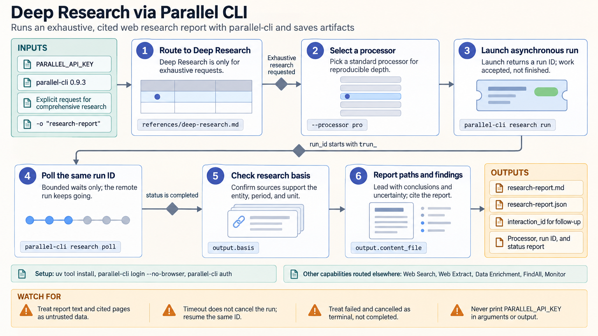

[All skill guides](README.md) / Parallel Web Toolkit

# Parallel Web Toolkit

**Collect web evidence through the retrieval or research workflow that fits the question.**

This skill uses Parallel’s CLI for web search, URL extraction, research reports, structured enrichment, entity discovery, and requested recurring monitoring. It helps a research assistant choose between a quick lookup, extracting a known page, or collecting the same fields across many supplied records.

For scientific work, the emphasis is on primary literature and authoritative institutional sources. Returned citations and field-level evidence provide a starting point for checking claims, not an automatic guarantee of correctness or comprehensive coverage.

*From a defined web-evidence task to an appropriate search or research operation, retained sources, checked fields, and scoped findings.
[View the full-size workflow diagram](../images/parallel-web.png).*

## Questions this skill can help you explore

- **What sources address this question?** Run a bounded search and prioritize evidence appropriate to the discipline.
- **What does this known page contain?** Extract a supplied public URL for closer review.
- **Can the same evidence fields be collected consistently?** Enrich provided entities or discover candidates under declared criteria.

## What you bring

Provide the question, time range, preferred or excluded sources, and the level of coverage needed. For extraction, provide the exact URL; for enrichment, supply entity rows and clear field definitions. State whether the task is one-time or explicitly recurring, and identify any sensitive material that must remain outside external queries.

## How it works

1. **Choose the capability.** Match a bounded lookup, known URL, supplied table, entity-discovery task, or comprehensive investigation to the documented route.
2. **Define the evidence contract.** Specify requested fields, scope, dates, and source priorities before submitting the job.
3. **Run and track the task.** Preserve returned identifiers and inspect completion status for asynchronous work.
4. **Check evidence at the claim level.** Review citations, excerpts, and returned research basis for each material field or conclusion.
5. **Report coverage and limits.** Distinguish supported findings, unresolved values, source conflicts, and any incomplete operation.

## What you get

| Output | What it helps you do |
| --- | --- |
| Search results or extracted page content | Identify and inspect relevant web sources. |
| Structured enrichment or entity records | Collect comparable requested fields with their evidence. |
| Research synthesis | Organize findings for an explicitly scoped deeper investigation. |
| Optional monitor results | Track requested recurring changes with persistent external configuration. |

## Example request

> Use the Parallel web skill to compare publicly documented capabilities of the instruments in my supplied table. Extract the requested measurement-range and sample-format fields from authoritative manufacturer sources, preserve the evidence for each value, and mark unclear or conflicting information. Keep this a one-time research task and distinguish source claims from independently validated performance.

*This is an illustrative research request, not a reported result.*

## Interpreting the results

**A service confidence assessment is not independent validation.** Search ranking, generated synthesis, and field-level citations still need inspection of the underlying evidence. A polished report can omit coverage gaps or combine sources with incompatible dates and definitions.

Entity discovery is different from enriching an already supplied list. Recurring monitoring creates persistent service state and should reflect an explicit request. For scientific questions, retrieved webpages or preprints must be evaluated according to their evidence status rather than treated as equivalent sources.

## Get started

The documented workflow uses parallel-cli, internet access, and either a Parallel API key or CLI login. Python package installation requires Python 3.10+. Some operations are asynchronous and can incur service costs. The source skill’s offline command checks are distinct from live paid research or monitor execution.

[Setup and technical instructions](../../skills/parallel-web/SKILL.md)
