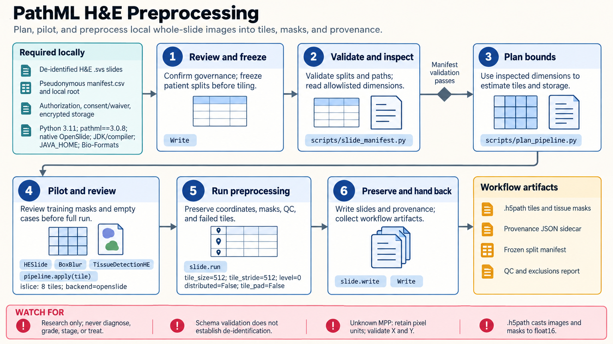

[All skill guides](README.md) / PathML

# PathML

**Build a traceable computational-pathology workflow from slide inventory through tiles and spatial measurements.**

PathML supports research processing of whole-slide pathology and multiplex imaging data. This skill helps a research assistant plan slide loading, tiling, quality control, preprocessing, storage, spatial graphs, and bounded model inference.

The workflow pays particular attention to patient-level splits, physical calibration, tile coordinates, and model provenance. These details determine whether downstream comparisons are reproducible and whether an apparent result could instead reflect scanner, stain, or data-leakage artifacts.

*From deidentified slide manifests to bounded tiling, reviewed preprocessing, calibrated spatial data, model outputs, and provenance.
[View the full-size workflow diagram](../images/pathml.png).*

## Questions this skill can help you explore

- **Can these slides be processed consistently?** Inventory formats, dimensions, scanner information, and resource needs.
- **Do tiles and measurements retain their spatial meaning?** Preserve level, coordinates, downsampling, and micrometers-per-pixel calibration.
- **Can model evaluation avoid patient leakage?** Freeze patient and slide assignments before deriving overlapping tiles or learned preprocessing.

## What you bring

Provide authorized, deidentified slides with pseudonymous patient, slide, and specimen identifiers. Include scanner and stain information, pixel calibration, channel definitions, planned splits, and analysis goals. For inference, supply a reviewed model artifact with expected inputs and outputs. State local storage limits and whether any optional model or dataset download is permitted.

## How it works

1. **Inventory and plan locally.** Validate the manifest and estimate tile count, memory, and output size.
2. **Freeze the evaluation split.** Keep every patient’s slides together before tiling, normalization, or feature fitting.
3. **Pilot preprocessing.** Inspect tissue masks, artifacts, stain behavior, edge padding, and empty regions on representative training data.
4. **Process with spatial provenance.** Preserve coordinates, calibration, quality decisions, and failures while validating channel and graph-feature alignment.
5. **Review inference and handoff.** Use bounded batches, inspect the actual outputs, and retain model, environment, split, and source provenance.

## What you get

| Output | What it helps you do |
| --- | --- |
| Slide manifest and resource plan | Make data scope and computational scale explicit. |
| Tiles and quality-control records | Review retained, excluded, and failed image regions. |
| Spatial measurements or graph data | Support calibrated cell and tissue analyses. |
| Linked model outputs and provenance | Trace predictions to source slides, coordinates, and model configuration. |

## Example request

> Use the PathML skill to plan a local research workflow for our deidentified H&E slides. Validate the manifest, keep all slides from each patient in one split, and estimate tiling resources. Pilot tissue masking and stain preprocessing on training slides, preserve tile coordinates and physical calibration, and document every quality-control exclusion before model evaluation.

*This is an illustrative research request, not a reported result.*

## Interpreting the results

**PathML outputs are research results, not patient diagnoses.** A model’s availability or successful execution does not establish validity across scanners, stains, tissue types, or populations. The source skill’s synthetic helper tests do not demonstrate a complete native-stack or pathology-model run.

Equal pixel sizes need not mean equal physical areas. Multiplex intensity normalization and storage precision can change quantitative values; exact images and integer instance labels may need separate preservation because the documented h5path path casts values to float16.

## Get started

The PathML stack needs a compatible Python 3.10–3.12 environment, native OpenSlide, a JDK/compiler, Bio-Formats, and its pinned dependencies. Bundled planners and validators can run on the standard library without PathML. Installation and optional model downloads need network access; keep sensitive imaging data on approved local storage.

[Setup and technical instructions](../../skills/pathml/SKILL.md)
