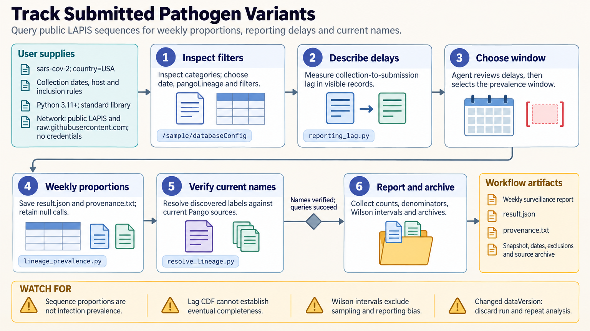

[All skill guides](README.md) / Pathogen Variant Surveillance

# Pathogen Variant Surveillance

**Describe public sequence submissions with explicit dates, denominators, nomenclature, and reporting-delay limits.**

This skill queries public GenSpectrum LAPIS deployments to examine pathogen lineage labels and descriptive sequence distributions. It helps a research assistant inspect the relevant database schema, verify nomenclature, summarize weekly proportions, and review site-wise mutation frequencies.

The workflow is for descriptive surveillance research. It keeps the submitted-sequence dataset distinct from the infections or cases in the wider population, and it preserves the filters and retrieval snapshot needed to understand each result.

*From an identified public database and surveillance scope to nomenclature checks, reporting-delay review, descriptive proportions, and saved provenance.
[View the full-size workflow diagram](../images/pathogen-variant-surveillance.png).*

## Questions this skill can help you explore

- **Which lineage labels occur in the selected submissions?** Inspect database categories and verify names where a nomenclature authority is available.
- **How did submitted sequence proportions change?** Report weekly counts and denominators under a consistent filter.
- **Could reporting delays affect the apparent pattern?** Review collection-to-submission timing and flag weakly observed recent periods.

## What you bring

Specify the pathogen, public deployment, lineage system, geography, host, collection period, and data-use filters. Clarify whether the question concerns labels, weekly proportions, reporting delay, or descriptive mutation frequencies. State how recent incomplete periods should be handled and retain the exact reference or segment definitions for any site-level query.

## How it works

1. **Inspect the schema and scope.** Select the correct date, geography, host, and lineage fields for the deployment.
2. **Review reporting delays.** Examine the observed delay distribution before choosing an analysis window and exclusion horizon.
3. **Discover and verify labels.** Check nomenclature rather than assuming an old or present-in-data label is authoritative.
4. **Calculate descriptive summaries.** Return counts, denominators, uncertainty intervals, and explicit low-completeness or missing-date flags.
5. **Archive the evidence.** Preserve response data, filters, dates, versions, and nomenclature-source identities for later interpretation.

## What you get

| Output | What it helps you do |
| --- | --- |
| Lineage validation and category summaries | Understand which labels were used and which remain unverified. |
| Weekly sequence proportions | Describe the selected submitted-sequence population. |
| Reporting-delay summaries | Identify sensitivity to incomplete recent submissions. |
| Site-frequency and provenance tables | Inspect descriptive variation with reference and coverage context. |

## Example request

> Use the pathogen variant surveillance skill to describe lineage proportions in public submissions for the region and collection period I specify. Inspect the deployment schema, verify the nomenclature, and review reporting delay before choosing the reporting window. Return weekly counts and denominators, flag incomplete periods, and preserve the query and response provenance.

*This is an illustrative research request, not a reported result.*

## Interpreting the results

**Sequence proportions are not infection prevalence.** Testing, sequencing selection, geographic coverage, and reporting changes can affect the apparent trend. Binomial intervals describe sampling variation under their assumptions and do not correct those biases.

A descriptive log-odds slope is not transmissibility, biological fitness, or a forecast. Site coverage means a resolvable sequence call, not read depth, and missing calls are not reference matches. Site-frequency tables do not establish joint haplotypes, pathogen function, or assay performance.

## Get started

The bundled scripts use Python 3.11+ and the standard library, with network access to public LAPIS deployments and relevant nomenclature sources. No credentials are needed for the supported public queries. Preserve data-use terms and attribution; a live endpoint alone does not imply unrestricted reuse of every record.

[Setup and technical instructions](../../skills/pathogen-variant-surveillance/SKILL.md)
