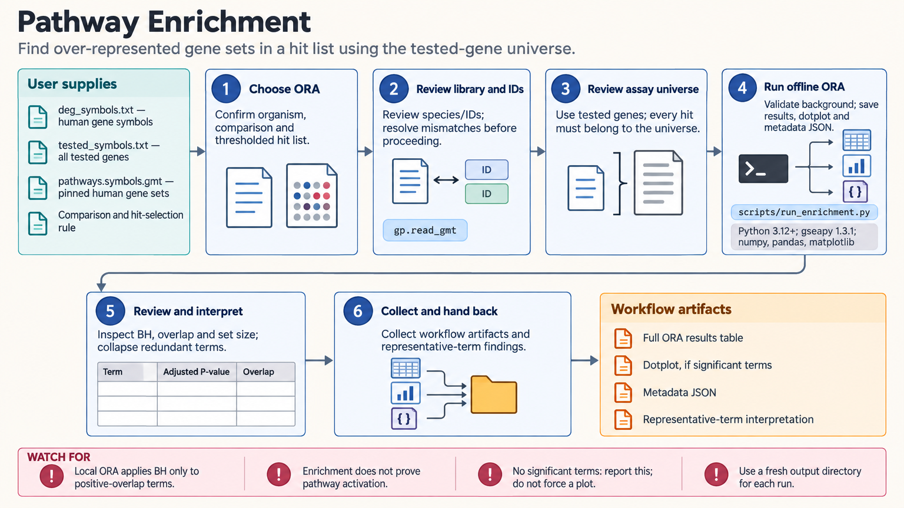

[All skill guides](README.md) / Pathway Enrichment

# Pathway Enrichment

**Connect gene-level results to biological gene sets while preserving the statistical comparison.**

Pathway enrichment asks whether a set of genes is represented unusually often among selected hits or concentrated toward an end of a complete ranking. This skill helps a research assistant choose the appropriate method, reconcile identifiers, select gene-set libraries, and interpret the output in the context of the experiment.

It supports over-representation analysis, ranked GSEA, and guidance for per-sample gene-set scoring. The goal is a defensible functional summary with visible assumptions, rather than a list of pathway names detached from the input data.

*From gene lists or ranked data to identifier checks, justified gene sets and background, enrichment testing, and interpreted results.
[View the full-size workflow diagram](../images/pathway-enrichment.png).*

## Questions this skill can help you explore

- **Which biological sets are associated with my hits?** Use over-representation analysis with an assay-appropriate background.
- **Are related genes concentrated near an end of the ranking?** Analyze the full signed ranked list with GSEA.
- **Which terms summarize the same underlying signal?** Review overlapping genes and redundant gene-set results.

## What you bring

Provide the organism, gene identifier type, experimental comparison, and either a thresholded hit list or the complete ranked table. For over-representation analysis, include all genes that could have been detected or tested. For ranking, explain the statistic and its direction. State relevant gene-set libraries or supply a versioned local GMT file.

## How it works

1. **Choose the method from the input.** Separate hit-list testing, full-rank enrichment, and sample-level scoring.
2. **Reconcile identifiers.** Preserve originals, resolve duplicate or one-to-many mappings, and apply the same mapping policy to query and background.
3. **Define the tested sets and universe.** Select biologically relevant libraries and document the assay’s detectable genes.
4. **Run and retain settings.** Save method-specific correction, seeds, permutation settings, library versions, and input identities.
5. **Interpret and visualize.** Review set sizes, overlap or leading-edge genes, redundant terms, effect direction, and scientific limitations.

## What you get

| Output | What it helps you do |
| --- | --- |
| Complete enrichment results table | Review tested terms and method-specific significance measures. |
| Dotplots or enrichment plots | Communicate supported patterns with clear definitions. |
| Gene overlap or leading-edge information | Identify genes contributing to the result. |
| Metadata and provenance record | Reproduce identifiers, libraries, background, and analysis settings. |

## Example request

> Use the pathway enrichment skill to analyze our full differential-expression ranking with a signed statistic. Check organism and identifier compatibility, use the selected versioned gene-set libraries, and preserve every tested gene. Return complete results, appropriate multiple-testing information, leading-edge genes, and plots that summarize redundant terms without claiming pathway activation from enrichment alone.

*This is an illustrative research request, not a reported result.*

## Interpreting the results

**Enrichment does not establish pathway activation or mechanism.** Results depend on the input selection, gene-set definitions, mapping, and background. A whole-genome default can bias an assay that could detect only a subset of genes.

Do not threshold a list before a ranked GSEA analysis. Correction methods differ among classic GSEA, multilevel GSEA, Enrichr, and g:Profiler and are not interchangeable. Correlated genes and assay-specific detection biases also limit simple random-hit assumptions.

## Get started

The documented workflow uses Python 3.12+, GSEApy, NumPy, pandas, and matplotlib. Optional mapping and catalog services need their own packages and network access. A local versioned GMT workflow can run offline; retain its exact contents and provide an explicit background for local over-representation analysis.

[Setup and technical instructions](../../skills/pathway-enrichment/SKILL.md)
