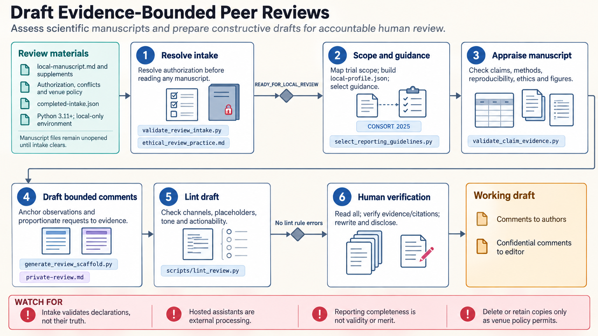

[All skill guides](README.md) / Peer Review

# Peer Review

**Prepare a constructive manuscript assessment whose comments are grounded in specific evidence.**

This skill supports an accountable human reviewer examining an authorized manuscript, protocol, preprint, or proposal. It helps organize claims and evidence, assess methods and statistics, review reporting and reproducibility, and draft actionable comments.

Its local templates and checks make the review process more explicit, but do not evaluate scientific merit automatically. The intended output is a working draft that the responsible reviewer reads, verifies, and revises using their own expertise and the venue’s policies.

*From authorized review scope and available evidence to claim checks, methodological assessment, actionable comments, and a verified human review draft.
[View the full-size workflow diagram](../images/peer-review.png).*

## Questions this skill can help you explore

- **Do the claims match the available evidence?** Compare population, direction, magnitude, outcome, and uncertainty with the cited results.
- **What would make the work clearer or more reliable?** Identify necessary clarifications, sensitivity analyses, corrections, or proportionate additional work.
- **What could not be assessed?** Record missing material, competence limits, and specialist-review needs.

## What you bring

Provide material you are authorized to review, the requested scope, relevant venue policies, and any reporting checklist. Include supplements and available data or code descriptions where permitted. State conflicts, confidentiality requirements, competence boundaries, and whether external processing is allowed. Local helper execution alone does not make a hosted assistant session local.

## How it works

1. **Establish authorization and scope.** Record policy, handling requirements, conflicts, available materials, and review limits.
2. **Orient and map claims.** Identify the study’s questions and major claims without deciding an editorial outcome.
3. **Assess methods and evidence.** Review design, statistical units, uncertainty, reproducibility, figures, tables, and citation support.
4. **Draft actionable comments.** Connect each issue to a specific location, its importance, and a proportionate way to address it.
5. **Verify the final draft.** Separate author-facing scientific comments from policy-appropriate confidential notes and have the human reviewer check every factual statement.

## What you get

| Output | What it helps you do |
| --- | --- |
| Review intake and scope record | Make authorization, limits, and responsibilities explicit. |
| Claim–evidence matrix | Track which results support each central claim. |
| Structured major and minor comments | Give authors specific and proportionate ways to improve the work. |
| Working review draft | Support the human reviewer’s final assessment and required disclosures. |

## Example request

> Use the peer-review skill to help assess this public preprint within my methodological expertise. Map its central claims to the reported analyses, examine the unit of replication and uncertainty, and draft constructive comments with exact locations and suggested remedies. Label unavailable material clearly and distinguish reporting omissions from demonstrated design flaws.

*This is an illustrative research request, not a reported result.*

## Interpreting the results

**Reporting completeness is not scientific validity.** A missing checklist item does not automatically establish bias or justify a publication decision. Conversely, a well-reported study can still have important design problems.

A nonsignificant test does not by itself demonstrate equivalence, and a code-availability statement does not establish reproducibility. Do not claim reproduction unless the authorized analysis was actually executed and documented. The tools check declared structure and narrow consistency rules; they do not replace expert judgment or issue editorial decisions.

## Get started

The bundled tools use Python 3.11+ and the standard library with bounded local JSON, CSV, or Markdown. They make no network, model, image, or external-service calls. Begin with the intake and ethics guidance, preserve confidentiality, and keep any review draft within the authorized handling and disclosure rules.

[Setup and technical instructions](../../skills/peer-review/SKILL.md)
