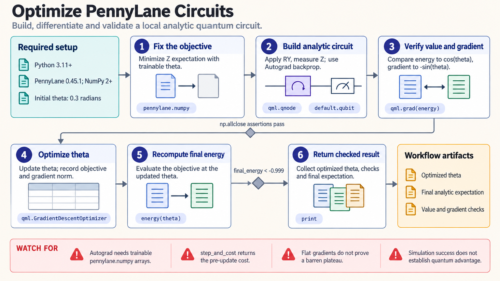

[All skill guides](README.md) / PennyLane

# PennyLane

**Build and test differentiable quantum circuits before interpreting optimization or moving to hardware.**

PennyLane connects parameterized quantum circuits with classical optimization and machine-learning frameworks. This skill helps a research assistant develop variational circuits, hybrid models, molecular energy calculations, or QAOA examples while checking values, gradients, and problem conventions.

The workflow starts with a small simulator case whose behavior can be independently verified. It then introduces finite sampling, noise, resources, or provider-specific execution as separate steps, so an optimization trace is not mistaken for evidence of quantum advantage.

*From defined problem conventions to a checked circuit and gradient, optimization, independent validation, and optional noisy or hardware execution.
[View the full-size workflow diagram](../images/pennylane.png).*

## Questions this skill can help you explore

- **Does the circuit represent the intended problem?** Check feature encodings, objective signs, or molecular Hamiltonian conventions.
- **Are gradients and optimization behaving correctly?** Compare small known cases before training larger models.
- **What changes with finite shots or hardware constraints?** Examine uncertainty, decomposed resources, and device compatibility.

## What you bring

Provide the mathematical objective, circuit or ansatz idea, and the scientific question. For chemistry, specify geometry units, charge, multiplicity, basis, active space, and mapping. For machine learning, include feature order, labels, and evaluation splits. State simulator or hardware requirements, random seeds, and any execution budget or baseline method.

## How it works

1. **Fix conventions.** Document the inputs, objective, encodings, and physical or mathematical assumptions.
2. **Build a small analytic case.** Keep reusable circuit logic separate from the device-bound interface.
3. **Check values and gradients.** Compare with an analytic solution, finite differences, or another trusted small reference.
4. **Optimize and validate.** Record the trajectory and evaluate the final objective independently; compare with held-out data or a suitable classical reference.
5. **Add execution realism.** Introduce finite shots or noise, report uncertainty, inspect resources, and verify any selected provider backend.

## What you get

| Output | What it helps you do |
| --- | --- |
| Circuit and problem definition | Keep the computation and its conventions explicit. |
| Value and gradient checks | Establish basic correctness before optimization. |
| Optimization and baseline results | Evaluate behavior on the stated problem. |
| Resource and uncertainty assessment | Prepare a realistic interpretation of sampling or hardware execution. |

## Example request

> Use the PennyLane skill to build a small molecular VQE example from my specified geometry and active space. Check the Hamiltonian conventions, validate an objective value and gradient, and compare the optimized state with an appropriate classical reference in the same particle-number sector. Then examine finite-shot uncertainty and report circuit resources without claiming hardware performance.

*This is an illustrative research request, not a reported result.*

## Interpreting the results

**Successful optimization does not establish quantum advantage or molecular accuracy.** The ansatz, active space, mapping, sector, optimizer, and measurement model all affect the result. A near-zero gradient alone does not diagnose a barren plateau.

Finite shots introduce sampling uncertainty, and a simulator’s available outputs may not exist on a device. Plugin portability does not guarantee identical gates, measurements, or differentiation. Hybrid machine-learning evaluation still needs held-out examples and appropriate classical baselines.

## Get started

The documented core uses Python 3.11+, PennyLane 0.45.1, and NumPy 2+. Local simulation needs no credentials. PyTorch, JAX, and hardware plugins need separately compatible dependencies; hardware access also needs provider credentials and network access. Follow the release-matched device guidance before migrating a validated circuit.

[Setup and technical instructions](../../skills/pennylane/SKILL.md)
