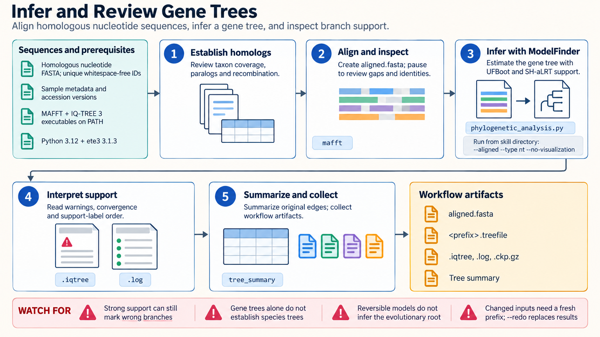

[All skill guides](README.md) / Phylogenetics

# Phylogenetics

**Infer and inspect evolutionary relationships with explicit alignment, model, support, and rooting choices.**

This skill guides a research assistant through aligning homologous nucleotide or protein sequences, estimating a phylogenetic tree, reviewing branch support, and preparing an interpretable summary or figure. It combines MAFFT alignment with IQ-TREE maximum-likelihood inference or FastTree approximate inference, with optional ETE3 summaries.

It is useful for gene trees and protein-family analysis when the biological input supports a common evolutionary comparison. It preserves the alignment and inference reports so the tree image can be interpreted in the context of the assumptions that produced it.

*From homologous sequences and metadata to inspected alignment, model-based inference, support review, justified display rooting, and retained artifacts.
[View the full-size workflow diagram](../images/phylogenetics.png).*

## Questions this skill can help you explore

- **What relationships are supported by these sequences?** Estimate a gene or protein-family tree under an explicit model.
- **Which branches remain uncertain?** Review the method-specific support measures and possible model or alignment problems.
- **How should the tree be displayed?** Choose labels and rooting with biological justification while retaining the original inference.

## What you bring

Provide homologous FASTA sequences with unique identifiers and a separate metadata table. State whether they are nucleotides or amino acids, how they were selected, and any known paralogy, recombination, or contamination concerns. Include accession versions and a biologically justified outgroup if available. Coding-sequence or dated analyses need additional model-specific information.

## How it works

1. **Review the biological inputs.** Check sequence identity, taxon coverage, homology, missing data, and the possibility that different sites have different histories.
2. **Align and inspect.** Use appropriate MAFFT settings and review gaps, composition, and uncertain regions; justify any trimming.
3. **Infer under a stated model.** Select IQ-TREE or a justified approximate approach and preserve commands, models, seeds, and logs.
4. **Read support and rooting carefully.** Interpret each support statistic by its method and distinguish inferred relationships from display orientation.
5. **Summarize and retain evidence.** Deliver the tree with alignment, reports, metadata, and any visualization, including limitations and unresolved branches.

## What you get

| Output | What it helps you do |
| --- | --- |
| Multiple-sequence alignment | Inspect the sequence evidence used for inference. |
| Newick tree and support labels | Reuse inferred relationships in downstream tools. |
| Model and execution reports | Review method choices and inference behavior. |
| Optional tree summary or figure | Communicate relationships without losing support and rooting context. |

## Example request

> Use the phylogenetics skill to analyze our curated homologous protein family. Check sequence identifiers and alignment quality, infer a tree with model selection and branch-support assessment, and explain uncertain relationships. Use the supplied outgroup only if biologically appropriate, retain the original tree and reports, and prepare a labeled figure with the support measures clearly defined.

*This is an illustrative research request, not a reported result.*

## Interpreting the results

**A gene tree is not automatically a species tree.** It also does not establish transmission direction or horizontal transfer by itself. Strong branch support can coexist with alignment error, biased sampling, or model misspecification.

FastTree local support and IQ-TREE support measures use different interpretations and scales. Reversible substitution models do not infer an evolutionary root, and midpoint rooting is a heuristic. Sampling dates alone do not justify a molecular clock or a dated phylogeny.

## Get started

Local inference requires MAFFT and IQ-TREE or FastTree executables. Optional summaries use the documented Python 3.12 and ETE3 environment; rendering additionally needs PyQt5, and optional trimming needs trimAl. Network access is needed for installation, while inference itself uses local files without service credentials.

[Setup and technical instructions](../../skills/phylogenetics/SKILL.md)
