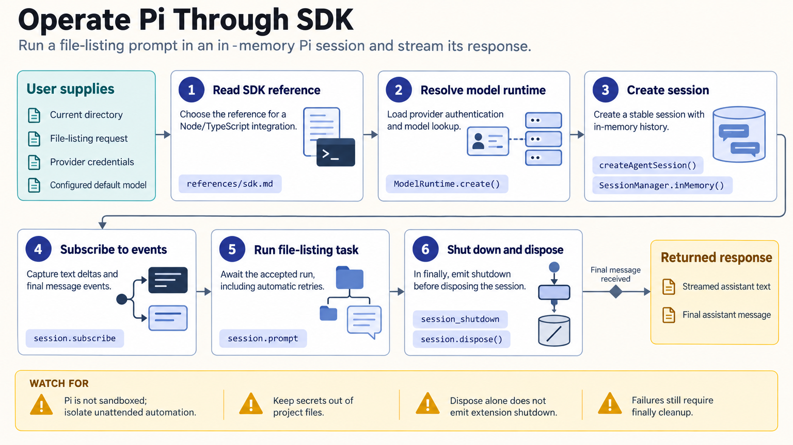

[All skill guides](README.md) / Pi Agent

# Pi Agent

**Configure and extend a terminal-based AI assistant for a defined research computing workflow.**

Pi is a coding-agent runtime that can work in a terminal or be embedded in another application. This skill helps an assistant install and configure Pi, connect a model provider, manage sessions, and add the tools or extensions a project needs. It is useful when building the environment around scientific work, rather than supplying a scientific analysis method itself.

*Make the agent environment, model access, and session lifecycle explicit. [View the full-size workflow diagram](../images/pi-agent.png).*

## Questions this skill can help you explore

- **How can I run Pi for my project?** Choose an interactive, scripted, or embedded interface and configure the appropriate model.
- **How can it use my research tools?** Add documented skills, extensions, or external tool connections with a defined scope.
- **How should an application track its work?** Handle sessions, streamed events, and completion signals without confusing accepted input with finished work.

## What you bring

Describe the intended application, operating environment, model provider or local-model setup, and the tasks the agent should perform. Identify the tools and project files it may access, whether sessions should persist, and what the surrounding application needs to observe or control.

## How it works

1. **Choose the operating mode.** Use a terminal session for direct interaction, an SDK for embedding, or a process protocol when another language controls the agent.
2. **Configure the model and credentials.** Select an available provider or local runtime and keep authentication separate from project content.
3. **Add the required capabilities.** Install only the relevant packages, skills, extensions, or tool connections and review their permissions.
4. **Track the session lifecycle.** Record events and correlate requests with responses, distinguishing a queued prompt from an analysis that has settled.
5. **Verify a representative task.** Check behavior, saved context, and outputs before relying on the integration for a larger research workflow.

## What you get

| Output | What it helps you do |
| --- | --- |
| Agent configuration and project setup | Create a repeatable starting environment for supported research tasks. |
| Extensions or application integrations | Connect project-specific tools and interaction patterns. |
| Session records and event handling | Inspect what ran and distinguish intermediate activity from completion. |

## Example request

> Use the Pi Agent skill to set up a terminal assistant for my local research repository. Configure my chosen model, document the tools it can access, and demonstrate a small file-inspection task. Explain how sessions are saved and how an application should detect that a requested run has actually completed.

*This is an illustrative request, not a reported research result.*

## Interpreting the results

**An agent runtime does not validate the science it performs.** The analysis still needs the appropriate methods, input checks, experimental context, and review. Successful model communication or tool execution is only evidence about the integration.

Pi runs locally without a sandbox by default, and installed extensions execute with the process's permissions. A project-trust setting is not a substitute for isolation. Provider calls, external tools, and local-model requirements each have their own data and resource implications.

## Get started

The documented CLI and SDK require Node.js 22.19 or later and npm, using the @earendil-works/pi-coding-agent package. Model access depends on the configured provider, credentials, or local runtime. Network access is needed for installation and remote services; optional ecosystem packages have separate requirements.

[Setup and technical instructions](../../skills/pi-agent/SKILL.md)
