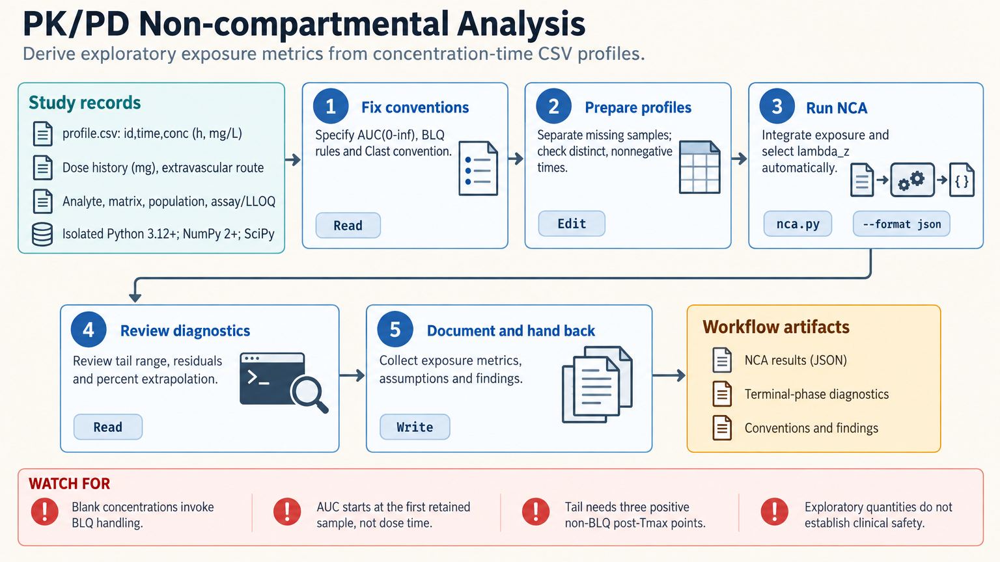

[All skill guides](README.md) / Pharmacokinetic and Pharmacodynamic Modeling

# Pharmacokinetic and Pharmacodynamic Modeling

**Relate drug concentration, time, and response using models with explicit assumptions and diagnostics.**

This skill supports exploratory pharmacokinetic and pharmacodynamic research: summarizing exposure, fitting individual concentration-time models, simulating supported regimens, and examining exposure-response relationships. It also helps prepare population-model datasets and orient more specialized analyses. The emphasis is on measurement conventions, study design, and whether the data support the parameters being estimated.

*Connect exposure calculations and model predictions to their measurement and study assumptions. [View the full-size workflow diagram](../images/pkpd-modeling.png).*

## Questions this skill can help you explore

- **What exposure does this profile describe?** Estimate appropriate concentration-time summaries with documented sampling and extrapolation rules.
- **Which model features are supported?** Fit supported structural models and inspect residuals, parameter uncertainty, and identifiability.
- **How do research scenarios compare?** Simulate specified model conditions or prepare a suitable dataset for a specialist estimation engine.

## What you bring

Provide actual sample times, concentrations, analyte and matrix, units, assay limits, and the full relevant dose history. Define the population and exposure or response endpoint, and distinguish missing samples from values below quantification. For comparative analyses, supply subject, sequence, period, treatment, and other design information as required.

## How it works

1. **Fix the conventions.** Align units, time origins, analyte definitions, missing-data rules, and the intended exposure metric.
2. **Choose a supported analysis.** Separate non-compartmental summaries, individual fitting, population-data preparation, and simulation.
3. **Inspect estimates and diagnostics.** Review terminal-phase selection, extrapolation, residuals, plausible bounds, and whether parameters can be identified separately.
4. **Evaluate research scenarios.** Use models consistent with the route, dose events, variability assumptions, and demonstrated or simulated steady state.
5. **Report the limits.** Preserve settings, data provenance, findings, and any need for a qualified population or regulatory analysis.

## What you get

| Output | What it helps you do |
| --- | --- |
| Exposure summaries and model parameters | Describe observed profiles under stated analytical conventions. |
| Simulation and diagnostic tables | Explore model behavior and locate uncertainty or fit problems. |
| Dataset checks and analysis records | Prepare reviewable inputs for further pharmacometric work. |

## Example request

> Use the PK/PD modeling skill to analyze my experimental concentration-time profiles. Confirm units and sampling conventions, calculate the specified exposure summaries, and fit the supported candidate models. Inspect terminal-phase selection, residuals, extrapolation, and parameter identifiability, and report which conclusions need additional data.

*This is an illustrative request, not a reported research result.*

## Interpreting the results

**A fitted curve does not establish an identifiable or clinically validated model.** Different parameter combinations can explain the same observations, and uncertainty may be understated when correlations or population variability are omitted.

The bundled individual fitting tools are not population mixed-effects estimation engines. Research simulations, bioequivalence calculations, and model-target quantities do not establish a safe patient dose or regulatory acceptance; their applicability depends on the specific design and validation.

## Get started

Bundled calculations run locally with Python 3.12+, NumPy, and SciPy, without credentials or proprietary software. Specialized NONMEM, Monolix, R, or physiologically based modeling workflows have separate runtime or licensing requirements and are not invoked by the basic helpers.

[Setup and technical instructions](../../skills/pkpd-modeling/SKILL.md)
