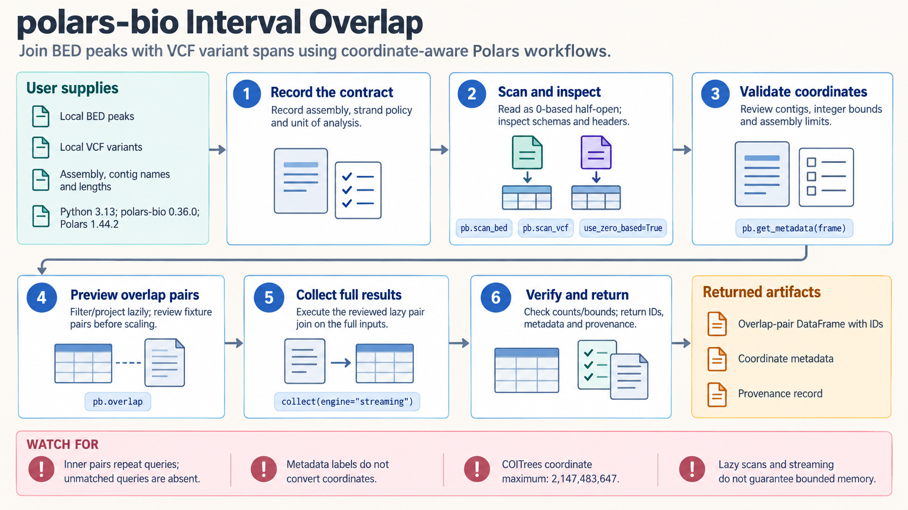

[All skill guides](README.md) / polars-bio

# polars-bio

**Query genomic files and interval relationships through a consistent table-based workflow.**

polars-bio brings genomic interval operations and biological file readers into Polars-style data processing. This skill helps an assistant work with regions, variants, alignments, annotations, and sequences while tracking coordinate conventions. It supports questions about overlap, nearby features, covered bases, and read depth, which require different operations and interpretations.

*Keep genomic coordinates and the unit being counted explicit throughout the analysis. [View the full-size workflow diagram](../images/polars-bio.png).*

## Questions this skill can help you explore

- **Which genomic features intersect?** Find interval pairs or count target records overlapping each query.
- **How much sequence is covered?** Calculate covered bases while separating this from overlap counts and alignment depth.
- **Can I query large biological files selectively?** Use supported readers and lazy plans for formats such as BED, VCF, BAM, and FASTA.

## What you bring

Provide the biological files, exact genome assembly, contig naming convention, and the intended coordinate system. State whether the task counts pairs, records, bases, or reads, and define any strand or sample grouping. Include a reference FASTA and index when required for external-reference CRAM data.

## How it works

1. **Inspect format and identity.** Choose the correct reader and check identifiers, assemblies, annotations, and genotype fields.
2. **Normalize coordinates deliberately.** Verify whether positions are one-based closed or zero-based half-open, and convert values exactly once.
3. **Select the scientific operation.** Distinguish overlap, nearest feature, merge, complement, covered bases, and read depth.
4. **Evaluate a small known case.** Check boundary behavior, grouping, missing matches, and row multiplicity before scaling up.
5. **Export with provenance.** Retain source identifiers, coordinate metadata, filtering rules, counts, and the versions needed to repeat the query.

## What you get

| Output | What it helps you do |
| --- | --- |
| Genomic overlap and nearest-feature tables | Relate regions to candidate annotations with explicit match semantics. |
| Coverage or depth summaries | Measure the chosen quantity with a declared denominator and filtering policy. |
| Filtered biological tables | Prepare selected records for downstream analyses without losing their coordinate context. |

## Example request

> Use polars-bio to annotate my peak regions with overlapping gene features. Verify the assembly and coordinate systems, retain peak and gene identifiers, and report both pairwise matches and the number of peaks with any match. Check adjacent intervals and unmatched peaks on a small example before processing the full dataset.

*This is an illustrative request, not a reported research result.*

## Interpreting the results

**Coordinate metadata and coordinate conversion are different actions.** The documented readers default to one-based closed coordinates, including converted BED input; manually labeling a table does not transform its numbers. Incorrect conversion can shift every boundary.

Overlapping-record counts, covered-base lengths, and read depth answer different questions. The documented depth implementation has a small-integer overflow limit and is unsuitable for ultra-deep data without independent verification. Lazy scanning also does not guarantee that joins or final results fit in memory.

For strand- or sample-specific joins, use readers that preserve the required fields and process matching groups separately. The default BED reader drops strand and block fields, and the documented interval grouping argument is not implemented.

## Get started

The documented package requires Python 3.11–3.14 and compatible Polars, PyArrow, and DataFusion dependencies. Local file workflows need no service credentials. Remote data require network and provider-specific access; keep the environment separate from packages with conflicting Arrow or DataFusion requirements.

[Setup and technical instructions](../../skills/polars-bio/SKILL.md)
