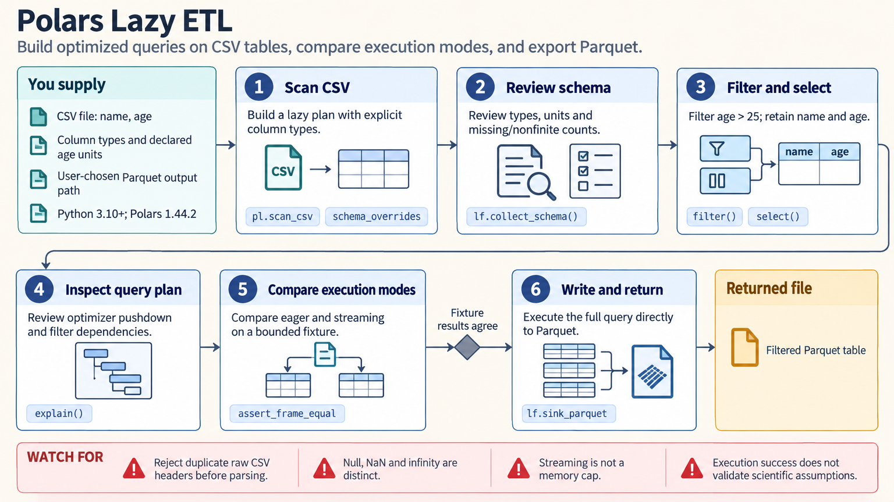

[All skill guides](README.md) / Polars

# Polars

**Transform and summarize large research tables with explicit data types and reproducible query logic.**

Polars is a table-processing library for selecting, filtering, joining, reshaping, and aggregating data. This skill helps an assistant express those operations as efficient query plans and adapt familiar pandas workflows. For scientists, its value is organizing measurements and metadata while checking that identifiers, missing values, grouping, and time order retain their intended meaning.

*Build an efficient table workflow while preserving the meaning of each row and column. [View the full-size workflow diagram](../images/polars.png).*

## Questions this skill can help you explore

- **How can I combine measurements and metadata?** Join tables with explicit keys and checks for missing or duplicated matches.
- **How can I summarize a large experiment?** Filter, group, and calculate derived columns without reading unnecessary data.
- **Can an existing pandas workflow scale better?** Translate operations while checking their statistical and missing-value semantics.

## What you bring

Provide the input files or tables, a description of each column, stable sample identifiers, units, and the desired output. Define the unit of analysis, grouping rules, missing-data policy, and time ordering. For large datasets, include approximate sizes and available memory so the execution plan can be chosen appropriately.

## How it works

1. **Inspect the schema.** Choose data types that preserve identifiers, dates, units, and missing values rather than relying entirely on inference.
2. **Build the transformation.** Select relevant columns and records, create derived values, and express grouping or reshaping operations clearly.
3. **Check relationships and order.** Validate joins and unmatched identifiers; sort time data within the correct subject or sample before time-dependent calculations.
4. **Choose how to execute.** Use immediate operations or an optimized lazy plan, and assess whether streaming or direct file output suits the workload.
5. **Verify the output.** Compare row counts, denominators, missing values, and representative calculations before saving the result.

## What you get

| Output | What it helps you do |
| --- | --- |
| Cleaned and joined research tables | Prepare traceable inputs for downstream analysis. |
| Grouped summaries and derived measurements | Calculate descriptive results under explicit grouping and counting rules. |
| Reusable query plans and exported files | Repeat the same transformation on comparable datasets. |

## Example request

> Use Polars to combine my assay measurements with sample metadata and summarize results by biological sample and condition. Preserve identifiers with leading zeros, audit unmatched and duplicated joins, and distinguish missing values from nonfinite measurements. Save the transformed table and show checks on counts and summary denominators.

*This is an illustrative request, not a reported research result.*

## Interpreting the results

**A fast query can still calculate the wrong scientific quantity.** Row counts, nonmissing counts, and unique-value counts differ, as do null values, NaN, and infinity. Join multiplicity or an incorrect grouping level can change the apparent sample size.

Lazy execution and streaming can reduce intermediate work, but a collected result still needs memory and some operations remain expensive. Moving filters across a join or aggregation can change the answer, so performance changes also need semantic checks.

## Get started

The documented Polars release requires Python 3.10+. Local table processing needs no service credentials. Optional Excel, database, cloud, NumPy/pandas, and GPU integrations require their corresponding packages and, for remote resources, network access and provider configuration.

[Setup and technical instructions](../../skills/polars/SKILL.md)
