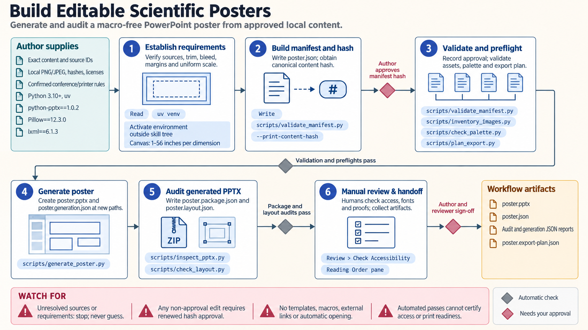

[All skill guides](README.md) / PowerPoint Research Posters

# PowerPoint Research Posters

**Build an editable research poster from approved content and verified physical print requirements.**

This skill creates a one-slide PowerPoint poster from an explicit local specification of text, figures, sources, layout, and approvals. It is intended for projects that specifically need an editable PowerPoint deliverable. The workflow checks physical dimensions, figure resolution, layout, and package structure while keeping scientific authorship and final review with the researcher.

*Carry the same approved content from the poster specification to the final editable file. [View the full-size workflow diagram](../images/pptx-posters.png).*

## Questions this skill can help you explore

- **Can these approved results become an editable poster?** Place exact supplied text and figures into a defined one-slide layout.
- **Will the poster fit its intended print size?** Check the relationship between canvas size, physical dimensions, margins, bleed, fonts, and figure resolution.
- **What still needs human review?** Separate automated layout checks from scientific, accessibility, and printer sign-off.

## What you bring

Provide exact author-approved poster text, authorship, affiliations, citations, funding statements, and local figures with source and license records. Confirm the conference and printer requirements, including physical size, scaling, bleed, safe margins, fonts, and delivery format. Every asset and content element must be identified in the poster specification.

## How it works

1. **Establish the physical requirements.** Record the print dimensions separately from the PowerPoint canvas and confirm any proposed scaling with the printer.
2. **Prepare the content manifest.** Connect every element and local asset to its source, intended position, reading order, and author approval.
3. **Audit before generation.** Check asset identity, resolution at final size, font requirements, contrast, and unresolved content.
4. **Generate and inspect the file.** Create a new one-slide presentation and review package structure, bounds, overlaps, and layout findings.
5. **Complete the manual review.** Inspect the poster in PowerPoint, check accessibility and exported output, obtain author sign-off, and review a print proof as required.

## What you get

| Output | What it helps you do |
| --- | --- |
| Editable one-slide `.pptx` poster | Continue revising the approved research presentation in PowerPoint. |
| Manifest and technical reports | Trace poster elements to sources and inspect layout or package findings. |
| Export and review records | Document the remaining application, accessibility, and printing checks. |

## Example request

> Use the PowerPoint poster skill to lay out my approved conference text and local figures. Follow the confirmed printer dimensions and margins, preserve each figure's proportions, and check resolution at the final print size. Produce an editable poster and technical reports, identifying the manual PowerPoint, accessibility, author, and print-proof checks still required.

*This is an illustrative request, not a reported research result.*

## Interpreting the results

**The generator reproduces supplied content; it does not write or validate the science.** Missing claims, source records, author approvals, or requirements remain unresolved rather than being filled with plausible text.

Automated checks do not certify accessibility or printed readability. Fonts, physical scaling, export settings, and the target application can change the appearance. The generated profile is intentionally narrow and does not treat an arbitrary presentation template as a trusted poster source.

## Get started

Generation requires Python 3.10+, uv, and the exact python-pptx, Pillow, and lxml versions listed in the technical instructions. The tools use local files without service credentials or network calls. Final PowerPoint, accessibility, PDF-export, printer, and author checks require the appropriate applications and people.

[Setup and technical instructions](../../skills/pptx-posters/SKILL.md)
