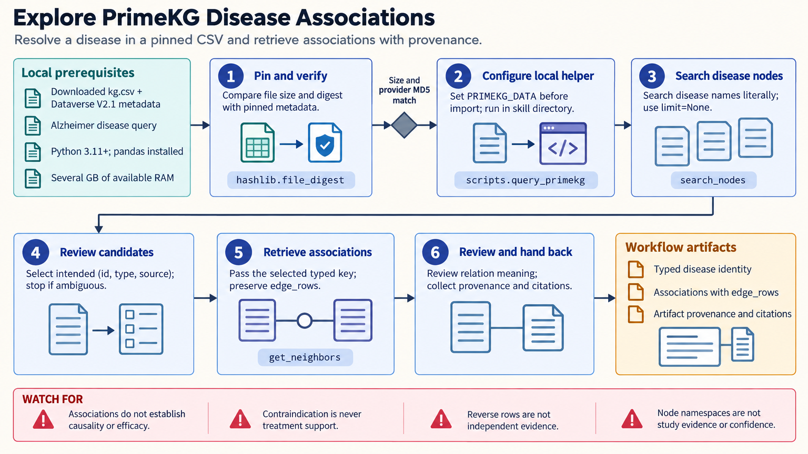

[All skill guides](README.md) / PrimeKG

# PrimeKG

**Explore recorded relationships among genes, drugs, diseases, and phenotypes in a reproducible knowledge graph.**

PrimeKG combines biological and medical associations into a graph that can be queried for direct neighbors, disease context, and short paths. This skill helps an assistant work with a specific downloaded PrimeKG dataset, resolve entities precisely, and preserve the meaning and provenance of each relationship. It is useful for evidence exploration and hypothesis generation.

*Keep entity identity and relationship meaning visible while exploring graph connections. [View the full-size workflow diagram](../images/primekg.png).*

## Questions this skill can help you explore

- **What is connected to this gene or disease?** Retrieve recorded neighbors while retaining the relationship type and original rows.
- **What context surrounds a disease?** Review associated genes, drugs, phenotypes, and related diseases without merging different kinds of evidence.
- **Is there a short association path between these entities?** Inspect supported one- or two-hop connections as starting points for research.

## What you bring

Provide a pinned PrimeKG CSV, its dataset version and checksum, and a clear entity or relationship question. Use stable identifiers where possible, but also retain entity type and source namespace. Define which relationships matter and how ambiguous names or grouped disease nodes should be handled.

## How it works

1. **Verify the graph artifact.** Record the dataset release, filename, checksum, retrieval date, and any filtering or rebuild steps.
2. **Resolve typed entities.** Check names against identifiers, types, and namespaces rather than accepting the first search match.
3. **Retrieve the requested relationships.** Query neighbors, disease summaries, or short paths while preserving the stored relation and supporting rows.
4. **Check evidence counting.** Account for reverse rows and distinguish indications, contraindications, negative relations, and missing information.
5. **Report the graph context.** Save the exact entities, traversal, artifact provenance, and limitations needed to evaluate the proposed hypothesis.

## What you get

| Output | What it helps you do |
| --- | --- |
| Typed entity and neighbor records | Inspect the recorded context of a gene, drug, disease, or phenotype. |
| Disease summaries and short paths | Develop hypotheses from explicitly identified graph relationships. |
| Source-preserving query results | Review original edge records and avoid counting duplicated orientations as independent evidence. |

## Example request

> Use the PrimeKG skill to explore my specified disease in a pinned local graph. Resolve the correct typed disease node, summarize connected genes and drug relationships, and inspect short paths to my gene of interest. Preserve indication versus contraindication labels and report dataset provenance and ambiguous matches.

*This is an illustrative request, not a reported research result.*

## Interpreting the results

**A graph path does not establish causality, treatment efficacy, or a diagnostic conclusion.** Traversal direction describes how the query walked the graph, not necessarily a biological mechanism. A contraindication must never be counted as supporting treatment evidence.

Missing edges mean that the graph does not record a relationship, not that the relationship is false. Dataset age, source coverage, duplicated edges, and highly connected nodes can affect the apparent evidence. This guide concerns PrimeKG rather than a different successor graph.

## Get started

Local queries require Python 3.11+, pandas, a downloaded PrimeKG CSV, and several gigabytes of available memory for the full artifact. Network access is needed to obtain public data or metadata, not for local traversal. Repeated large queries may need a separately validated indexed store.

[Setup and technical instructions](../../skills/primekg/SKILL.md)
