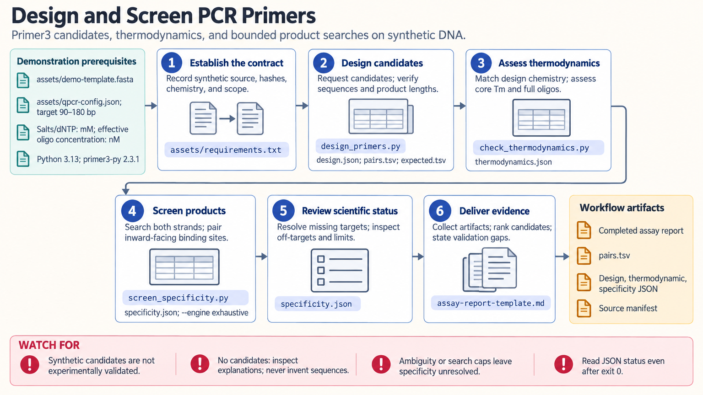

[All skill guides](README.md) / Primer Design and Specificity

# Primer Design and Specificity

**Design PCR primer candidates and document the evidence behind their expected products and specificity.**

This skill combines Primer3 design and thermodynamic calculations with reference-based searches for possible amplification products. It supports new PCR or RT-qPCR pairs, reviews of existing primers, selected junction or isoform constraints, cloning tails, and multiplex checks. The result is a traceable set of computational candidates with clearly stated experimental validation still needed.

*Design and screen primer candidates while distinguishing computational checks from experimental validation. [View the full-size workflow diagram](../images/primer-design.png).*

## Questions this skill can help you explore

- **Which primer pairs fit this assay?** Design candidates for a specified template, target interval, and product-size range.
- **Could these oligos form unwanted structures or products?** Assess thermodynamics and search relevant references for paired amplification.
- **What changes for tails, isoforms, or multiplexing?** Track annealing cores, product coordinates, and cross-pair interactions explicitly.

## What you bring

Provide the assay purpose, reviewed reference sequence and version, organism, template type, desired products, and unwanted templates. Specify reaction chemistry and oligo concentrations, allowed or excluded binding regions, relevant variants, and any tails or multiplex membership. Junction and isoform requests need actual sequence annotations.

## How it works

1. **Define the assay contract.** Resolve references, coordinates, chemistry, desired products, and what the specificity screen must cover.
2. **Design or import candidates.** Preserve exact ordering sequences in the stated orientation, separating annealing cores from added tails.
3. **Assess thermodynamics.** Calculate sequence-dependent properties under the declared conditions and review relevant oligo interactions.
4. **Screen amplification products.** Search the chosen references with explicit orientation, mismatch, length, and resource limits; include cross-pair products for multiplex panels.
5. **Assemble the evidence.** Rank candidates with their limitations and document the experimental checks needed to establish the assay's intended performance.

## What you get

| Output | What it helps you do |
| --- | --- |
| Primer-pair tables | Order or review exact oligo sequences, tails, and expected products. |
| Thermodynamic and specificity reports | Inspect structural concerns and potential unintended amplification. |
| Assay report and source manifest | Retain chemistry, reference identity, search limits, and outstanding validation. |

## Example request

> Use the primer-design skill to prepare PCR candidates for my specified reference interval. Use the supplied buffer conditions and product-size range, screen against the relevant target and off-target references, and retain multiple candidates when uncertainty remains. Report exact oligo sequences, expected products, thermodynamic findings, and the experimental controls needed next.

*This is an illustrative request, not a reported research result.*

## Interpreting the results

**A computationally favorable pair is not a validated assay.** A low design penalty, a single alignment, or no off-target found within a bounded search does not prove specificity. Incomplete references, uncertain bases, and heuristic searches must remain visible in the conclusion.

Ordinary DNA primer models do not automatically cover degenerate, modified-base, bisulfite, or probe assays. Quantitative assays also need appropriate efficiency, dynamic-range, and control measurements. A single melt peak alone does not establish product identity.

## Get started

Design and thermodynamic calculations require Python 3.11+ and the documented primer3-py package. Bounded exhaustive screening uses the standard library; BLAST-assisted screening also needs blastn and makeblastdb. Bundled scripts use local inputs, while installation, reference retrieval, or external Primer-BLAST need network access.

[Setup and technical instructions](../../skills/primer-design/SKILL.md)
