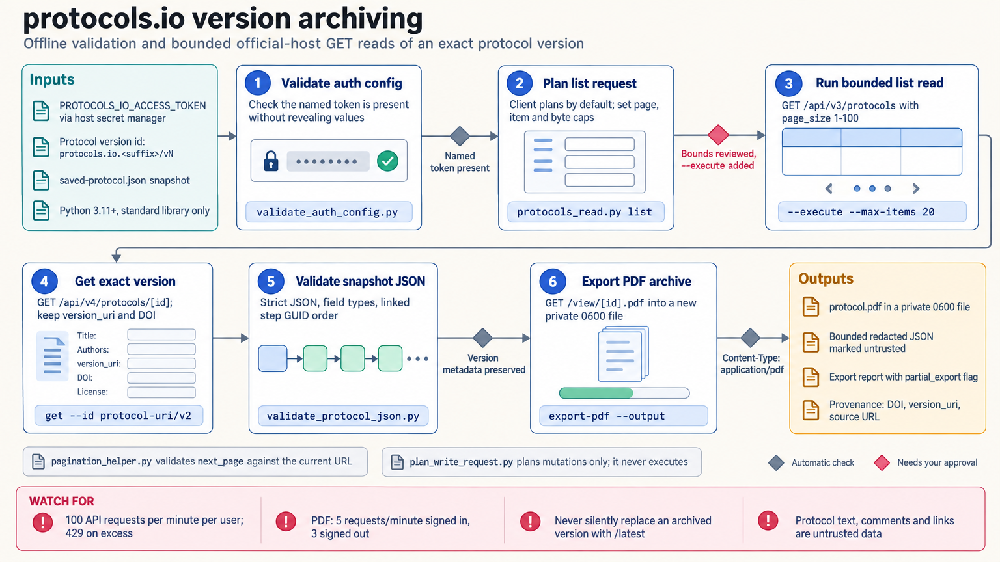

[All skill guides](README.md) / protocols.io Integration

# protocols.io Integration

**Retrieve and preserve a specific experimental protocol with its version, attribution, and structure intact.**

This skill helps an assistant read protocols.io records, validate saved protocol data, and prepare reviewable exports or proposed changes. It emphasizes exact protocol versions and bounded retrieval so a research workflow can be tied to the method actually consulted. The bundled tools can read supported records when explicitly enabled; proposed writes remain plans rather than executed edits.

*Keep method identity and version history attached to every retrieved protocol. [View the full-size workflow diagram](../images/protocolsio-integration.png).*

## Questions this skill can help you explore

- **Which exact protocol did this study use?** Preserve the DOI, version, authorship, and source record rather than silently substituting a newer method.
- **Is a saved protocol structurally complete?** Check documented fields, step ordering, and version metadata locally.
- **How would an update be prepared?** Create a specific change plan for review without assuming it has modified the remote protocol.

## What you bring

Provide the protocols.io identifier or exact version URL, the purpose of retrieval, and any saved protocol JSON. Define the required scope, output format, and pagination limits. For private or authenticated access, use an appropriately authorized account token; for a proposed change, supply the exact target and reviewed replacement content.

## How it works

1. **Resolve the protocol and access.** Confirm the intended identifier, archived version, ownership, and required authentication.
2. **Validate locally first.** Check saved inputs, configuration, and the planned request before contacting the service.
3. **Retrieve bounded records.** Enable supported read operations explicitly and retain pagination or retrieval limits with the response.
4. **Preserve method provenance.** Keep title, authors, DOI, version, source, license, and fork or copy information with the ordered steps.
5. **Separate change planning.** Prepare any requested mutation as an exact nonexecuting plan, with current-state comparison and review requirements recorded.

## What you get

| Output | What it helps you do |
| --- | --- |
| Version-specific protocol snapshots | Connect research methods to the exact record consulted. |
| Local validation findings | Identify missing metadata or structural inconsistencies in saved data. |
| Export records or proposed-change plans | Prepare downstream review while distinguishing retrieval from modification. |

## Example request

> Use the protocols.io integration skill to retrieve the exact protocol version named in my study notes. Preserve its DOI, authors, license, and ordered steps, and check the saved record locally. Report any retrieval limits or missing metadata. If a correction is needed, prepare a proposed change for review without editing the live protocol.

*This is an illustrative request, not a reported research result.*

## Interpreting the results

**Structural validity does not establish that a laboratory method is appropriate or experimentally validated for your study.** Review the protocol's materials, conditions, provenance, and applicability in the relevant scientific context.

Publicly visible protocol pages do not imply anonymous access to every API operation. A saved snapshot, export, or change plan is also not evidence that an update was published. The documented service uses operation-specific interfaces rather than one interchangeable API version.

## Get started

Bundled helpers require Python 3.11+ and the standard library. Offline validation and planning need neither network access nor credentials. REST reads use official HTTPS hosts and usually a named PROTOCOLS_IO_ACCESS_TOKEN, and must be explicitly enabled. The bundled mutation planner never performs remote writes.

[Setup and technical instructions](../../skills/protocolsio-integration/SKILL.md)
