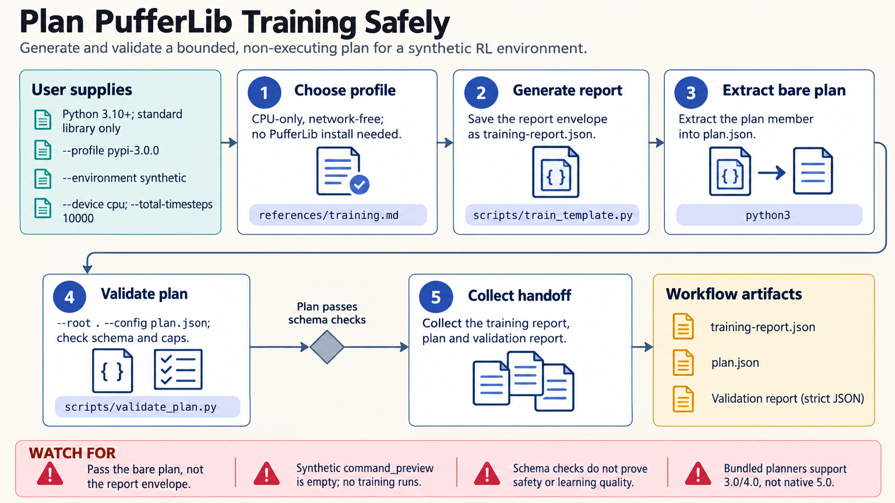

[All skill guides](README.md) / PufferLib

# PufferLib

**Prepare reinforcement-learning environments and experiments with clear version, evaluation, and resource boundaries.**

PufferLib supports reinforcement-learning environments, parallel environment execution, policies, and training workflows. This skill helps an assistant choose the appropriate version and review environment behavior before a larger experiment. Its bundled tools provide local synthetic checks and plans for the documented 3.0 and pinned 4.0 profiles. Native 5.0 training needs its separate build workflow and compatible hardware.

*Establish what an environment means and how it will be evaluated before measuring learning performance. [View the full-size workflow diagram](../images/pufferlib.png).*

## Questions this skill can help you explore

- **Does my environment behave consistently?** Check observations, actions, rewards, episode endings, seeding, and cleanup.
- **How can I run multiple environments?** Plan parallel execution and memory use under the selected interface.
- **What would a defensible learning experiment require?** Separate training and evaluation seeds, track configuration, and review checkpoints and performance metrics.

## What you bring

Describe the environment, observation and action spaces, reward definition, termination rules, and scientific objective. Identify the PufferLib version or source revision, policy design, available hardware, step budget, and evaluation plan. Any external environment, map, or checkpoint also needs a reviewed origin and compatibility information.

## How it works

1. **Choose the version first.** Distinguish the native source workflow from published Python adaptation interfaces instead of combining their examples.
2. **Validate the environment contract.** Check shapes, data types, finite rewards, reset behavior, and the distinction between task termination and time limits.
3. **Plan vectorization and policy use.** Review worker counts, buffers, resource limits, and how the selected policy consumes observations.
4. **Prepare the experiment.** Keep training and evaluation conditions separate, record logging choices, and inspect the generated plan before any training launch.
5. **Review actual outcomes.** Evaluate completed runs with appropriate seeds and metrics, preserving model, environment, and checkpoint provenance.

## What you get

| Output | What it helps you do |
| --- | --- |
| Environment-contract reports | Find interface problems before expensive reinforcement-learning runs. |
| Execution and training plans | Review the version, environment, resources, and evaluation settings. |
| Run and checkpoint review records | Connect observed performance to the configuration that produced it. |

## Example request

> Use the PufferLib skill to review my reinforcement-learning experiment plan. Start with the synthetic local checks, identify the correct version for my environment, and inspect episode termination and reset behavior. Propose bounded parallel execution and an evaluation design with separate seeds, and state what still needs an actual native build or training run.

*This is an illustrative request, not a reported research result.*

## Interpreting the results

**Passing synthetic interface checks does not demonstrate learning or scientific validity.** A policy's return depends on reward design, environment behavior, training distribution, and evaluation protocol. Time-limit truncation and true termination must not be silently treated as the same event. The documented 3.0 trainer has unresolved time-limit and inactive-agent handling that needs review before relying on affected training results.

A plan is not a completed experiment, and checkpoint metadata is not proof that loading the file is safe. Version-specific behavior matters: the documented native CPU build supports evaluation rather than training, and historical Python examples are not interchangeable with the native interface.

## Get started

Bundled local checks require Python 3.10+ and the standard library, with no network or credentials. Actual PufferLib use needs the selected version's native build and dependencies; the native training route requires a compatible C/CUDA toolchain. External logging and remote artifacts require their own configured access.

[Setup and technical instructions](../../skills/pufferlib/SKILL.md)
