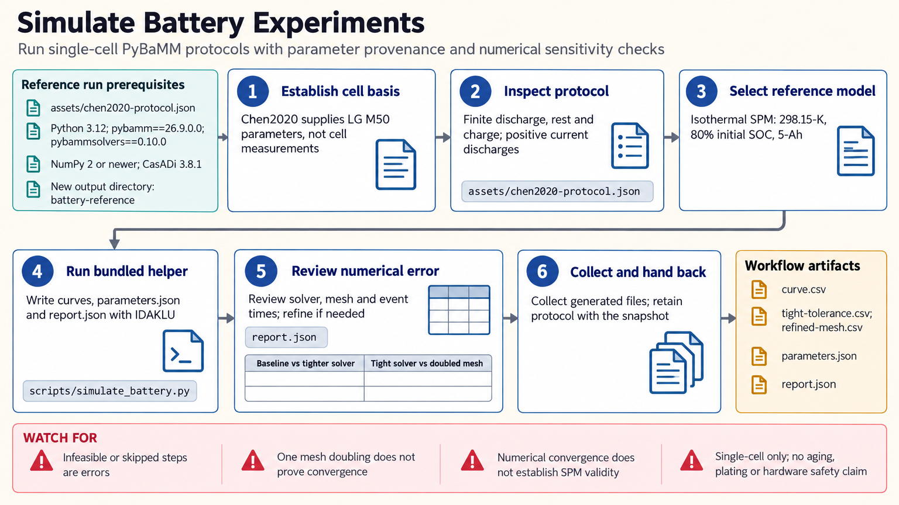

[All skill guides](README.md) / PyBaMM

# PyBaMM

**Explore how a lithium-ion cell responds to a defined charge, discharge, and rest protocol.**

The PyBaMM skill guides an assistant through electrochemical battery simulations and comparisons with measured cycling curves. It helps make the model's assumptions, parameter sources, and numerical accuracy visible, so a predicted voltage trace can be interpreted in the context of a particular cell and experiment.

*Simulate a battery experiment with recorded parameters, protocol details, and numerical checks. [View the full-size workflow diagram](../images/pybamm.png).*

## Questions this skill can help you explore

- **What voltage trajectory does a model predict?** Simulate finite charge, discharge, and rest steps, including voltage cutoffs.
- **Does model detail matter?** Compare the reduced single-particle model with a model that resolves electrolyte and electrode transport.
- **How well does a simulation match measurements?** Examine voltage residuals while checking that the imposed current and initial conditions match.

## What you bring

Provide the cell chemistry, geometry, nominal capacity, temperature, initial state of charge, and cycling protocol. Include a suitable parameter set and its source. For comparisons, supply measurements with time in seconds, voltage in volts, and current in amps, together with the experiment's sign convention and time origin.

## How the analysis works

1. **Define the physical case.** Establish which cell the parameters describe and whether the model's transport assumptions suit the requested rates.
2. **Specify the experiment.** Translate each step into a duration, current or C-rate, and any voltage cutoff. C-rates depend on the parameter set's nominal capacity.
3. **Run the simulation.** Record actual step termination and preserve the initialized parameters alongside the protocol.
4. **Check numerical sensitivity.** Tighten solver tolerances and refine the spatial mesh separately, comparing voltages and event times.
5. **Compare with data.** Inspect residuals and current agreement before attributing differences to battery physics.

## What you get

| Output | What it helps you do |
| --- | --- |
| Cycling curves | Review voltage, current, time, and net discharge capacity. |
| Solver and mesh comparisons | Determine whether numerical choices materially affect the answer. |
| Measurement residuals and error summaries | Locate disagreement across the experimental protocol. |
| Parameter and protocol records | Reproduce the modeled case and explain its provenance. |

## Example request

> Use the PyBaMM skill to model my cell's discharge, rest, and recharge experiment. I will provide the parameter set, initial state of charge, and measured current and voltage. Compare predictions with the measurements, check solver and mesh sensitivity, and explain where model assumptions may limit the comparison.

*This request is illustrative; it does not report a tested cell or experimental result.*

## Interpreting the results

**Numerical agreement does not establish physical validity.** A converged simulation can still use unsuitable parameters or an inadequate transport model. Matching voltage alone does not uniquely identify kinetic parameters.

The bundled workflow uses isothermal cell models and does not establish aging, lithium-plating behavior, mechanical integrity, or a hardware operating envelope. Its teaching parameterization should not be assumed to describe your cell.

## Get started

The documented environment uses Python, PyBaMM, and the IDAKLU solver supplied through pybammsolvers. Local simulations and CSV comparisons need no credentials. Installation and optional dataset retrieval require network access.

[Setup and technical instructions](../../skills/pybamm/SKILL.md)
