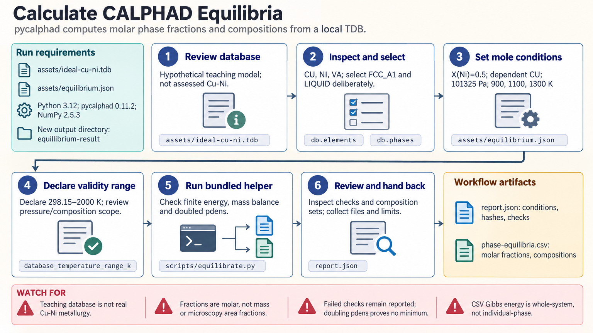

[All skill guides](README.md) / pycalphad

# pycalphad

**Calculate which phases are thermodynamically favored under stated alloy conditions.**

The pycalphad skill uses a thermodynamic database to calculate equilibrium phase fractions and compositions. It guides an assistant through explicit composition and temperature definitions, numerical checks, and exports that retain the database's provenance. This makes it useful for examining alloy phase stability and explaining what an equilibrium calculation actually assumes.

*Calculate equilibrium phase fractions and compositions while retaining database provenance and mass-balance checks. [View the full-size workflow diagram](../images/pycalphad.png).*

## Questions this skill can help you explore

- **Which phases are favored at a given temperature?** Calculate equilibrium using a deliberately selected set of candidate phases.
- **How do fractions and compositions change on heating?** Compare a temperature series and refine the sampling near transitions.
- **Are the results internally consistent?** Check phase-fraction totals, elemental mass balance, and sensitivity to numerical sampling.

## What you bring

Provide a suitable TDB thermodynamic database, its source and license, the elements and candidate phases, bulk composition, pressure, and temperatures. State whether composition is given as mole fractions or weight percentages; the helper requires elemental mole fractions, kelvin, and pascals.

Include the assessment's applicable composition, temperature, and pressure ranges when known. For real-material interpretation, the database must represent the system you are studying.

## How the analysis works

1. **Inspect the database.** Review available elements, phase models, assessment provenance, and any intentionally excluded phases.
2. **Define the conditions.** Specify independent elemental mole fractions and the dependent element without silently renormalizing inconsistent inputs.
3. **Calculate equilibria.** Evaluate the requested temperatures and retain separate stable composition sets, including multiple compositions of the same phase.
4. **Check the calculation.** Verify finite energies, phase fractions summing to one, reconstructed bulk composition, and a denser numerical sampling run.
5. **Report the basis.** Label phase fractions as molar and retain conditions, database hashes, exclusions, and unresolved limitations.

## What you get

| Output | What it helps you do |
| --- | --- |
| Phase-equilibrium tables | Compare stable phases, molar fractions, and compositions across temperature. |
| Mass-balance checks | Confirm that phase compositions reconstruct the specified alloy. |
| Sampling comparisons | Identify results needing further numerical refinement. |
| Provenance report | Revisit the database, conditions, and phase-selection decisions. |

## Example request

> Use the pycalphad skill with my assessed alloy database to calculate equilibrium phases across this temperature range. I will provide the composition and pressure. Report phase fractions and compositions, check mass balance and numerical sensitivity, and identify any calculations outside the assessment's documented range.

*This is an illustrative research request, not a prediction for a particular alloy.*

## Interpreting the results

**Equilibrium does not predict the rate of microstructural change.** These calculations do not establish precipitation kinetics, retained metastable phases, or the microstructure produced by a specific cooling schedule.

Excluding a phase changes the question being solved. Successful numerical checks establish internal consistency, not experimental accuracy. The bundled hypothetical Cu–Ni example is a teaching model rather than an assessed database for real Cu–Ni alloys.

## Get started

Calculations run locally with Python, pycalphad, and NumPy. Installation needs network access; calculations need no service credentials. Real-material work may require a separately licensed thermodynamic database.

[Setup and technical instructions](../../skills/pycalphad/SKILL.md)
