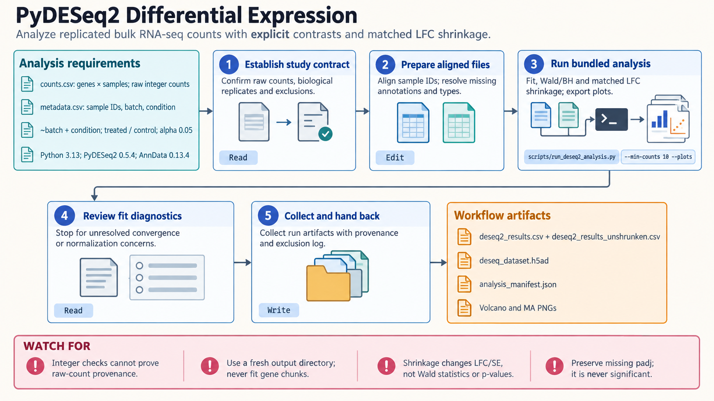

[All skill guides](README.md) / PyDESeq2

# PyDESeq2

**Compare gene expression between biological conditions with an explicit experimental design.**

The PyDESeq2 skill guides bulk RNA-seq differential-expression analysis in Python. It connects count validation, statistical modeling, contrasts, and visualization so that a gene table answers a stated comparison. It also supports appropriately prepared donor-level pseudobulk counts when the experimental unit and study design are preserved.

*From gene counts and biological replicates to interpretable expression comparisons.
[View the full-size workflow diagram](../images/pydeseq2.png).*

## Questions this skill can help you explore

- **Which genes differ between conditions?** Estimate a named comparison with uncertainty and multiple-testing correction.
- **How should paired samples or batch effects enter the analysis?** Build a model that reflects the study's biological units and measured covariates.
- **Which effect estimates are useful for follow-up?** Review fold changes, optional shrinkage, diagnostic plots, and the complete results table.

## What you bring

Provide nonnegative integer gene counts, unique sample and gene identifiers, and sample metadata describing conditions, donors, pairing, and relevant covariates. Explain how the counts were generated and identify any prior exclusions.

Normalized expression, TPM, FPKM, and logarithmically transformed values are not substitutes for the required count input. State the intended reference group, comparison direction, and false-discovery threshold before fitting.

## How the analysis works

1. **Reconcile counts and metadata.** Check orientation, identifiers, sample membership, missing values, and count provenance.
2. **Set the design.** Define biological replication, categorical reference levels, and a model whose effects can be estimated from the available samples.
3. **Fit the expression model.** Estimate normalization and dispersion, then inspect outliers, convergence, and model warnings.
4. **Test the intended contrast.** Apply Wald tests and false-discovery correction while retaining the full unshrunk table.
5. **Review and export.** Optionally shrink the matching coefficient, create result summaries, and save the fitted dataset and design information.

## What you get

| Output | What it helps you do |
| --- | --- |
| Complete differential-expression table | Examine effect estimates, test statistics, and adjusted p-values. |
| Selected gene tables | Prioritize genes under the declared analysis threshold. |
| Diagnostic and result plots | Review sample patterns and the relationship between effect size and uncertainty. |
| Fitted dataset and model metadata | Reopen the analysis and reproduce the comparison. |

## Example request

> Use the PyDESeq2 skill to compare treated and control samples in my bulk RNA-seq experiment. I will provide raw counts and metadata including donor and batch. Check whether the design supports the comparison, document the reference group, preserve unshrunk results, and explain any shrinkage applied to fold changes.

*This request is illustrative and does not imply a significant treatment effect.*

## Interpreting the results

**Cells or sequencing lanes do not replace biological replicates.** Confounding between batch and treatment can make an effect impossible to estimate regardless of sample count.

An adjusted p-value is not an effect size or proof of mechanism. Shrinkage changes reported effect estimates; the accompanying Wald tests retain their original statistical meaning. The Python implementation should not be assumed to reproduce every feature of R DESeq2.

## Get started

The workflow runs locally with Python, PyDESeq2, and its scientific dependencies, including AnnData. No credentials are required. Installation and optional example-data downloads need network access.

[Setup and technical instructions](../../skills/pydeseq2/SKILL.md)
