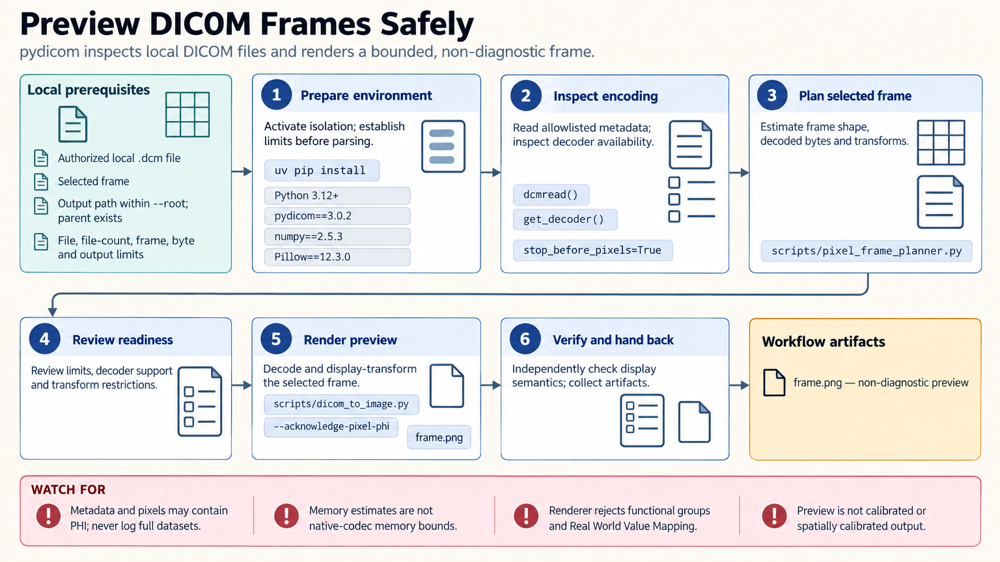

[All skill guides](README.md) / pydicom

# pydicom

**Inspect and prepare DICOM imaging files while preserving their technical and privacy context.**

The pydicom skill helps an assistant read medical-imaging datasets, inspect their metadata, plan pixel decoding, and produce bounded local derivatives. It is useful when a research collection contains different image encodings or when a file conversion needs careful verification. Its scope is file processing rather than clinical image interpretation or PACS operation.

*From heterogeneous DICOM files to reviewed research derivatives.
[View the full-size workflow diagram](../images/pydicom.png).*

## Questions this skill can help you explore

- **What is in this image collection?** Summarize files, frames, metadata structure, and encoding requirements without exposing unnecessary identifiers.
- **Can the images be decoded in this environment?** Check transfer syntaxes, required codec plugins, and expected memory use.
- **How should a derivative be checked?** Review conversions or a site-defined pseudonymization process while preserving the original files.

## What you bring

Provide authorized local DICOM files, the research purpose, and a clear description of the desired output. Specify limits on file counts, decoded image size, and output volume for large collections.

If de-identification is involved, supply a reviewed action profile and the relevant privacy requirements. Sensitive information can occur in filenames, private metadata, overlays, structured content, and the image pixels themselves.

## How it works

1. **Inventory the collection.** Use bounded technical summaries and approved metadata fields to understand the inputs.
2. **Plan decoding.** Identify compression formats, available plugins, frame counts, and memory requirements before loading pixels.
3. **Process selected files.** Perform the requested local inspection, transformation, or non-diagnostic frame rendering.
4. **Validate derivatives.** Check relevant metadata, pixel handling, file consistency, and any documented changes.
5. **Audit privacy-sensitive work.** Review the applied profile and residual risks; keep re-identification maps and keys separate from shared derivatives.

## What you get

| Output | What it helps you do |
| --- | --- |
| Aggregate inventory | Understand the collection without automatically dumping patient metadata. |
| Codec and frame reports | Plan compatible decoding and resource use. |
| Selected rendered frames or converted files | Inspect research derivatives and check image-processing choices. |
| Audit records | Review which transformations or pseudonymization actions were applied. |

## Example request

> Use the pydicom skill to inspect an authorized local imaging collection. Summarize transfer syntaxes and frame counts, identify missing decoding plugins, and estimate memory requirements. Render a small approved set of frames for technical review while avoiding unnecessary patient identifiers in logs or reports.

*This is an illustrative processing request, not a diagnostic assessment.*

## Interpreting the results

**A readable image is not a validated diagnostic image.** Decoding plugins and display choices can affect pixel interpretation and need independent checks for the intended use.

Removing selected tags does not establish that a dataset is anonymous or compliant with a particular privacy standard. Pixel text and contextual information may remain identifying. De-identification requires a profile and expert review appropriate to the recipient and purpose.

## Get started

The skill uses local Python and pydicom. Pixel workflows may additionally need NumPy, Pillow, or transfer-syntax-specific plugins. No service credentials are needed for the local helpers; installation requires access to approved packages.

[Setup and technical instructions](../../skills/pydicom/SKILL.md)
