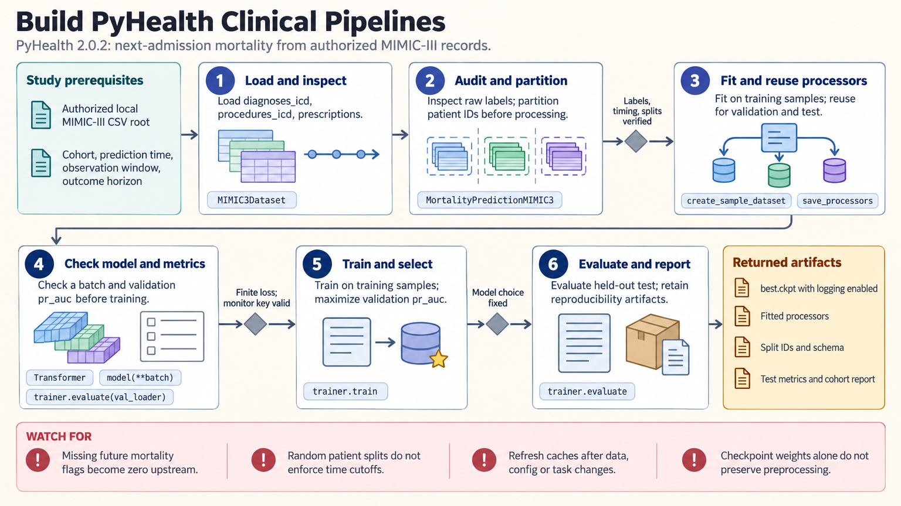

[All skill guides](README.md) / PyHealth

# PyHealth

**Build clinical prediction experiments with explicit outcomes, patient splits, and evaluation limits.**

The PyHealth skill guides clinical machine-learning workflows using electronic health records, physiological signals, imaging tasks, and medical codes. It helps connect a dataset to a prediction task, compatible model, training process, and evaluation. Particular attention goes to what information was available at prediction time and whether held-out patients remain independent.

*From clinical records to a clearly defined prediction experiment.
[View the full-size workflow diagram](../images/pyhealth.png).*

## Questions this skill can help you explore

- **Can these records support the proposed prediction?** Define the cohort, observation window, outcome horizon, and available features.
- **How does a model perform on held-out patients?** Evaluate discrimination and calibration under a documented splitting strategy.
- **How should medical codes be interpreted?** Inspect mappings and retain coding-system versions and unmatched or ambiguous entries.

## What you bring

Provide authorized data access, a cohort definition, the proposed outcome, and the exact time at which a prediction would be made. Include patient identifiers suitable for grouping, feature timestamps, outcome ascertainment rules, and the intended evaluation population.

Specify any restricted dataset agreements and computing constraints. Public synthetic data can exercise a pipeline, but it cannot demonstrate clinical performance.

## How the analysis works

1. **Check the task definition.** Inspect what the dataset's task actually labels, rather than inferring its meaning from a short name.
2. **Create and audit samples.** Review raw task outputs, processed schemas, missing outcomes, and feature availability.
3. **Separate patients and preprocessing.** Choose splits suited to the research claim and fit learned preprocessing on training data.
4. **Train a compatible model.** Check one batch, specify evaluation metrics, and select a checkpoint using the validation set.
5. **Evaluate once choices are fixed.** Report patient counts, outcome prevalence, discrimination, calibration, threshold choices, and appropriate uncertainty.

## What you get

| Output | What it helps you do |
| --- | --- |
| Cohort and task specification | Explain who is studied and exactly what is predicted. |
| Processed samples and split checks | Review schemas, label quality, and patient overlap. |
| Model checkpoints and training records | Reproduce model selection and subsequent evaluation. |
| Held-out metrics | Assess performance for the stated prediction setting. |

## Example request

> Use the PyHealth skill to develop a clinical prediction prototype from my authorized records. First clarify the outcome horizon and which fields are available at prediction time. Split by patient, keep learned preprocessing within training data, and report prevalence, discrimination, and calibration with the limitations of the evaluation design.

*This is an illustrative research request, not a validated clinical system.*

## Interpreting the results

**Patient separation alone does not prevent temporal leakage.** Discharge information may be unavailable at an earlier prediction time, and vocabulary or feature construction can leak information before splitting.

The meaning of each task must be checked explicitly: a next-admission outcome is different from current-stay deterioration. Strong performance on a retrospective dataset, attention weights, or a medication-interaction penalty does not establish clinical usefulness, causal explanation, or prescribing safety.

## Get started

The documented workflow uses Python, PyHealth, and Torch. Installation, public datasets, and uncached medical-code resources need network access. Restricted clinical data require authorized access; local experiments should follow the dataset's access conditions.

[Setup and technical instructions](../../skills/pyhealth/SKILL.md)
