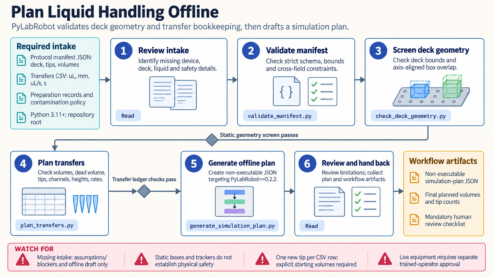

[All skill guides](README.md) / PyLabRobot

# PyLabRobot

**Develop reviewable laboratory automation plans before involving physical equipment.**

The PyLabRobot skill helps translate liquid-handling intentions into resource definitions, deck layouts, transfer plans, and software-only simulations. It connects an experiment's volumes and labware to the automation framework while making missing configuration and operator checks explicit. This supports protocol development and review across compatible device backends.

*From an experimental protocol to an offline automation plan.
[View the full-size workflow diagram](../images/pylabrobot.png).*

## Questions this skill can help you explore

- **Is the planned transfer sequence internally consistent?** Check capacities, dead volumes, channels, and source and destination bookkeeping.
- **What resources must be defined?** Describe plates, carriers, tips, adapters, positions, and orientations.
- **What remains unresolved before a run?** Identify missing calibration, liquid-handling settings, physical clearances, or recovery procedures.

## What you bring

Provide the proposed device model, deck layout, labware definitions, tip specifications, initial volumes, transfer table, and units. Include aspiration and dispense heights, rates, mixing requirements, liquid properties, contamination boundaries, and the relevant validated liquid class.

For eventual hardware work, device identity, firmware, transport, calibration, and a trained operator are also required. Missing details should remain visible as blockers rather than becoming guessed settings.

## How it works

1. **Describe the resources.** Build an explicit resource tree and record labware geometry, capacities, positions, and channel assignments.
2. **Validate the plan.** Check the manifest and conservative static geometry, then reconcile transfer volumes and tip use.
3. **Simulate in software.** Use the chatterbox backend or other offline tools to inspect planned operations without connecting to equipment.
4. **Review limitations.** Separate bookkeeping checks from questions of motion, collision risk, liquid behavior, and actual device state.
5. **Prepare an operator handoff.** Document the protocol revision, unresolved assumptions, commissioning needs, and recovery procedure for a separately approved physical run.

## What you get

| Output | What it helps you do |
| --- | --- |
| Resource and deck descriptions | Review the labware model and intended physical arrangement. |
| Transfer plan and volume checks | Catch inconsistent capacities, missing volumes, and channel assignments. |
| Software-only operation trace | Inspect the planned sequence before commissioning. |
| Assumptions and operator checklist | Make unresolved physical requirements visible. |

## Example request

> Use the PyLabRobot skill to turn my plate-transfer table into an offline protocol draft. I will provide labware, tip definitions, starting volumes, and deck positions. Validate volume bookkeeping, show the software-only operation sequence, and list the calibration and operator checks needed before considering a physical run.

*This is an illustrative request for an offline draft, not execution on laboratory equipment.*

## Interpreting the results

**Software tracking is bookkeeping, not sensing.** It cannot establish that a tip or liquid is physically present. A visualizer or chatterbox trace does not prove reachability, collision freedom, or acceptable liquid handling.

After a device error, software rollback does not reverse a partially completed physical transfer. A trained operator must reconcile the real state before recovery. Physical operation requires explicit review of the exact device, deck, protocol, and safety controls.

## Get started

The planning helpers use Python's standard library and make no hardware connections. PyLabRobot is required for its simulation API. Live devices additionally require model-specific dependencies, configuration, calibration, and operator authorization.

[Setup and technical instructions](../../skills/pylabrobot/SKILL.md)
