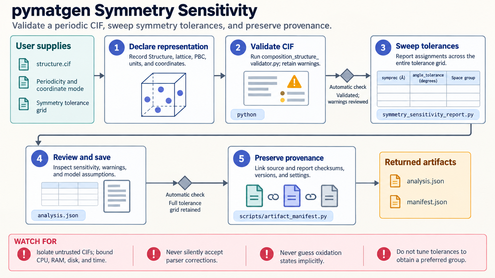

[All skill guides](README.md) / pymatgen

# pymatgen

**Examine materials structures and computed properties without losing their assumptions or provenance.**

The pymatgen skill helps an assistant inspect, validate, convert, and transform crystal structures and molecular data. It also supports symmetry analysis, computed phase diagrams, electronic-structure file handling, and bounded Materials Project queries. The workflow emphasizes units, coordinate conventions, parser warnings, and the origin of every derived structure.

*From structure files to traceable materials analysis.
[View the full-size workflow diagram](../images/pymatgen.png).*

## Questions this skill can help you explore

- **What structure does this file describe?** Inspect lattice, composition, occupancy, coordinate conventions, and parser corrections.
- **How robust is a symmetry assignment?** Compare space-group results across justified tolerances.
- **What do computed energies imply?** Build a phase diagram from a compatible set of entries and correction schemes.
- **Will a conversion preserve the needed information?** Check what the destination format can represent and verify the round trip.

## What you bring

Provide local structure or electronic-structure files and their provenance. State whether the object is periodic, the coordinate convention, units, oxidation-state information, and any known disorder or partial occupancy.

For phase diagrams, include consistent energies and their calculation and correction methods. For database retrieval, identify the desired system, fields, filters, and intended data use.

## How the analysis works

1. **Validate the input.** Inspect parsing warnings, lattice and coordinates, occupancy, composition, and suspicious distances.
2. **Choose the analysis.** Establish whether the question concerns symmetry, conversion, transformation, computed stability, or electronic structure.
3. **Expose sensitive choices.** Record symmetry tolerances, oxidation states, energy conventions, and relevant exclusions.
4. **Create new artifacts.** Preserve originals, document transformations, and check scientifically important properties after conversion.
5. **Retain provenance.** Save versions, warnings, parent and child file hashes, and database query details where relevant.

## What you get

| Output | What it helps you do |
| --- | --- |
| Structure validation report | Review occupancy, units, coordinates, and parser warnings. |
| Symmetry sensitivity results | Distinguish stable assignments from tolerance-dependent ones. |
| Converted or transformed structures | Prepare inputs for further calculations with documented changes. |
| Phase-diagram or property analysis | Interpret compatible computed entries within their stated scope. |

## Example request

> Use the pymatgen skill to inspect these CIF files before further calculations. Report parser warnings, partial occupancies, coordinate conventions, and symmetry sensitivity. Convert the reviewed structures to my requested format, preserve the originals, and check which information survives the conversion.

*This is an illustrative materials workflow, not a claim about any particular structure.*

## Interpreting the results

**A space group depends on the structure and numerical tolerance.** Selecting a tolerance to obtain a preferred label can conceal uncertainty. File conversion may lose disorder, charge, magnetic information, or metadata that the next calculation needs.

A computed phase diagram is conditional on the supplied entries and compatible energy corrections. It does not establish stability against missing phases or reproduce finite-temperature behavior without appropriate thermodynamic information.

## Get started

Local scientific work requires Python and the documented pymatgen packages. Planning helpers can run without the scientific stack. Materials Project queries additionally use mp-api, network access, and an `MP_API_KEY`; local structure analysis needs no service credentials.

[Setup and technical instructions](../../skills/pymatgen/SKILL.md)
