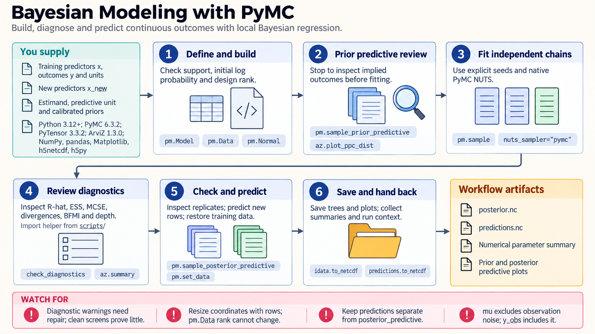

[All skill guides](README.md) / PyMC

# PyMC

**Express scientific assumptions as a probabilistic model and examine the uncertainty they imply.**

The PyMC skill guides Bayesian modeling from the research question through prior checks, inference, diagnostics, and prediction. It supports hierarchical models and other probabilistic analyses in which uncertainty and group structure matter. The emphasis is on checking the model's behavior and interpretation, not simply obtaining posterior samples.

*From scientific assumptions to checked posterior and predictive uncertainty.
[View the full-size workflow diagram](../images/pymc.png).*

## Questions this skill can help you explore

- **What does the model imply about an effect?** Estimate a defined quantity while retaining uncertainty under stated assumptions.
- **How should related groups share information?** Build hierarchical structures for repeated measurements, sites, or experimental groups.
- **Does the model reproduce meaningful features of the data?** Compare predictive replicates with observations and inspect residual structure.
- **How sensitive are conclusions to priors?** Examine plausible alternative assumptions and weakly identified parameters.

## What you bring

Provide measurements, units, grouping variables, missingness information, and a clearly defined target of inference or prediction. Explain what is already known scientifically and what values would be implausible.

State whether predictions concern existing groups, new groups, or future time periods. This choice affects splitting, preprocessing, and the uncertainty that must be included.

## How the analysis works

1. **Define the model.** Choose a likelihood, predictors, group structure, and scientifically calibrated priors.
2. **Check prior predictions.** Simulate before fitting to identify unrealistic scales, outcomes, or relationships.
3. **Fit multiple chains.** Record the inference backend, seeds, preprocessing, and computational environment.
4. **Inspect sampling and model behavior.** Review convergence diagnostics, effective sample sizes, divergences, and posterior predictive checks.
5. **Assess sensitivity and predict.** Examine prior sensitivity and identifiability, then generate predictions for the correct unit and uncertainty level.

## What you get

| Output | What it helps you do |
| --- | --- |
| Explicit probabilistic model | Make assumptions and the scientific target reviewable. |
| Posterior summaries and intervals | Describe model-based uncertainty in parameters or derived quantities. |
| Sampling diagnostics | Identify numerical problems that undermine interpretation. |
| Predictive checks and forecasts | Examine fit and obtain predictions with the required uncertainty. |

## Example request

> Use the PyMC skill to model measurements from several laboratories with partial pooling. I will provide units, laboratory identifiers, and prior scientific knowledge. Check prior predictions, inspect sampling diagnostics, compare plausible priors, and distinguish predictions for an existing laboratory from predictions for a new one.

*This is an illustrative modeling request, not a reported posterior result.*

## Interpreting the results

**Good sampling diagnostics do not prove that the scientific model is correct.** Parameters can remain weakly identified even when chains appear well behaved. In-sample predictive agreement also does not establish external validity or causal interpretation.

Predictions for a new group need uncertainty in the group's effect as well as observation noise. Reporting only the population mean can substantially understate that uncertainty. Model comparisons must score predictions at a unit consistent with the research question.

## Get started

The skill runs locally with Python, PyMC, PyTensor, and ArviZ-compatible dependencies. Installation requires network access; inference requires no remote service or credentials. Optional alternative samplers need additional packages, and realistic models may require substantial computation.

[Setup and technical instructions](../../skills/pymc/SKILL.md)
