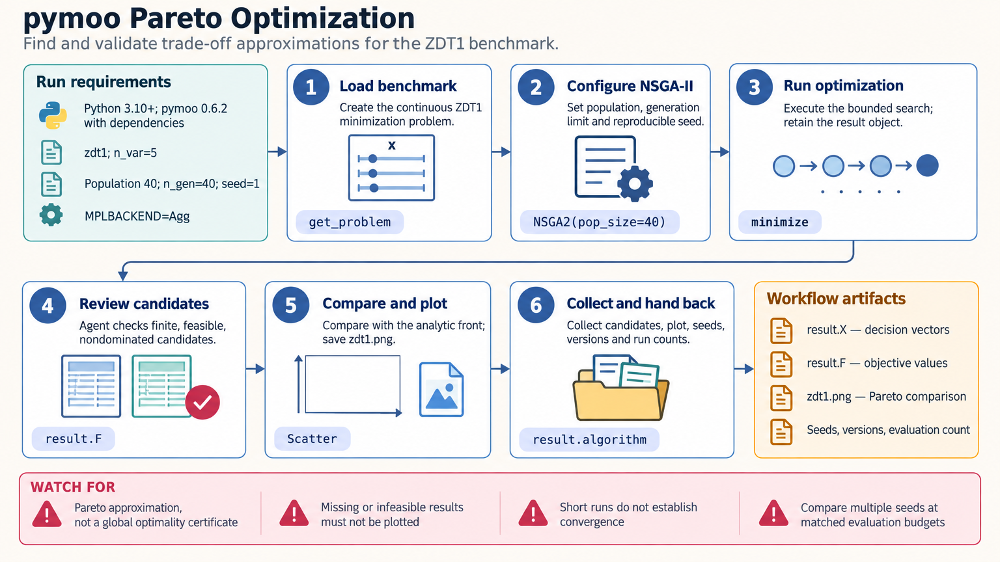

[All skill guides](README.md) / pymoo

# pymoo

**Explore feasible trade-offs when a research or engineering design has competing objectives.**

The pymoo skill guides optimization problems with one or several objectives, explicit constraints, and continuous or discrete decision variables. It helps an assistant define the mathematical problem, choose a search method, and examine candidate solutions. For multiple objectives, the result is usually a set of trade-offs for scientific judgment rather than one universally best design.

*From design requirements to a reviewed set of candidate trade-offs.
[View the full-size workflow diagram](../images/pymoo.png).*

## Questions this skill can help you explore

- **Which designs balance conflicting goals?** Examine trade-offs such as performance, material use, and operating cost.
- **Can a design satisfy all declared constraints?** Inspect the actual residuals and re-evaluate selected candidates.
- **How stable is the search result?** Compare seeds, budgets, algorithms, or benchmark behavior.

## What you bring

Provide decision variables with bounds and types, objective definitions and units, and all physical or practical constraints. Explain how each candidate is evaluated and the cost of a simulation or experiment.

State which objectives are minimized or maximized and what would make a candidate unacceptable. If a simulator is noisy, failed, or approximate, describe how that uncertainty enters the evaluation.

## How the analysis works

1. **Define the problem.** Separate decision variables, objective values, and constraints, recording any scaling or sign conversions.
2. **Choose a suitable search.** Match the algorithm and genetic operators to the number of objectives and variable types.
3. **Run with a documented budget.** Preserve random seeds, evaluation counts, stopping criteria, and relevant history.
4. **Inspect feasibility and stability.** Check constraint residuals and compare repeated searches before interpreting an apparent frontier.
5. **Select and recheck candidates.** Apply explicit preferences and evaluate chosen designs against the original physical constraints.

## What you get

| Output | What it helps you do |
| --- | --- |
| Candidate decision variables | Inspect designs proposed by the search. |
| Objective and constraint tables | Compare performance while retaining feasibility information. |
| Trade-off plots | See how improving one objective can worsen another. |
| Search records and comparisons | Evaluate sensitivity to method, seed, and computation budget. |

## Example request

> Use the pymoo skill to explore designs that trade off energy consumption and throughput. I will provide a simulator, variable bounds, and operating constraints. Compare feasible candidates across several search seeds, show the trade-off curve, and re-evaluate a small set of selected designs in the original units.

*This is an illustrative optimization request, not evidence that any design is feasible.*

## Interpreting the results

**A computed frontier is an approximation from the search.** It does not prove global optimality or that unexamined designs cannot perform better. Convergence measures and benchmark success do not replace checking the real problem.

A least-infeasible candidate may still violate constraints. Scaling objectives or constraints can affect the search and subsequent selection, so report original units and residuals. The preferred compromise depends on scientific or operational priorities that an optimization algorithm cannot determine for you.

## Get started

Local work uses Python and pymoo with its numerical and plotting dependencies. No service credentials are required. Installation needs network access; parallel runners, checkpointing, or additional algorithm wrappers may require optional packages.

[Setup and technical instructions](../../skills/pymoo/SKILL.md)
