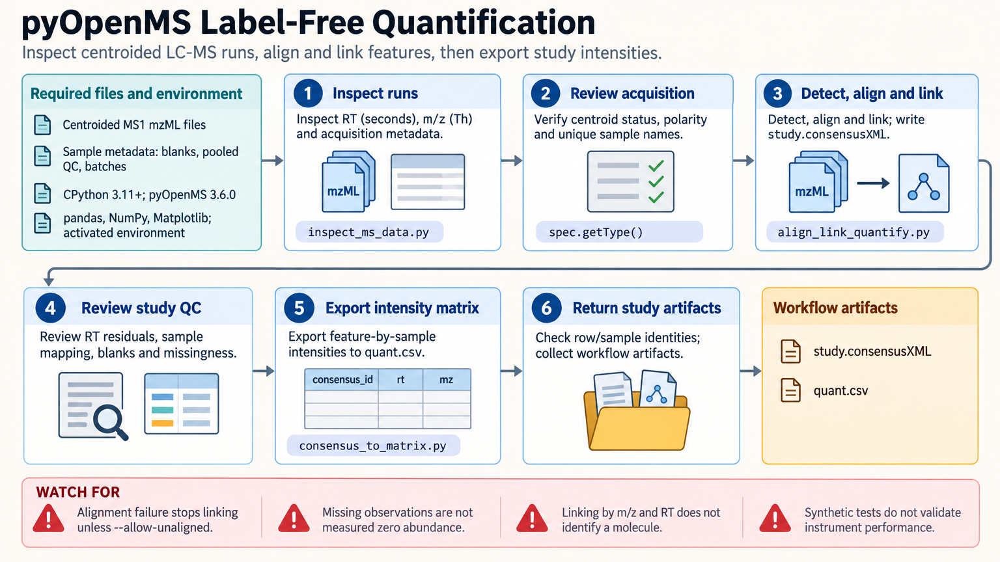

[All skill guides](README.md) / pyOpenMS

# pyOpenMS

**Turn mass-spectrometry files into inspected features, quantitative tables, and traceable annotations.**

The pyOpenMS skill supports proteomics and metabolomics data processing through Python bindings to OpenMS. It combines reusable workflows for inspecting spectra, detecting features, aligning runs, exporting intensity matrices, and reviewing identifications. It is useful when the analysis needs more than a simple comparison between two spectra.

*From LC–MS data to reviewed features and quantitative outputs.
[View the full-size workflow diagram](../images/pyopenms.png).*

## Questions this skill can help you explore

- **What signals and metadata are present?** Inspect spectra, retention-time ranges, chromatograms, and file contents.
- **Which features can be compared across samples?** Detect peaks, align retention times, link features, and export quantitative matrices.
- **What supports an annotation?** Review accurate-mass candidates, adduct groups, or peptide identifications with their relevant confidence measures.

## What you bring

Provide suitable mass-spectrometry files, sample metadata, instrument and acquisition information, and the analysis goal. Common supported formats include mzML, mzXML, featureXML, consensusXML, and identification files.

For identification processing, provide the search results, database provenance, score meaning and direction, and target–decoy labels. For accurate-mass annotation, supply appropriate local reference tables and mass tolerances.

## How the analysis works

1. **Inspect and prepare inputs.** Check file types, acquisition ranges, metadata, and whether signal processing or format conversion is needed.
2. **Process spectra deliberately.** Apply suitable smoothing, centroiding, normalization, or thresholds while retaining the choices made.
3. **Detect and connect features.** Find relevant signals, align runs, and link corresponding features across samples.
4. **Quantify or annotate.** Export intensities, inspect adduct relationships, or process search-derived peptide identifications.
5. **Review confidence and export.** Check the unit of error control and retain intermediate files, parameters, and plots for follow-up.

## What you get

| Output | What it helps you do |
| --- | --- |
| File summaries and chromatograms | Review acquisition coverage and signal behavior. |
| Feature and consensus files | Preserve detected and linked signals across runs. |
| Quantitative matrices | Prepare sample comparisons and downstream statistical analyses. |
| Annotation and identification tables | Evaluate candidate identities with stated supporting evidence. |

## Example request

> Use the pyOpenMS skill to process my LC–MS metabolomics runs. Inspect the files, detect features, align retention times, and export a sample intensity matrix. Record the processing settings, show representative chromatograms, and keep accurate-mass annotations distinct from confirmed compound identities.

*This is an illustrative workflow request, not a report of detected metabolites.*

## Interpreting the results

**A detected feature or mass match does not establish molecular identity.** Isomers, adducts, contaminants, and acquisition effects can complicate annotation. Thresholds and feature-finding settings need validation for the instrument and experiment.

For proteomics, peptide-spectrum-match error control is not automatically protein-level error control. Target–decoy labels, score direction, search pooling, and the unit being reported must be explicit. A quantitative matrix also needs appropriate biological replication and statistical modeling for condition comparisons.

## Get started

The workflow uses a compatible CPython installation, pyOpenMS, and numerical and plotting packages. Search-engine executables are separate dependencies. Local file processing needs no service credentials; installation and external reference retrieval require network access.

[Setup and technical instructions](../../skills/pyopenms/SKILL.md)
