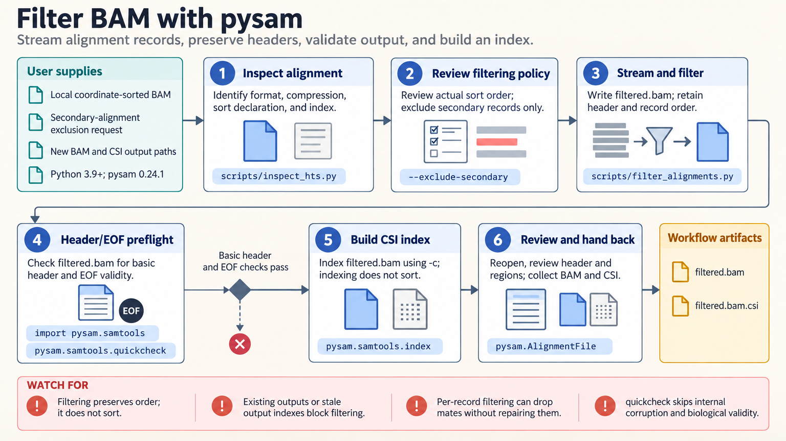

[All skill guides](README.md) / pysam

# pysam

**Inspect and manipulate genomic files with explicit coordinate, reference, and filtering conventions.**

The pysam skill helps an assistant work directly with sequencing alignments, variant calls, reference sequences, and indexed genomic tables. It is useful for focused region queries, streaming quality summaries, and preparing carefully filtered files. The guidance makes conventions visible so that a technically successful query does not silently examine the wrong bases or reads.

*From genomic files to documented queries and derivatives.
[View the full-size workflow diagram](../images/pysam.png).*

## Questions this skill can help you explore

- **What is in this sequencing file?** Inspect headers, references, available indexes, and aggregate alignment or variant properties.
- **Which records overlap a region?** Query indexed alignments, variants, sequences, or tabular annotations with consistent coordinates.
- **How does a filtering policy affect the data?** Retain reads under explicit flag and quality rules while preserving record order and headers.

## What you bring

Provide local SAM, BAM, CRAM, VCF, BCF, FASTA, FASTQ, or indexed tabular files as appropriate. Include indexes, assembly information, chromosome naming conventions, and the exact reference FASTA needed for CRAM decoding.

Define the regions and filtering rules: mapping quality, base quality, duplicate handling, secondary alignments, overlapping read pairs, and any pileup depth cap. State whether a summary covers the full file or a bounded subset.

## How the analysis works

1. **Inspect file contracts.** Confirm format, compression, sorting, headers, references, and available indexes.
2. **Resolve coordinates.** Distinguish zero-based, half-open numeric API coordinates from region-string conventions.
3. **Choose access deliberately.** Use indexed queries for regions or streaming iteration for an intended whole-file scan.
4. **Summarize or filter.** Apply declared semantics, preserve source metadata, and write derivatives to new paths.
5. **Check the outputs.** Confirm counts, ordering, headers, and index compatibility before downstream use.

## What you get

| Output | What it helps you do |
| --- | --- |
| File inspection report | Confirm format, references, and indexing before analysis. |
| Alignment or variant summaries | Review aggregate properties under stated inclusion rules. |
| Region-specific records | Prepare focused follow-up analyses with consistent coordinates. |
| Filtered genomic files | Share a documented subset while retaining necessary headers. |

## Example request

> Use the pysam skill to inspect my BAM files and summarize alignment quality over a supplied set of regions. Confirm the assembly and coordinate conventions, state how duplicates and secondary alignments are handled, and save any filtered files separately with their original headers preserved.

*This is an illustrative file-processing request, not a biological finding.*

## Interpreting the results

**Coverage depends on the counting rules.** Base quality, mapping quality, flags, paired-read overlap, and maximum depth can change a pileup without any change in the underlying sample.

Off-by-one coordinates and mismatched reference assemblies can produce plausible but incorrect results. A valid file or index does not establish that alignments or variant calls are biologically correct. These low-level summaries support, rather than replace, assay-specific quality assessment and downstream inference.

## Get started

Local workflows use Python and pysam. CRAM may additionally require an exact local reference or an explicitly configured reference cache. No credentials are needed for the bundled local helpers. Installation or deliberately configured remote data and reference access requires network availability.

[Setup and technical instructions](../../skills/pysam/SKILL.md)
