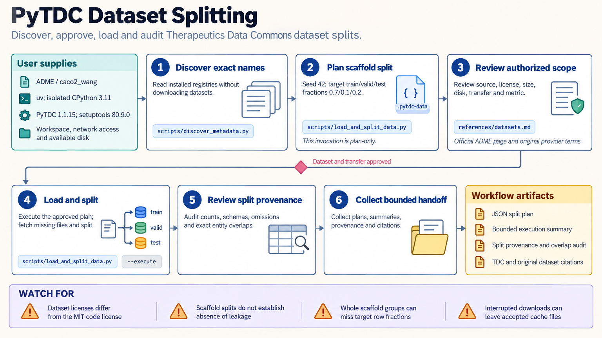

[All skill guides](README.md) / PyTDC

# PyTDC

**Choose and evaluate therapeutic machine-learning tasks with documented datasets, splits, and metrics.**

The PyTDC skill provides access to Therapeutics Data Commons datasets and benchmark conventions. It helps an assistant discover the installed task registry, plan data access, construct appropriate splits, and evaluate predictions. It also covers bounded molecular scoring, while keeping such scores distinct from experimental evidence about a compound.

*From a therapeutic prediction question to a reproducible benchmark workflow.
[View the full-size workflow diagram](../images/pytdc.png).*

## Questions this skill can help you explore

- **Which dataset matches the research task?** Discover therapeutic prediction tasks and inspect their labels and requirements.
- **What generalization claim does a split test?** Compare random, scaffold, entity-based, or time-based partitions where supported.
- **How should predictions be evaluated?** Use the task's prescribed metric with the correct shape, threshold, and direction.
- **What does a molecular score represent?** Evaluate supported local scoring functions under their stated assumptions.

## What you bring

Specify the scientific task, target or label, desired dataset, intended use, and computing and storage limits. Provide model predictions when evaluation is the goal, including their alignment with the reference rows.

For a new benchmark, explain what should be unseen at test time: molecules, scaffolds, targets, combinations, or later observations. Review dataset licenses and access requirements before downloading.

## How the analysis works

1. **Discover without downloading.** Inspect package metadata and available task, dataset, evaluator, and oracle names.
2. **Plan access and evaluation.** Record the exact resource, license, cache location, expected transfer, split, metric, and seed.
3. **Load the selected data.** Retrieve only the required dataset and inspect labels, row identity, and missing information.
4. **Audit the split.** Record partition sizes and relevant entity overlaps, including rows discarded by specialized split methods.
5. **Evaluate and preserve context.** Apply the benchmark's metric and retain versions, split parameters, predictions, and limitations.

## What you get

| Output | What it helps you do |
| --- | --- |
| Dataset and task plan | Select a resource appropriate to the scientific question. |
| Audited data partitions | Describe what the evaluation does and does not hold out. |
| Metric results | Compare predictions under a reproducible convention. |
| Bounded molecular scores | Inspect a defined computational property or model output. |

## Example request

> Use the PyTDC skill to identify a suitable molecular property benchmark. Before downloading, summarize its labels, license, storage needs, and prescribed metric. Prepare a split matching my intended generalization claim, audit molecular overlap, and evaluate my predictions without changing the benchmark definition.

*This is an illustrative benchmark request, not evidence of predictive performance.*

## Interpreting the results

**A scaffold split does not eliminate every form of leakage.** Analog similarity, duplicate records, shared provenance, and time relationships still need review. Specialized entity splits can discard rows and alter partition proportions.

Computational oracle scores do not establish efficacy, safety, or synthetic feasibility. PyTDC supplies datasets and scoring interfaces; the core workflow does not provide a generic molecule generator. Different evaluators can use different score directions and thresholds.

## Get started

The documented environment uses an isolated Python 3.11 installation with PyTDC and its compatibility dependencies. Dataset and checkpoint downloads require network access and disk space. Optional service or docking oracles have separate dependencies and access requirements.

[Setup and technical instructions](../../skills/pytdc/SKILL.md)
