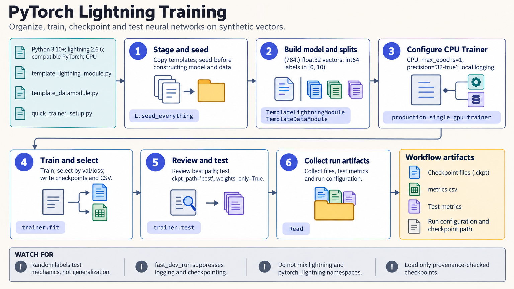

[All skill guides](README.md) / PyTorch Lightning

# PyTorch Lightning

**Organize neural-network experiments so training, validation, and saved models are easier to reproduce.**

The PyTorch Lightning skill helps structure a PyTorch research project into model logic, data preparation, training configuration, and evaluation. It supports checkpoints, callbacks, experiment logging, and scaling to suitable hardware. Its value is in making the computational experiment explicit; scientific validity still depends on the data, task, and evaluation design.

*From a neural-network prototype to an organized training experiment.
[View the full-size workflow diagram](../images/pytorch-lightning.png).*

## Questions this skill can help you explore

- **How can I make training easier to reproduce?** Separate model behavior, data processing, optimizer choices, and Trainer settings.
- **Which model checkpoint should be evaluated?** Use a declared validation criterion and preserve the selected weights and configuration.
- **How should computation scale?** Plan precision, accumulation, and distributed strategies around the actual hardware and model.

## What you bring

Provide the modeling task, dataset and split definitions, preprocessing rules, model architecture, loss function, and evaluation metrics. Include the available CPU or accelerator hardware, memory limits, and expected experiment size.

Specify whether logs should remain local or use an online tracking service. Explain the scientific unit of evaluation, such as patient, specimen, experimental run, or independent sequence.

## How it works

1. **Organize the model.** Define training, validation, test, and prediction behavior together with optimizer configuration.
2. **Separate the data pipeline.** Make preparation, splitting, transforms, and loaders explicit and reusable.
3. **Configure the run.** Choose device strategy, precision, callbacks, checkpoint policy, logging, and reproducibility settings.
4. **Check a small execution.** Inspect batch shapes, losses, metric names, and checkpoint behavior before a large training run.
5. **Train and evaluate.** Monitor validation, restore the intended checkpoint, and evaluate under the fixed study protocol.

## What you get

| Output | What it helps you do |
| --- | --- |
| Organized model and data components | Reuse the experiment without mixing data handling and training logic. |
| Training configuration | Review hardware, precision, optimization, and stopping choices. |
| Checkpoints and logs | Resume runs and trace which model was selected. |
| Evaluation and prediction outputs | Examine performance on the intended held-out data. |

## Example request

> Use the PyTorch Lightning skill to organize my image-classification prototype. Keep the existing patient-level data splits, make transforms and validation metrics explicit, save the checkpoint selected by validation loss, and begin with a small local run before preparing a configuration for my available GPU.

*This is an illustrative experiment-organization request, not a claim about model accuracy.*

## Interpreting the results

**A well-organized training loop does not prevent data leakage.** Splits, preprocessing, label construction, and model-selection decisions must respect the independent unit of the research question.

Changing batch size, precision, device count, or distributed sampling can change optimization and metric behavior. Successful CPU execution does not validate a multi-device configuration. Repeatedly consulting the test set during model development also changes what its reported performance means.

## Get started

The skill uses Python, the `lightning` distribution, and compatible PyTorch. Local CPU workflows need no network after installation. GPU and distributed methods require suitable hardware and supporting software. Optional online loggers require their own packages, network access, and credentials.

[Setup and technical instructions](../../skills/pytorch-lightning/SKILL.md)
