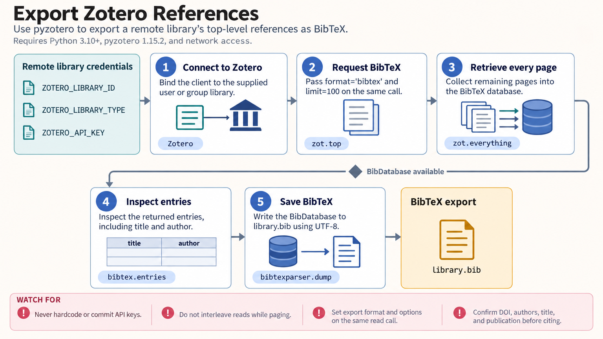

[All skill guides](README.md) / Pyzotero

# Pyzotero

**Organize and export a Zotero reference library with reviewable, item-level changes.**

The Pyzotero skill helps an assistant work with Zotero references, collections, tags, and attachments through its Python client. It supports finding existing literature records, exporting citations, and preparing or applying requested library updates. The workflow retains item identifiers and checks individual outcomes so a large library operation remains understandable.

*From a reference library to organized records and reusable citations.
[View the full-size workflow diagram](../images/pyzotero.png).*

## Tasks this skill can help you complete

- **Find references already in a library.** Search items, inspect collection membership, and retrieve the relevant bibliographic fields.
- **Prepare citations for writing.** Export references in supported formats such as BibTeX while preserving identifiers.
- **Organize a project collection.** Create or update records, collections, and tags under an explicit change request.
- **Manage attachments.** Associate files with the intended parent item and check the result of each requested operation.

## What you bring

Identify the Zotero library, whether it belongs to a user or a group, and the collection or items of interest. State the search criteria or exact organizational changes you want.

For new references, provide trustworthy bibliographic metadata and source identifiers. For attachments, provide the intended files and parent records. Access requirements depend on whether the workflow uses a public library, private remote library, or local Zotero installation.

## How it works

1. **Select the library and access method.** Confirm the correct user or group identity and appropriate read or write permissions.
2. **Retrieve the relevant records.** Handle pagination so the result covers the intended collection rather than only the first page.
3. **Inspect metadata and proposed changes.** Check item types, titles, authors, identifiers, collection membership, and existing versions.
4. **Export or update deliberately.** Use suitable templates for new items and preserve item keys when managing existing records.
5. **Verify individual outcomes.** Inspect successful, failed, and unchanged entries, then reconcile partial failures before retrying.

## What you get

| Output | What it helps you do |
| --- | --- |
| Retrieved reference records | Review the literature already captured in a project library. |
| Citation exports | Prepare bibliographies or manuscript inputs. |
| Organized collections and tags | Make related references easier to find. |
| Item-level operation report | Confirm which requested changes succeeded or need attention. |

## Example request

> Use the Pyzotero skill to inspect my project collection and export its references as BibTeX. Identify missing DOIs and inconsistent author fields for review. Prepare a list of proposed metadata corrections and preserve the Zotero item keys so I can trace each recommendation to the original record.

*This is an illustrative library-management request, not a completed literature review.*

## Interpreting the results

**A reference record is bibliographic metadata, not an appraisal of the study.** Accurate exports do not establish that a paper supports a particular claim, and missing identifiers may reflect incomplete records rather than missing publications.

A nonempty API response does not mean every item was created or updated successfully. Batch operations need item-level verification, and retries should target reconciled failures to avoid duplicate records.

## Get started

Use Python and pyzotero. Remote access requires network connectivity; private reads and remote writes require a Zotero API key. Local reads need a supported Zotero installation with its local API enabled. Local writes have additional version and authorization requirements described in the technical instructions.

[Setup and technical instructions](../../skills/pyzotero/SKILL.md)
