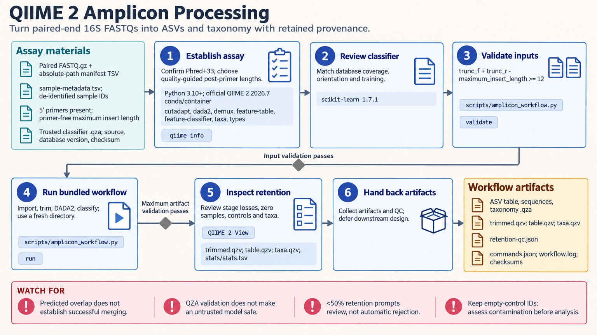

[All skill guides](README.md) / QIIME 2 amplicon analysis

# QIIME 2 amplicon analysis

**Process paired-end 16S reads into sequence variants and taxonomy while retaining analysis provenance.**

The QIIME 2 amplicon skill guides a bounded workflow from demultiplexed paired-end reads to amplicon sequence variants, or ASVs, and taxonomic assignments. It emphasizes primer orientation, read overlap, compatible classifiers, and per-sample read retention. The resulting artifacts preserve the processing history needed to review an amplicon study.

*Produce sequence variants and taxonomy with traceable processing and sample-level quality review. [View the full-size workflow diagram](../images/qiime2-amplicon.png).*

## Questions this skill can help you explore

- **Are the reads configured for the intended assay?** Check paired files, quality encoding, primer sequences, and sample identifiers.
- **Where are reads being lost?** Inspect trimming, denoising, merging, and chimera-removal stages separately.
- **Which taxa are supported by the sequence variants?** Apply an explicitly supplied classifier suited to the assay and reference database.

## What you bring

Provide demultiplexed paired-end FASTQ files, sample metadata, and a manifest linking samples to files. Include primers as sequenced in each direction, whether primers are still present, quality encoding, and the expected insert-length range.

Supply a trusted, compatible taxonomy classifier with its database version and provenance. Extraction blanks, PCR negatives, and a mock community are valuable inputs for interpreting contamination and pipeline behavior.

## How the analysis works

1. **Validate assay and inputs.** Check file pairs, sample IDs, primer orientation, runtime versions, and expected overlap after trimming.
2. **Import and trim.** Remove the specified primers when present, retaining a clear record of reads discarded at this stage.
3. **Denoise and merge.** Use DADA2 with truncation and error settings chosen from actual quality profiles.
4. **Assign taxonomy.** Apply the supplied classifier and retain ASV sequences, tables, and classification provenance.
5. **Review retention and controls.** Examine stage-specific losses, zero or missing samples, dominant taxa, and control behavior before ecological analysis.

## What you get

| Output | What it helps you do |
| --- | --- |
| ASV feature table and representative sequences | Prepare a reviewed foundation for downstream community analyses. |
| Taxonomy assignments | Explore sequence-supported taxonomic labels. |
| Read-retention reports | Identify where samples lose usable reads. |
| QIIME artifacts and visualizations | Preserve provenance and inspect quality, depth, and composition. |

## Example request

> Use the QIIME 2 amplicon skill to process my paired-end 16S study. I will provide primers, sample metadata, controls, and a compatible classifier. Check overlap after primer removal, choose truncation settings from quality profiles, and report read losses at each stage before proposing any downstream diversity analysis.

*This is an illustrative processing request, not a microbial-community result.*

## Interpreting the results

**Read counts are not absolute cell counts, and taxonomy is not strain identification.** Assay bias, contamination, database coverage, and classifier behavior affect the interpretation.

Predicted overlap does not guarantee successful read merging. A retention threshold is a review heuristic rather than a universal rejection rule. Diversity, rarefaction, and differential-abundance analyses require separate design choices; exports alone also lose the original artifact provenance graph.

## Get started

Execution requires the documented QIIME 2 distribution and relevant plugins, installed through its supported distribution channels rather than PyPI alone. Validation helpers use standard-library Python. Installation and classifier retrieval need network access; local processing requires no service credentials.

[Setup and technical instructions](../../skills/qiime2-amplicon/SKILL.md)
