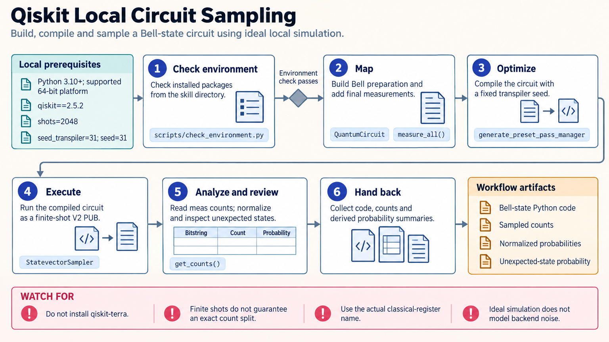

[All skill guides](README.md) / Qiskit

# Qiskit

**Develop quantum-circuit experiments with a clear distinction between simulation and hardware execution.**

The Qiskit skill guides circuit construction, observable definition, local simulation, backend-aware compilation, and IBM Quantum Runtime workflows. It helps an assistant connect the scientific quantity of interest to the correct execution interface and result interpretation. Local and noisy simulations can support preparation before any separately configured quantum-hardware workload.

*From a quantum-circuit question to target-aware execution and analysis.
[View the full-size workflow diagram](../images/qiskit.png).*

## Questions this skill can help you explore

- **What does this circuit predict ideally?** Obtain local statevector expectation values or finite-shot samples.
- **How might noise or hardware constraints affect it?** Use appropriate simulators and inspect the compiled circuit for a target backend.
- **How should an observable be measured?** Keep qubit layout, registers, and uncertainty aligned with the intended quantity.

## What you bring

Provide the circuit or scientific problem, initial state, parameters, observables, and the desired result type. State whether the goal is an exact ideal calculation, finite-shot sampling, noisy simulation, or an IBM QPU run.

For hardware-oriented work, include the intended backend, access entitlement, shot or precision requirements, and resource limits. Clarify how qubits and classical registers represent the scientific variables.

## How it works

1. **Map the problem.** Define a circuit and, when estimating expectation values, the relevant observables.
2. **Choose the execution path.** Select a local primitive, noisy simulator, or authorized hardware interface appropriate to the question.
3. **Compile for the target.** Transpile a parameterized circuit and apply the resulting layout to every observable.
4. **Execute with explicit settings.** Supply parameter arrays, shots or precision, and any mitigation choices through the supported interface.
5. **Interpret the results.** Read the correct classical registers and retain uncertainty, metadata, circuit details, and resource usage.

## What you get

| Output | What it helps you do |
| --- | --- |
| Circuit and observable definitions | Review how the scientific problem is encoded. |
| Target-compatible circuits | Inspect the operations and layout required for execution. |
| Samples or expectation values | Analyze the requested quantum measurement. |
| Execution metadata | Trace simulator, backend, settings, and resource use. |

## Example request

> Use the Qiskit skill to build a parameterized circuit for my proposed experiment. Start with ideal local expectation values, then prepare a target-aware version for a specified backend. Check that observable layouts remain correct, explain finite-shot uncertainty, and keep any hardware submission as an explicit later step.

*This is an illustrative workflow request, not a report of quantum-hardware results.*

## Interpreting the results

**Ideal simulation and QPU execution answer different questions.** A noise model captures selected assumptions and may not reproduce a device's actual behavior. Error mitigation also changes the estimator and its uncertainty; it does not establish an error-free computation.

Qubit ordering, register names, and transpilation layout can change how results must be read. A plausible numerical output is insufficient evidence that the intended observable was measured. Open-system master-equation dynamics usually need a different modeling workflow.

## Get started

Local work uses Python and Qiskit; noisy simulation additionally uses Qiskit Aer. IBM hardware access requires the Runtime package, network access, an IBM Quantum Platform account, and an API key. Other Qiskit ecosystem capabilities are separately installed packages.

[Setup and technical instructions](../../skills/qiskit/SKILL.md)
