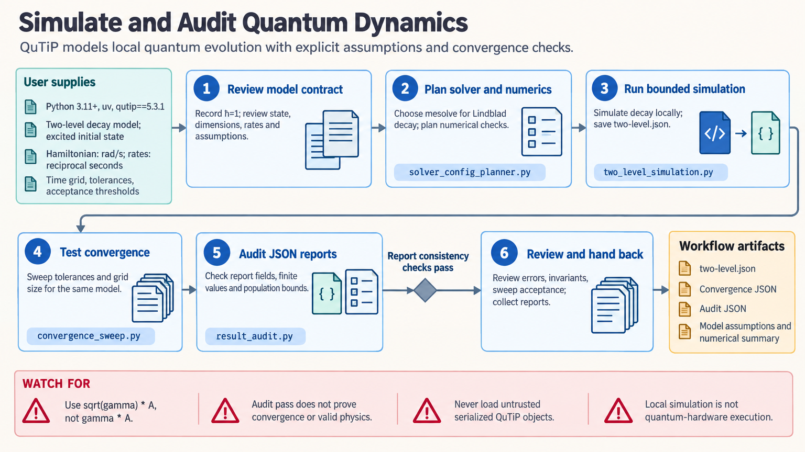

[All skill guides](README.md) / QuTiP

# QuTiP

**Simulate quantum dynamics while checking physical conventions and numerical convergence.**

The QuTiP skill supports local modeling of closed and open quantum systems, including state evolution, dissipative dynamics, trajectories, steady states, and spectra. It helps an assistant translate a physical model into consistent operators and select an appropriate solver. The workflow keeps approximation choices and artificial numerical cutoffs visible throughout the calculation.

*From a quantum-system model to checked local simulations.
[View the full-size workflow diagram](../images/qutip.png).*

## Questions this skill can help you explore

- **How does a state evolve?** Simulate closed evolution or specified dissipation and driving.
- **What stationary or spectral behavior follows from the model?** Examine steady states, correlations, spectra, and phase-space representations.
- **Are numerical choices affecting the answer?** Test Hilbert-space truncation, time grids, solver tolerances, and trajectory counts.

## What you bring

Provide the Hamiltonian, initial state, subsystem ordering, interactions, driving functions, and dissipative channels. State units and whether frequencies are angular or cyclic, and define what each relaxation or dephasing rate measures.

List the physical approximations, observables, simulation times, and required accuracy. For oscillator or hierarchical models, explain the truncation and bath representation to be investigated.

## How the analysis works

1. **Establish conventions.** Align units, tensor ordering, dimensions, states, operators, and rate definitions.
2. **Check physical validity.** Inspect normalization and, for density matrices, Hermiticity, trace, and positivity within stated tolerances.
3. **Select the solver.** Match deterministic, trajectory, steady-state, or specialized methods to the model's physics.
4. **Test numerical sensitivity.** Refine relevant cutoffs, integration settings, grids, or trajectory ensembles and inspect solver statistics.
5. **Report the model and results.** Preserve assumptions, environment, seeds, convergence evidence, and observable definitions.

## What you get

| Output | What it helps you do |
| --- | --- |
| State and observable trajectories | Examine the time dependence implied by the model. |
| Steady-state or spectral results | Explore stationary response and correlation structure. |
| Physical validity checks | Detect inconsistent states, dimensions, or generator conventions. |
| Convergence comparisons | Separate numerical sensitivity from modeled behavior. |

## Example request

> Use the QuTiP skill to simulate a driven dissipative two-level system. I will provide the Hamiltonian convention, relaxation and dephasing rates, and initial state. Check the collapse-operator definitions, compare solver tolerances and time grids, and explain which physical approximations limit the resulting population and coherence curves.

*This is an illustrative model request, not an experimental quantum-system result.*

## Interpreting the results

**A numerically stable solution can still describe the wrong physical model.** Confusing hertz with angular frequency, or using a rate rather than its square root in a collapse operator, changes the dynamics.

Approximations such as weak coupling, Markovian baths, secularization, and finite Hilbert-space truncation need physical justification. Agreement after one refinement is evidence about that numerical choice, not proof of all convergence. Specialized methods may introduce additional cutoffs that require their own checks.

## Get started

Local simulations use Python, QuTiP, NumPy, and SciPy. Plotting and optional family packages add dependencies. No remote service or credentials are used. Circuit, quantum-control, and experimental acceleration extensions have separate packages and validation boundaries.

[Setup and technical instructions](../../skills/qutip/SKILL.md)
