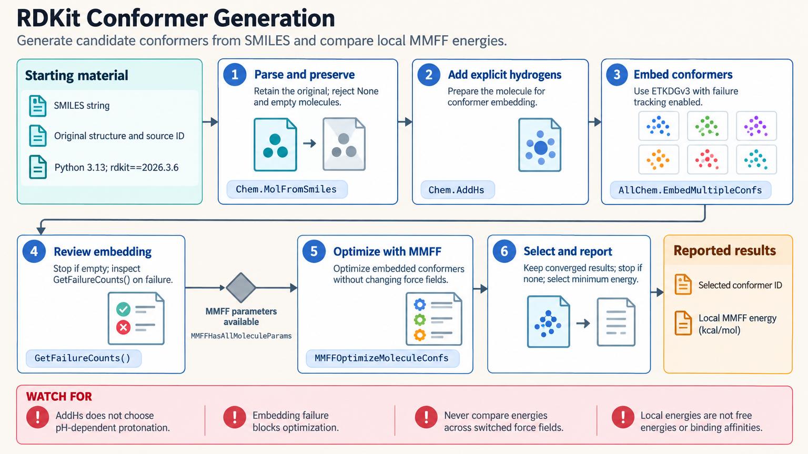

[All skill guides](README.md) / RDKit

# RDKit

**Inspect molecular structures and compute chemical representations while preserving their meaning.**

The RDKit skill provides fine-grained cheminformatics workflows for molecular files, descriptors, fingerprints, substructure matching, reactions, and coordinate generation. It helps an assistant make explicit decisions about chemical representation rather than silently treating every structure string as an interchangeable identifier. It is especially useful when custom molecular handling or detailed validation is needed.

*From molecular records to explicit chemical representations and research descriptors.
[View the full-size workflow diagram](../images/rdkit.png).*

## Questions this skill can help you explore

- **Are these molecular records usable?** Detect parsing and sanitization failures while preserving their source identifiers.
- **Which molecules share a pattern or representation?** Run SMARTS substructure queries or compare fingerprints under specified settings.
- **What calculated properties describe the collection?** Summarize descriptors such as molecular weight, polarity, or hydrogen-bond counts.
- **Can coordinates support a proposed analysis?** Generate depictions or conformers and check whether generation and optimization succeeded.

## What you bring

Provide molecular structures in a supported format such as SMILES or SDF, stable record identifiers, and the analysis purpose. Explain any policy for salts, protonation, tautomers, stereochemistry, and disconnected fragments.

For similarity or substructure work, specify the query and the chemical distinctions that matter. For three-dimensional work, identify the intended conformer or geometry use and any constraints.

## How the analysis works

1. **Parse and validate structures.** Record invalid or empty molecules without losing their original record positions and identifiers.
2. **Declare representation choices.** Preserve originals and make standardization or chemical transformations explicit.
3. **Run the selected calculation.** Compute descriptors, fingerprints, substructure matches, reactions, depictions, or conformers with documented parameters.
4. **Inspect failures and ambiguity.** Review sanitization, stereochemistry, fingerprint collisions, and failed embedding before further processing.
5. **Export traceable results.** Retain source identities, settings, versions, and the distinction between original and derived structures.

## What you get

| Output | What it helps you do |
| --- | --- |
| Validated molecular records | Identify usable structures and records needing correction. |
| Descriptor or fingerprint tables | Prepare chemical comparisons and downstream modeling. |
| Match and similarity results | Explore structural patterns under explicit definitions. |
| Depictions or conformers | Inspect molecules visually or prepare geometry-based work. |

## Example request

> Use the RDKit skill to inspect my compound collection and calculate descriptors. Preserve the original identifiers, flag invalid structures, and state how salts and stereochemistry are handled. Compare molecules with a documented fingerprint and explain why high similarity does not necessarily establish chemical identity.

*This is an illustrative cheminformatics request, not a compound-screening result.*

## Interpreting the results

**Canonical SMILES is not a complete standardization policy.** It does not choose protonation at a specified pH, merge tautomers, remove salts, or resolve unspecified stereochemistry. Adding hydrogens also does not make those choices automatically.

Fingerprint similarity is representation-dependent and can collide. Descriptor cutoffs, alerts, and drug-likeness scores are research heuristics rather than evidence of potency, safety, bioavailability, or synthesis feasibility. A generated conformer needs validation for its intended downstream use.

## Get started

The workflow uses Python and the RDKit package in a compatible environment. No credentials or network are required after installation. Binary availability varies by platform; the technical instructions describe supported package sources and reproducible setup.

[Setup and technical instructions](../../skills/rdkit/SKILL.md)
