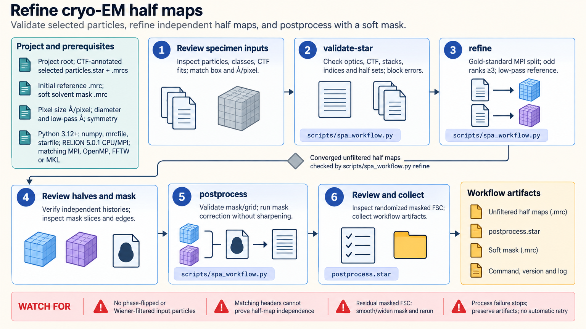

[All skill guides](README.md) / RELION

# RELION

**Refine a selected cryo-EM particle population and review the evidence behind map quality.**

The RELION skill guides a bounded single-particle workflow beginning with extracted, CTF-annotated particles and an initial three-dimensional reference. It checks acquisition metadata and particle stacks, supports gold-standard refinement, and reviews independent half maps and soft-mask postprocessing. It keeps reconstruction execution separate from the biological interpretation of a map.

*Trace a selected particle population through refinement and map-quality review without losing half-map independence. [View the full-size workflow diagram](../images/relion.png).*

## Questions this skill can help you explore

- **Are the refinement inputs internally consistent?** Check optics groups, particle references, stack dimensions, pixel size, and acquisition units.
- **What map is supported by the selected particles?** Refine a homogeneous population with justified symmetry and an appropriate initial reference.
- **How should map quality be assessed?** Review independent half maps, Fourier shell correlation, mask behavior, and additional resolution evidence.

## What you bring

Provide the RELION project, particle STAR file, referenced image stacks, acquisition and CTF metadata, and initial reference map. Include pixel size, specimen dimensions, justified symmetry, and any existing half-set assignments.

Explain prior particle extraction, normalization, selection, and resampling. The bounded runner assumes a compatible effective box and pixel size; it does not replace motion correction, picking, or population selection.

## How the analysis works

1. **Validate metadata and stacks.** Check optics membership, units, indices, duplicate particle references, boxes, and sampling.
2. **Review the selected population.** Inspect particles, class averages, CTF fits, orientations, and consistency with the starting map.
3. **Run gold-standard refinement.** Preserve independent particle half sets and record the refinement configuration and history.
4. **Inspect unfiltered half maps.** Check grids and diagnostic correlation while reviewing anisotropy and local resolution.
5. **Postprocess with a reviewed mask.** Use a suitable soft mask, inspect its slices, and examine mask-correction behavior before interpreting resolution or sharpening.

## What you get

| Output | What it helps you do |
| --- | --- |
| Input validation report | Resolve inconsistent metadata or particle-stack references. |
| Refined maps and job records | Trace the reconstruction of the selected particle population. |
| Half-map checks and diagnostic FSC | Review independent evidence for reproducible map features. |
| Postprocessing artifacts | Inspect mask-corrected quality measures and downstream map preparation. |

## Example request

> Use the RELION skill to review my extracted-particle refinement inputs. Check optics groups, acquisition units, stack references, and half-set assignments. After refinement, inspect the independent unfiltered half maps and a proposed soft mask, and explain the limits of the reported global resolution.

*This is an illustrative reconstruction request, not a resolution claim.*

## Interpreting the results

**Matching map headers do not establish half-map independence.** That evidence comes from particle assignments and refinement history. Two derivatives of one combined map cannot substitute for independent half maps.

A tight or inappropriate mask can inflate correlation. Global FSC does not summarize local resolution, directional anisotropy, absolute handedness, or biological correctness. The bundled diagnostic FSC is not a substitute for RELION's mask-corrected postprocessing, and this workflow is not a general tomography or heterogeneous-state pipeline.

## Get started

Validation uses Python with NumPy, mrcfile, and starfile. Refinement requires the documented RELION executables and their MPI, OpenMP, and numerical-library environment. GPU operation needs a suitable accelerator build. Installation requires network access; local processing needs no service credentials.

[Setup and technical instructions](../../skills/relion/SKILL.md)
