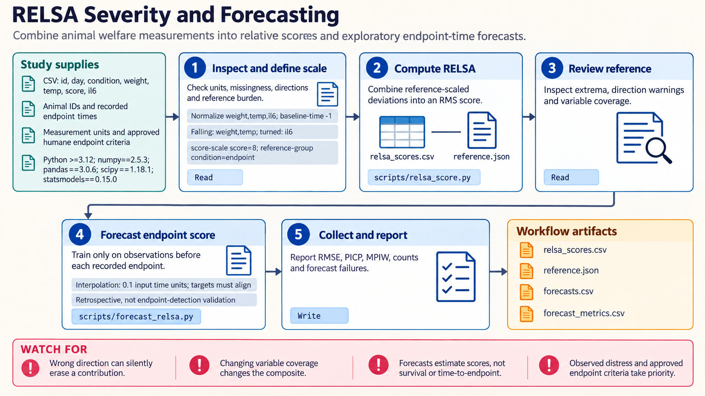

[All skill guides](README.md) / RELSA severity assessment

# RELSA severity assessment

**Combine animal-welfare measurements on a documented relative scale and inspect exploratory score forecasts.**

The RELSA skill supports multivariate severity assessment by combining directional changes in welfare readouts, such as body weight, activity, temperature, and clinical scores. It also supports exploratory forecasts of a score at a specified future observation time. The reference cohort, variable definitions, and approved observation and endpoint criteria remain central to interpretation.

*From documented welfare readouts to reference-relative scores and cautious forecasting.
[View the full-size workflow diagram](../images/relsa-severity-assessment.png).*

## Questions this skill can help you explore

- **How do several welfare readouts change together?** Summarize a fixed panel using an explicit baseline and direction of worsening.
- **Can cohorts be compared on the same scale?** Reuse a characterized reference and the same measurement and encoding choices.
- **What might the score be at the next specified observation?** Examine an exploratory forecast and its prediction interval.

## What you bring

Provide per-animal longitudinal measurements, identifiers, observation times, group information, baseline definitions, and a scientifically characterized reference cohort. State whether each variable rises or falls with worsening in this model.

Explain ordinal scoring scales, zero baselines, missing measurements, and the approved monitoring and humane-endpoint criteria. Use a consistent panel where possible; adding or removing variables can change the composite score without a biological change.

## How the analysis works

1. **Define the scale.** Record baseline normalization, worsening directions, ordinal encodings, and the reference set.
2. **Calculate relative scores.** Combine deviations using the chosen reference maxima while preserving animal and time identifiers.
3. **Inspect comparability.** Review missingness, changing variable panels, and whether later cohorts use the same frozen reference.
4. **Explore forecasts or zones.** When justified, forecast a score at a named time or inspect data-derived severity zones.
5. **Report limitations.** Keep observed welfare, approved endpoints, prediction intervals, and the score's relative interpretation visible.

## What you get

| Output | What it helps you do |
| --- | --- |
| Per-animal score trajectories | Summarize measured worsening across a defined panel. |
| Saved reference and normalization settings | Maintain a consistent scale for later comparisons. |
| Exploratory forecasts and intervals | Review uncertainty about a specified future score. |
| Evaluation or zone summaries | Inspect forecast behavior and proposed descriptive thresholds. |

## Example request

> Use the RELSA skill to summarize my study's recorded welfare measures. I will provide the reference cohort, baseline rules, and approved endpoint criteria. Check directionality and missingness, preserve one scale across cohorts, and clearly separate any next-observation score forecast from the study's welfare decisions.

*This is an illustrative analytical request, not an assessment of any animal.*

## Interpreting the results

**Observed distress and approved humane endpoints take precedence over the score.** A low score cannot justify delaying care. Zero indicates no measured worsening in the selected directions, not normal welfare; one is a relative scale unit, not a universal endpoint.

Forecasts concern a score at a specified time, not time-to-endpoint or death probability. Data-derived zones are not official severity categories. The Python forecasting helper is an independent approximation, and comparisons require consistent reference, variables, encoding, and measurement methods.

## Get started

Local analysis uses Python with NumPy, pandas, SciPy, statsmodels, and Matplotlib. No credentials or network are needed after installation. Prepare the study's measurement definitions and approved monitoring context before interpreting calculated scores.

[Setup and technical instructions](../../skills/relsa-severity-assessment/SKILL.md)
