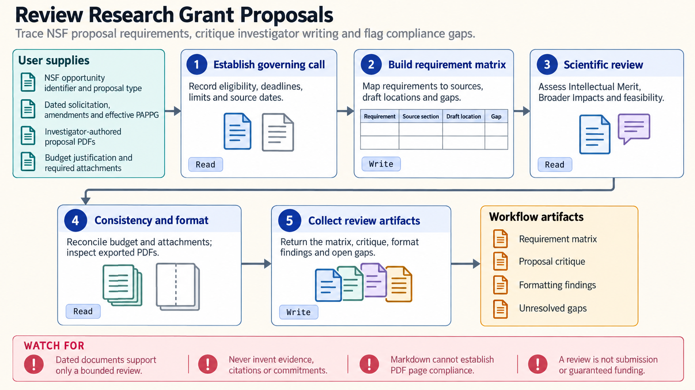

[All skill guides](README.md) / Research grants

# Research grants

**Develop a proposal around the actual funding opportunity, scientific plan, and review criteria.**

The research-grants skill supports investigator-authored proposal preparation and review across several research funders. It helps connect aims, methods, feasibility, budgets, and required attachments to an opportunity's instructions. The central deliverable is a clear, traceable proposal package whose unresolved scientific and submission requirements remain visible.

*From a funding opportunity and research plan to a reviewable proposal package.
[View the full-size workflow diagram](../images/research-grants.png).*

## Tasks this skill can help you complete

- **Understand an opportunity's requirements.** Identify eligibility, stages, limits, attachments, deadlines, and review criteria from official documents.
- **Strengthen an investigator-authored narrative.** Examine whether aims, significance, methods, risks, and milestones fit together.
- **Check budget and project consistency.** Relate requested resources and personnel to the proposed work.
- **Prepare a resubmission response.** Track reviewer concerns and the changes made to address them.

## What you bring

Provide the official opportunity identifier and instructions, any amendments, submission stage, deadline, and investigator-authored scientific material. Include preliminary data, the proposed methods, team roles, resources, timeline, and budget assumptions.

Identify the funder and applicable authorship or AI-use policies. Missing commitments, approvals, preliminary results, or investigator records should be marked unresolved rather than replaced by plausible prose.

## How it works

1. **Establish the governing documents.** Record the exact opportunity, amendments, form versions, source dates, and submission requirements.
2. **Map requirements to the draft.** Build a matrix linking each requirement to its source, proposal location, and remaining gap.
3. **Review the scientific argument.** Check the relationship between the question, aims, approach, alternatives, feasibility, and expected contribution.
4. **Reconcile the project package.** Align budget, personnel, facilities, milestones, supporting material, and any response to reviewers.
5. **Inspect the final files.** Review exported formatting and page limits alongside scientific and institutional approval needs.

## What you get

| Output | What it helps you do |
| --- | --- |
| Opportunity and requirement matrix | Track the rules that apply to this particular proposal. |
| Structured critique and revisions | Improve clarity and consistency of investigator-authored material. |
| Timeline and budget review | Connect requested resources to the work plan. |
| Submission-gap checklist | Identify unresolved attachments, approvals, and formatting issues. |

## Example request

> Use the research-grants skill to review my investigator-authored proposal against this official opportunity. Map each requirement to the draft, identify gaps in the aims and feasibility argument, reconcile the work plan with the budget, and keep any missing commitments or approvals explicit.

*This is an illustrative proposal-review request, not a funding prediction.*

## Interpreting the results

**A persuasive proposal is not evidence that the planned science will succeed.** Preliminary findings, feasibility claims, and partner commitments must come from the investigators' records. A completed checklist also does not establish eligibility or formal compliance.

Funder instructions and permitted assistance vary by opportunity and date. The checked-in skill limits its NIH workflow to requirements, critique, consistency checks, and limited editing of investigator-authored material. Templates are illustrative worksheets, and a Markdown draft cannot establish the page count of the final submission.

## Get started

Core work uses supplied proposal material and official requirements. Network access is needed to verify current opportunities unless a bounded review uses dated official documents. Optional generated figures require separate image-generation dependencies and credentials.

[Setup and technical instructions](../../skills/research-grants/SKILL.md)
