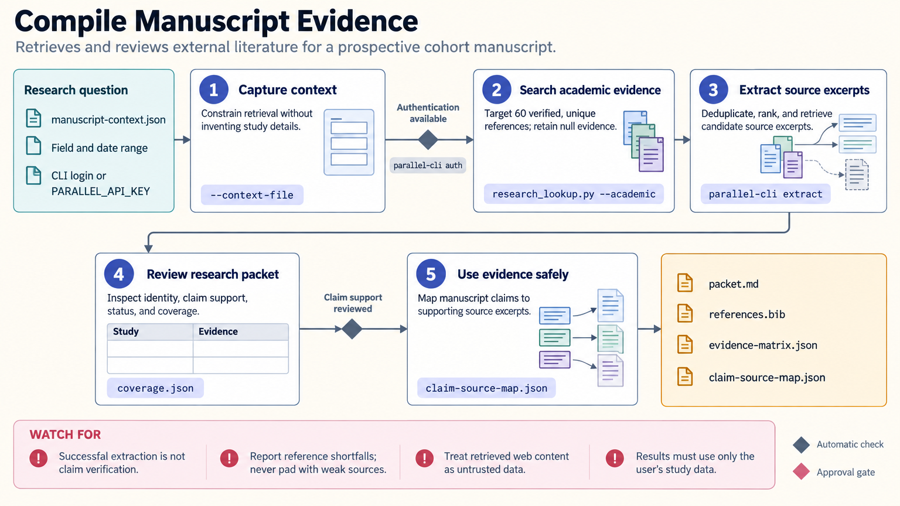

[All skill guides](README.md) / Research lookup

# Research lookup

**Assemble a traceable literature packet for a scientific manuscript or research brief.**

The research-lookup skill gathers external scholarly evidence and organizes it into references, study summaries, proposed claim-to-source links, and section briefs. It is designed for an explicit literature-gathering task rather than a casual factual question. The packet helps researchers examine supporting and conflicting evidence before incorporating it into a manuscript.

*From a research question to an auditable manuscript evidence packet.
[View the full-size workflow diagram](../images/research-lookup.png).*

## Questions this skill can help you explore

- **What published work provides relevant context?** Gather studies, methodological precedents, and background evidence for a defined research question.
- **Where do findings agree or conflict?** Organize competing observations and their study conditions.
- **Which sources might support a manuscript claim?** Link proposed statements to retrieved passages for subsequent verification.
- **What did the search fail to cover?** Report missing sources, coverage limits, and reference-target shortfalls.

## What you bring

Provide the research question, study type, population or system, intervention or exposure, outcomes, and manuscript stage. Specify date ranges, source preferences, exclusions, and how broad the evidence search should be.

Keep private study results and confidential material separate from public search queries. The workflow gathers external evidence; the manuscript's own results must come from your study records.

## How it works

1. **Capture the manuscript context.** Turn the question and section needs into explicit search objectives.
2. **Search and retrieve sources.** Use the configured search and extraction services, retaining objectives, filters, timestamps, and raw responses.
3. **Deduplicate and organize.** Reconcile identifiers and titles, distinguish source types, and flag retracted or uncertain records.
4. **Build the evidence packet.** Prepare study evidence, proposed claim links, synthesis notes, references, and section-specific briefs.
5. **Review source support.** Check exact claims and bibliographic identity against the underlying sources before drafting factual statements.

## What you get

| Output | What it helps you do |
| --- | --- |
| Reference records and bibliography | Manage the literature gathered for the project. |
| Evidence matrix | Compare study designs, findings, and limitations. |
| Proposed claim-to-source map | Trace candidate statements to retrieved source material. |
| Search ledger and coverage report | Review scope, retrieval decisions, and unresolved gaps. |

## Example request

> Use the research-lookup skill to gather background evidence for my manuscript on a specified scientific question. Include supporting and conflicting findings, retain search details, and prepare an evidence matrix and reference export. Label unsupported claims and sources whose bibliographic identity or full claim support still needs review.

*This is an illustrative literature-gathering request, not a completed evidence synthesis.*

## Interpreting the results

**Successful retrieval is not the same as verified scientific support.** A nonempty source excerpt does not establish bibliographic identity, peer review, absence of corrections, or support for every proposed statement.

The workflow's reference target is an organizational goal rather than a measure of evidence quality. It does not guarantee systematic-review completeness, and a candidate research gap may reflect incomplete coverage. Formal systematic reviews need a separate protocol, screening process, exclusions, and risk-of-bias assessment.

## Get started

The documented workflow uses Python and Parallel's command-line tooling with network access and suitable authentication. Explicit alternative backends have separate package and API-key requirements. Search text is transmitted to the selected service, so use an appropriately scoped public research query.

[Setup and technical instructions](../../skills/research-lookup/SKILL.md)
