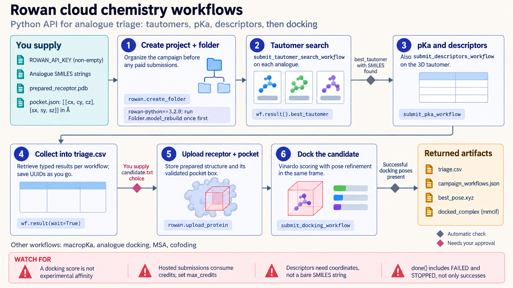

[All skill guides](README.md) / Rowan

# Rowan

**Run hosted molecular-modeling workflows with explicit chemical inputs and result provenance.**

The Rowan skill helps an assistant use a cloud molecular-modeling platform for property prediction, conformer and tautomer ensembles, docking, protein–ligand workflows, and related calculations. It supports programmatic batches and multi-step campaigns. The workflow makes method choice, molecular representation, hosted computation, and interpretation part of the research plan.

*From documented molecular structures to organized hosted modeling results.
[View the full-size workflow diagram](../images/rowan.png).*

## Questions this skill can help you explore

- **Which molecular states should be considered?** Explore conformers, tautomers, or protonation-related predictions with a suitable method.
- **What properties does a selected model predict?** Request supported pKa, permeability, descriptor, or other property workflows.
- **How might a ligand interact with a protein?** Prepare a docking, analogue-docking, or cofolding workflow appropriate to the available structures.
- **How can a modeling campaign stay traceable?** Organize batches, identifiers, settings, and retrieved results together.

## What you bring

Provide molecular identifiers and supported structures, with stereochemistry, charge, protonation state, and geometry where required. Topology-based and geometry-based methods need different inputs; a SMILES string is not interchangeable with a prepared three-dimensional structure.

For protein work, include the relevant structure or sequence and preparation decisions. Specify the scientific objective, method, batch size, account access, and computation budget.

## How it works

1. **Define chemical inputs.** Preserve original structures and make charge, stereochemistry, protonation, and preparation assumptions explicit.
2. **Choose the supported method.** Match the scientific task and input representation to an available workflow and its applicability limits.
3. **Plan and submit hosted work.** Record configuration, project organization, and resource expectations before launching calculations.
4. **Monitor and retrieve results.** Track job status and obtain structured outputs using the appropriate result interface.
5. **Inspect and compare.** Review failures, units, ensemble choices, and method assumptions before ranking candidates or linking workflow stages.

## What you get

| Output | What it helps you do |
| --- | --- |
| Property predictions | Examine model-based quantities for documented molecular inputs. |
| Conformer or tautomer ensembles | Review alternative molecular states for further modeling. |
| Docking or structure-workflow outputs | Inspect candidate poses and configurations. |
| Job and project records | Trace batches, parameters, status, and result provenance. |

## Example request

> Use the Rowan skill to plan a hosted conformer and property-prediction campaign for my compound series. Check which methods accept my supplied structures, record protonation and stereochemistry choices, estimate the submission scope, and keep failed calculations and method limitations visible in the resulting comparison.

*This is an illustrative modeling request, not a report of predicted compound behavior.*

## Interpreting the results

**A hosted calculation remains conditional on its model and molecular preparation.** Canonicalization does not resolve protonation, tautomerism, stereochemistry, or the applicability of a chosen engine.

Docking poses and predicted properties are research hypotheses rather than evidence of binding, efficacy, or experimental performance. Account-dependent workflow availability and charged computation also need to be considered when planning batches. The checked-in examples do not establish authenticated service execution for every workflow.

## Get started

Use Python with rowan-python and its molecular dependencies. Hosted workflows require network access, a `ROWAN_API_KEY`, and suitable account access or credits. Preserve the software environment and chosen methods for a reproducible campaign.

[Setup and technical instructions](../../skills/rowan/SKILL.md)
