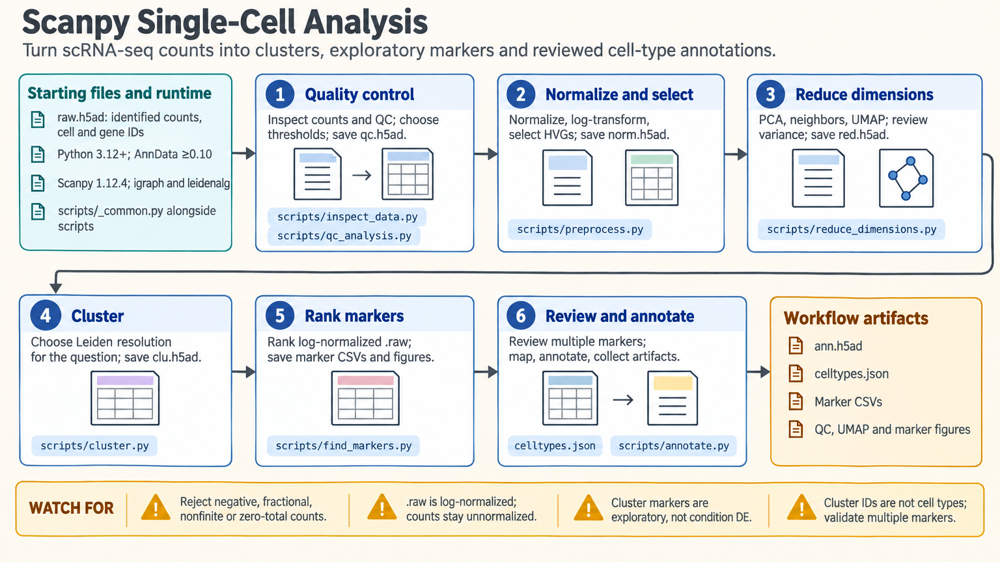

[All skill guides](README.md) / Scanpy

# Scanpy

**Turn single-cell gene expression data into a clearer picture of your cell populations.**

Single-cell RNA sequencing measures gene expression in individual cells. The Scanpy
skill guides an AI research assistant through exploring those measurements: checking
data quality, grouping cells with similar expression patterns, finding genes that
distinguish those groups, and supporting cell type assignments with biological evidence.
It combines analysis instructions with reusable scripts and plotting guidance.

*From gene counts to reviewed cell populations, with figures and data saved along the way.
[View the full-size workflow diagram](../images/scanpy.png).*

## Questions this skill can help you explore

- **Which cell populations are present?** Identify groups of similar cells and examine
  known marker genes to propose cell type labels.
- **What distinguishes one population from another?** Rank genes associated with each
  group and visualize their expression.
- **Could technical differences explain the patterns?** Inspect sample quality and
  differences between experimental batches before interpreting clusters biologically.
- **How can I prepare for a treatment comparison?** Sum original gene counts by
  biological sample and cell type, producing “pseudobulk” data for a subsequent
  statistical analysis.

## What you bring

Start with a **gene-count matrix**—a table of counts for each gene in each cell—with
cell and gene identifiers. Include sample, donor, tissue, treatment, and batch information
where relevant, plus the organism and any known cell markers.

The skill supports common inputs such as **10x Genomics files** and **AnnData (`.h5ad`)**
files. Existing Seurat or SingleCellExperiment objects can be used after an R conversion
step. If the data have already been processed, identify where the original counts are
stored and describe the steps already performed.

## How the analysis works

1. **Check the measurements.** Inspect gene counts, detected genes, and mitochondrial
   RNA fractions. Choose filtering thresholds appropriate to the tissue and experiment;
   optionally check for droplets containing more than one cell.
2. **Prepare the expression data.** Normalize counts, transform expression values, and
   select informative genes while retaining original counts for later analyses.
3. **Explore cell populations.** Summarize expression patterns, build a map such as
   UMAP, and group similar cells. Examine how the groups change with clustering settings.
4. **Interpret the groups.** Rank candidate marker genes and review multiple markers
   against the organism, tissue, and experimental context before assigning cell types.
5. **Save results for follow-up.** Export the processed dataset, figures, and marker
   tables. When needed, prepare counts grouped by sample and cell type for comparisons
   between conditions.

## What you get

| Output | What it helps you do |
| --- | --- |
| Quality-control plots | Review which cells were retained and whether filtering choices are reasonable. |
| Cell maps, including UMAP plots | Explore expression patterns, clusters, and their relationship to sample metadata. |
| Marker-gene tables and expression plots | Evaluate candidate cell identities and select genes for follow-up. |
| A processed `.h5ad` dataset | Reopen the analysis with expression data, metadata, clusters, and reviewed annotations together. |
| Optional pseudobulk count tables | Prepare sample-level inputs for a separate differential-expression analysis. |

## Example request

> Use the Scanpy skill to explore my single-cell RNA-seq data from human blood.
> I have 10x count files and a metadata table identifying each donor and batch.
> Check data quality, explain the filtering choices, group similar cells, and
> propose immune cell types using multiple marker genes. Save the processed
> dataset, quality-control plots, UMAP plots, and marker tables. Flag ambiguous
> cell labels and patterns that may reflect batch effects.

*This is an example of a research request, not a reported experimental result.*

## Interpreting the results

**Clusters are starting points for biological interpretation.** A cluster number does
not establish a cell type, and marker rankings from those same cells are exploratory.
Cell labels need supporting markers and review in the context of your experiment.

**Treatment comparisons need biological replication.** Thousands of cells from one
donor do not replace independent donors. Pseudobulk preparation preserves the sample
as the unit of comparison; the subsequent statistical model must account for the study
design. Batch correction also needs review because it can remove biological variation.

## Get started

The core workflow runs locally with Python, Scanpy, and AnnData, without service
credentials. The bundled scripts load data into memory, so larger datasets may need
subsetting or a separately planned workflow. Optional integration methods and conversion
from R objects require additional packages.

[Setup and technical instructions](../../skills/scanpy/SKILL.md) ·
[Detailed analysis workflow](../../skills/scanpy/references/analysis_workflow.md) ·
[Plotting guide](../../skills/scanpy/references/plotting_guide.md)
