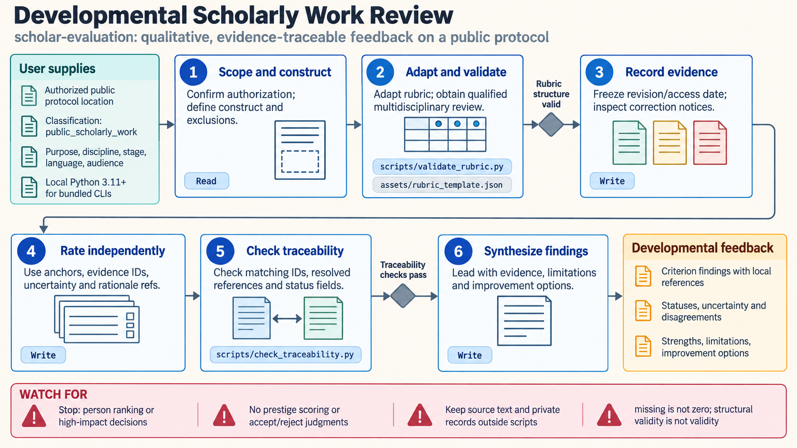

[All skill guides](README.md) / Scholar evaluation

# Scholar evaluation

**Give a scholarly work constructive feedback that can be traced to its evidence.**

The scholar-evaluation skill supports developmental review of a paper, draft, protocol, synthesis, or research idea. It starts with qualitative judgment and can audit a bounded, low-stakes rubric when structured ratings are useful. The focus is the work's documented reasoning and evidence, with uncertainty and disagreement preserved.

*From a scholarly work to evidence-traceable developmental feedback.
[View the full-size workflow diagram](../images/scholar-evaluation.png).*

## Questions this skill can help you explore

- **What is clear, supported, or unresolved in this work?** Identify strengths and specific opportunities for improvement.
- **Do review criteria measure the intended construct?** Examine definitions, anchors, evidence requirements, and inappropriate proxies.
- **Where do reviewers disagree?** Retain independent judgments and inspect whether differences reflect missing evidence or differing interpretations.
- **How sensitive is a rubric summary?** Explore stated weight choices without treating numerical stability as validation.

## What you bring

Provide the scholarly work and the purpose of a developmental review. Identify the scientific question, intended audience, relevant source locations, and any predeclared criteria.

For optional local tooling, use bounded ratings and pseudonymous identifiers linked to authorized local evidence records. Keep raw private applications, personal records, reviewer identities, and sensitive source text out of the tooling inputs.

## How the review works

1. **Define the permitted review.** Establish that the task concerns constructive feedback on a work or a low-stakes process audit.
2. **Specify the construct and criteria.** Describe what each criterion means, what evidence supports it, and where uncertainty should remain.
3. **Build traceable observations.** Link strengths, concerns, and missing information to specific source locations.
4. **Review independently and check quality.** Preserve raw ratings where used, inspect disagreement, and examine sensitivity and traceability.
5. **Synthesize constructive findings.** Report criterion-level evidence, uncertainty, and feasible improvements for qualified human review.

## What you get

| Output | What it helps you do |
| --- | --- |
| Evidence-linked comments | Locate and act on specific strengths or weaknesses. |
| Defined review rubric | Make the meaning of optional criteria and ratings transparent. |
| Disagreement and sensitivity summaries | Understand where judgments depend on assumptions. |
| Developmental review report | Prioritize improvements without reducing the work to an opaque score. |

## Example request

> Use the scholar-evaluation skill to give developmental feedback on my research protocol. Focus on the clarity of the question, connection between methods and claims, and unresolved evidence. Link comments to the draft, preserve uncertainty, and recommend concrete revisions without issuing an acceptance judgment or ranking authors.

*This is an illustrative feedback request, not a formal assessment decision.*

## Interpreting the results

**Rubric scores are ordinal summaries, not natural measurements of quality.** Weighted averages assume meaningful spacing and trade-offs, and an uncertainty range from the helper is not a confidence interval. Agreement and sensitivity checks do not establish validity or fairness.

The skill excludes ranking people, consequential personnel or funding decisions, and publication acceptance or readiness judgments. Journal prestige, citation counts, affiliations, and reputation are not substitutes for evaluating the submitted evidence. Its referenced research framework is experimental rather than validated psychometrics.

## Get started

Core review uses the supplied work and transparent criteria. Optional local checks use standard-library Python and strict JSON or CSV inputs. They make no network or external-model calls and require no credentials.

[Setup and technical instructions](../../skills/scholar-evaluation/SKILL.md)
