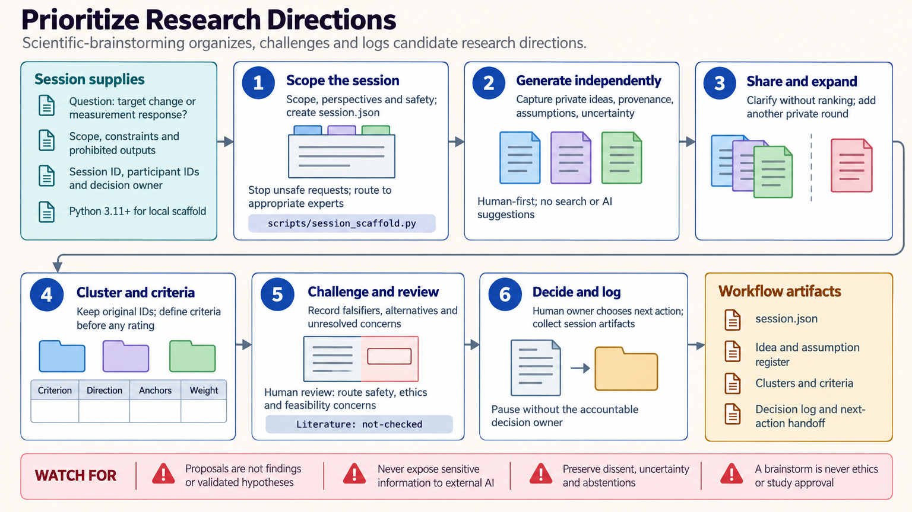

[All skill guides](README.md) / Scientific brainstorming

# Scientific brainstorming

**Create and challenge research ideas while keeping assumptions, evidence, and decisions distinct.**

The scientific-brainstorming skill structures early-stage scientific ideation. It helps an assistant or research group generate candidate explanations and directions, organize them without losing minority views, and compare them using explicit criteria. The result is a documented set of proposals and next questions, not a validation of the ideas themselves.

*From an open research question to a traceable set of candidate directions.
[View the full-size workflow diagram](../images/scientific-brainstorming.png).*

## Questions this skill can help you explore

- **What alternative explanations or approaches are worth considering?** Generate ideas before committing to the first attractive mechanism or method.
- **Which assumptions make an idea work?** Identify predicted observations, hidden dependencies, and possible disconfirming evidence.
- **What would a useful next test distinguish?** Favor informative comparisons and clarify what a null result would teach.
- **Why were some directions prioritized?** Preserve criteria, reasons, disagreements, and the decision context.

## What you bring

Provide a focal question, current observations or knowledge, project constraints, decision owner, and time horizon. Distinguish fixed constraints from assumptions that could be challenged.

Describe relevant perspectives and missing expertise. Identify sensitive information and any topic requiring ethical, clinical, regulatory, or institutional review so a brainstorm remains within its appropriate scope.

## How it works

1. **Scope the session.** Define the purpose, boundaries, constraints, and unresolved observations.
2. **Generate independently.** Capture ideas before participants see one another's proposals, reducing avoidable anchoring and dominance.
3. **Share and organize.** Clarify ideas and group them by a stated relationship while preserving original identifiers and meaningful distinctions.
4. **Check evidence and challenge assumptions.** Review relevant literature, reopen ideation, and ask what would make each promising idea wrong or uninformative.
5. **Prioritize transparently.** Apply declared criteria, retain uncertainty and dissent, and record a shortlist with the next evidence needed.

## What you get

| Output | What it helps you do |
| --- | --- |
| Idea register | Preserve proposals, origins, assumptions, and predictions. |
| Organized alternatives | Compare mechanisms or methods without silently merging distinct ideas. |
| Adversarial review notes | Expose confounders, failure modes, and disconfirming observations. |
| Decision log and next questions | Explain priorities and prepare a subsequent study-design discussion. |

## Example request

> Use the scientific-brainstorming skill to explore explanations for an unexpected result in my experiment. Start with independent alternatives, label assumptions and predictions, and then check relevant evidence. Compare candidate follow-up directions by information gained, feasibility, and what a negative result would teach, preserving disagreements.

*This is an illustrative ideation request, not evidence for any proposed explanation.*

## Interpreting the results

**An idea, a located source, and a validated hypothesis are different things.** Brainstorming cannot supply empirical validation or substitute for a defensible study design. An incomplete search does not prove that a proposed direction is novel.

Consensus and vote counts are not measures of truth. Numerical criteria are decision aids whose assumptions and trade-offs must remain visible. Ethical or institutional review is a separate process, and a research idea does not authorize clinical advice or experimentation.

## Get started

The core workflow needs no specialized package or service. Optional local helpers use standard-library Python for records and quality checks without network access or credentials. Provide the focal question and constraints before selecting facilitation or evaluation methods.

[Setup and technical instructions](../../skills/scientific-brainstorming/SKILL.md)
