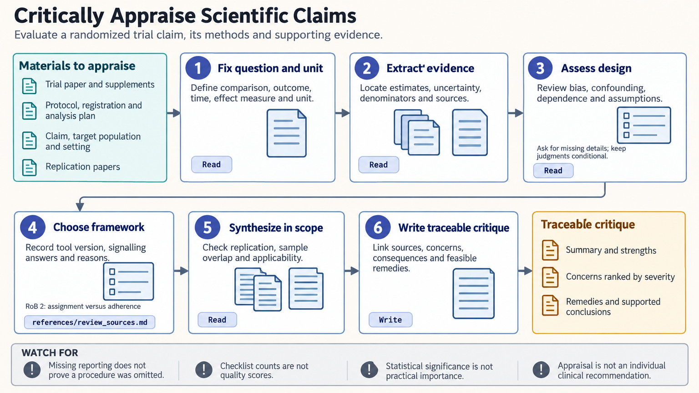

[All skill guides](README.md) / Scientific critical thinking

# Scientific critical thinking

**Assess what a scientific claim is supported by, and where its interpretation exceeds the evidence.**

The scientific-critical-thinking skill guides evidence appraisal across study design, bias, statistical interpretation, and applicability. It helps an assistant extract the relevant result before judging it, distinguish different kinds of claims, and write specific, constructive critiques. It also explains when formal risk-of-bias or certainty frameworks are appropriate.

*From a scientific claim to a proportionate assessment of its support and limitations.
[View the full-size workflow diagram](../images/scientific-critical-thinking.png).*

## Questions this skill can help you explore

- **Does the design answer the stated question?** Examine the population, comparison, outcome, timing, and independent sampling unit.
- **What might explain the result besides the preferred interpretation?** Review confounding, selection, measurement, attrition, and analytic choices.
- **How certain is the relevant body of evidence?** Consider replication, overlapping samples, missing evidence, and applicability.
- **What would strengthen the argument?** Connect each concern to its consequence and a feasible remedy.

## What you bring

Provide the claim and its source, ideally including full methods, results, supplementary information, protocol, and analysis plan. Specify whether the target is a descriptive, predictive, or causal statement.

Include the population, exposure or intervention, comparator, outcome, time point, effect measure, and setting of interest. A study can support one interpretation while remaining insufficient for another.

## How the appraisal works

1. **Fix the question and unit.** Establish exactly which result and inference are being assessed.
2. **Extract before judging.** Locate numerical results, uncertainty, denominators, design details, and missing reporting.
3. **Examine design and analysis.** Review dependence, multiplicity, confounding, measurement, selection, and model assumptions.
4. **Choose an appropriate framework.** Distinguish reporting completeness, risk of bias, and certainty of an evidence body rather than collapsing them into one score.
5. **Write a traceable critique.** Identify source locations, implications, uncertainty, strengths, and practical improvements while keeping conclusions within scope.

## What you get

| Output | What it helps you do |
| --- | --- |
| Claim and result specification | Clarify what the evidence is being asked to support. |
| Evidence extraction notes | Separate observed findings from interpretation and missing information. |
| Structured appraisal | Review validity and applicability under a suitable framework. |
| Constructive critique | Prioritize concerns that materially affect the claim. |

## Example request

> Use the scientific-critical-thinking skill to assess this paper's causal claim. Identify the exact comparison and effect estimate, review confounding and selection, and distinguish missing reporting from demonstrated methodological problems. Explain which conclusions are supported and what additional evidence would most directly address the main uncertainty.

*This is an illustrative appraisal request, not a judgment about a particular study.*

## Interpreting the results

**Missing reporting is not proof that a procedure was omitted.** Conversely, complete reporting does not establish low risk of bias. Appraisal must remain explicit about what can and cannot be checked.

Good model fit or optimizer convergence does not prove parameter identifiability or causality. Frameworks such as GRADE concern defined outcomes and comparisons, not a whole paper's prestige or design label. Checklist totals should not become an unsupported quality score, and criticism should remain proportional to its effect on the conclusion.

## Get started

Core appraisal needs the source evidence and no specialized software or network connection. Optional requested diagrams use separate schematic-generation tooling and credentials. The technical references explain framework selection and interpretation boundaries.

[Setup and technical instructions](../../skills/scientific-critical-thinking/SKILL.md)
