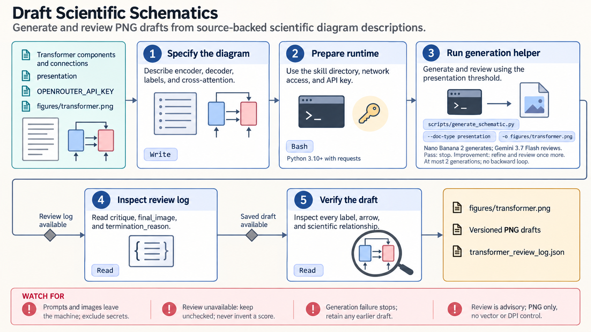

[All skill guides](README.md) / Scientific schematics

# Scientific schematics

**Create a visual draft of a scientific workflow or concept from source-backed relationships.**

The scientific-schematics skill generates raster diagram drafts from a natural-language description and uses an automated visual review to guide limited refinement. It suits conceptual pathways, system diagrams, research workflows, and model architectures. The scientist supplies the scientific content and checks the final labels and relationships before the image is used.

*From a scientific diagram brief to a reviewed raster illustration draft.
[View the full-size workflow diagram](../images/scientific-schematics.png).*

## Tasks this skill can help you complete

- **Explain a multi-step workflow.** Arrange inputs, transformations, decisions, and outputs into a readable diagram.
- **Show a conceptual model.** Depict known components and explicitly defined relationships without relying on a paragraph of prose alone.
- **Prepare a visual for a document.** Adapt hierarchy, labeling, and composition to a presentation, poster, report, or manuscript draft.
- **Record the generation process.** Retain image versions and the automated review comments for manual inspection.

## What you bring

Provide the diagram's purpose, audience, destination, and a source-backed list of components and relationships. State which arrows mean movement, regulation, causation, sequence, or association, and identify uncertainties that should remain visible.

Specify required labels, terminology, color conventions, layout constraints, and final display size. Sensitive or unpublished details should only be included when appropriate for transmission to the external generation service.

## How it works

1. **Write a precise brief.** Establish the scientific content, visual hierarchy, labels, and meaning of connections.
2. **Generate an initial draft.** Request a PNG image using the configured image model.
3. **Review visual quality.** The helper records an automated critique and uses its local thresholds to decide whether refinement is requested.
4. **Refine within the limit.** Create another version when indicated, preserving versions and the review record.
5. **Inspect manually.** Check every label, arrow, omission, legend, and scientific relationship at the intended final size.

## What you get

| Output | What it helps you do |
| --- | --- |
| Raster diagram draft | Explain a conceptual structure or workflow visually. |
| Versioned PNG files | Compare the initial and refined compositions. |
| Review log | Inspect automated comments, scores when available, and stopping reasons. |
| Selected final draft | Prepare a checked illustration for integration into another document. |

## Example request

> Use the scientific-schematics skill to draft a diagram of my analysis workflow. I will provide the exact steps, labels, and relationships. Make the difference between measured inputs and inferred outputs visible, use a restrained color scheme, and retain the review log so I can inspect every scientific connection before using the image.

*This is an illustrative design request, not a validated scientific figure.*

## Interpreting the results

**Automated visual review does not verify scientific correctness.** An image can be attractive while misspelling a label, omitting a component, or reversing an arrow. Review thresholds are local heuristics rather than publisher acceptance criteria.

The output is a raster image at the returned resolution, without an editable vector path or explicit DPI control. Converting it to another format does not create additional detail. Exact quantitative plots should come from the data and appropriate plotting tools, not an image model.

## Get started

The helper uses Python, requests, network access, and an OpenRouter API key. Generation and review are external service calls. The technical instructions describe configuration, output records, and limitations; human scientific and publication-format review remains necessary.

[Setup and technical instructions](../../skills/scientific-schematics/SKILL.md)
