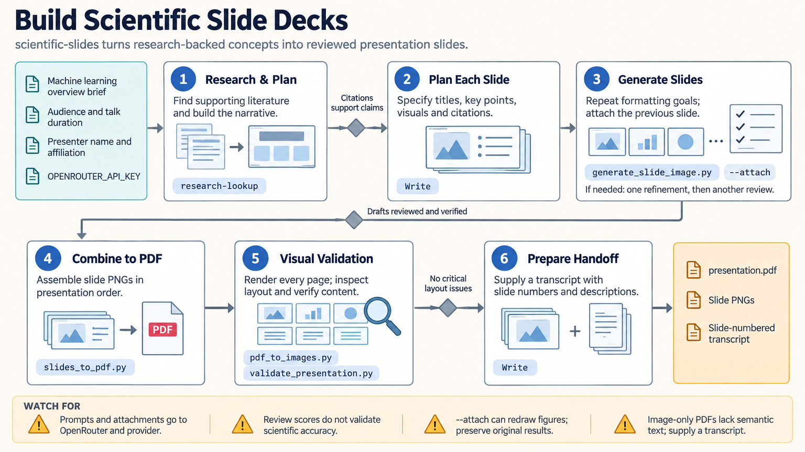

[All skill guides](README.md) / Scientific slides

# Scientific slides

**Build a research presentation with a clear narrative, readable figures, and a checked final layout.**

The scientific-slides skill supports conference talks, seminars, defenses, journal clubs, and other scientific presentations. It helps an assistant plan the argument, choose visual emphasis, pace the talk, and assemble a deck in an appropriate format. Scientific claims and quantitative figures remain tied to supplied evidence throughout the design process.

*From research content to an audience-focused presentation.
[View the full-size workflow diagram](../images/scientific-slides.png).*

## Tasks this skill can help you complete

- **Shape the research story.** Connect the motivating question, methods, results, interpretation, and remaining uncertainty.
- **Choose what belongs on each slide.** Give each slide a clear purpose and use figures that support the spoken explanation.
- **Adapt to the audience and time.** Adjust technical depth and pacing for a short conference talk, seminar, or defense.
- **Prepare a usable deck.** Choose editable slides or image-based outputs according to equations, data, accessibility, and template requirements.

## What you bring

Provide the talk's audience, duration, purpose, required template or format, and the scientific material to present. Include verified results, figures, references, terminology, and any statements that must remain qualified.

Identify which elements need editing later, whether speaker notes are needed, and the expected presentation screen or sharing medium. Use source-derived plots for exact quantitative results.

## How it works

1. **Plan the narrative.** Define the audience's starting knowledge and the question the talk should answer.
2. **Outline slide purposes.** Assign each slide a main message, supporting visual, evidence, and approximate speaking time.
3. **Set a coherent design.** Establish typography, colors, spacing, labels, and citation treatment across the deck.
4. **Build the chosen format.** Use editable PowerPoint or Beamer when precision and editability matter; conceptual image slides can support selected overview material.
5. **Render and rehearse.** Inspect readability, clipping, scientific labels, reference accuracy, and pacing in the delivered files.

## What you get

| Output | What it helps you do |
| --- | --- |
| Slide-by-slide plan | Review the narrative before detailed production. |
| Presentation deck | Deliver a structured scientific talk in the chosen format. |
| Visual assets | Explain methods, concepts, and results consistently. |
| Timing and visual-review notes | Refine presentation length and readability. |

## Example request

> Use the scientific-slides skill to turn my approved figures and research summary into a 15-minute conference talk. Plan a clear narrative, keep the quantitative results editable, include concise source citations, and inspect the rendered deck for legibility and clipping. Flag claims that need stronger evidence or clearer qualification.

*This is an illustrative presentation request, not a report of research findings.*

## Interpreting the results

**Clear slides do not strengthen the underlying evidence.** Simplification must preserve uncertainty, comparison groups, units, and the distinction between observations and interpretations. A memorable schematic cannot substitute for a measured result.

Generated slide images require manual checking of text, citations, equations, and relationships. They also limit editability and accessible text. Output format and tool choice should therefore follow the actual use, especially for exact data, equations, or a supplied institutional template.

## Get started

Dependencies depend on the chosen workflow. Generated visuals use Python, network access, and an OpenRouter API key. Editable PowerPoint production may use Node.js and PptxGenJS; Beamer requires a TeX installation. Rendering and validation use additional document and image packages listed in the technical instructions.

[Setup and technical instructions](../../skills/scientific-slides/SKILL.md)
