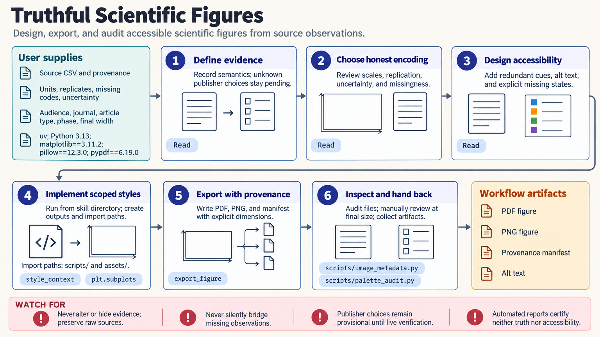

[All skill guides](README.md) / Scientific visualization

# Scientific visualization

**Present research data clearly while preserving uncertainty, missingness, and the meaning of comparisons.**

The scientific-visualization skill guides figure design and review using plotting tools such as Matplotlib, Seaborn, and Plotly. It covers visual encoding, multi-panel composition, accessible labeling, export planning, and inspection of the delivered files. The priority is a truthful figure whose appearance helps readers understand the evidence.

*From research data to readable, traceable scientific figures.
[View the full-size workflow diagram](../images/scientific-visualization.png).*

## Questions this skill can help you explore

- **Which plot best expresses the comparison?** Match visual encoding to variable meaning, study design, and audience.
- **How should uncertainty and replication appear?** Show the chosen interval, sample size, and independent unit explicitly.
- **Can readers interpret the figure without color alone?** Use labels, markers, line styles, or other redundant cues.
- **Will the exported file work at its final size?** Review dimensions, fonts, image metadata, and verified destination requirements.

## What you bring

Provide source data, variable meanings, units, replicate structure, and the exact estimator and uncertainty measure. Include missing or censored value definitions and a record of exclusions, normalization, smoothing, binning, or image adjustments.

Specify the audience, medium, final size, and target journal or venue if relevant. When destination requirements are unknown, the figure can remain provisional rather than claiming compliance.

## How it works

1. **Define the evidence and destination.** Record what is being shown, the transformations applied, and how the figure will be used.
2. **Choose an honest encoding.** Select axes, scales, marks, aggregation, and uncertainty displays suited to the variables.
3. **Design for readability.** Use legible labels and redundant visual cues, and distinguish missing data from zero or excluded values.
4. **Export deliberately.** Save the requested raster, vector, or interactive outputs with explicit dimensions and provenance.
5. **Inspect and compare.** Review the final files at intended size, check metadata, and examine whether styling changes the apparent conclusion.

## What you get

| Output | What it helps you do |
| --- | --- |
| Scientific figures or multi-panel layouts | Communicate the research comparison clearly. |
| Explicit uncertainty and missing-data displays | Preserve important limitations of the measurements. |
| Export and metadata checks | Review dimensions, format, and technical suitability. |
| Source and transformation records | Trace each visual element back to the analysis. |

## Example request

> Use the scientific-visualization skill to redesign my multi-panel results figure. Preserve every data point and declared exclusion, label the uncertainty intervals and unit of replication, and make groups distinguishable without color alone. Export at the intended manuscript width and inspect the final files for readability.

*This is an illustrative figure-design request, not a new analysis result.*

## Interpreting the results

**A palette, resolution value, or automated report does not establish accessibility or publication compliance.** Requirements depend on the actual destination, and human inspection remains necessary.

Axes, smoothing, binning, normalization, and missing-data treatment can alter the apparent message. Preserve originals and document these choices rather than optimizing the figure for a preferred conclusion. Interactive hover cannot replace accessible labels, an accompanying data table, or a usable static version when those are needed.

## Get started

The workflow uses Python and the selected plotting library. Local audit helpers need no network or credentials and load optional image or PDF packages as required. Plotly static export has additional browser requirements described in the technical instructions.

[Setup and technical instructions](../../skills/scientific-visualization/SKILL.md)
