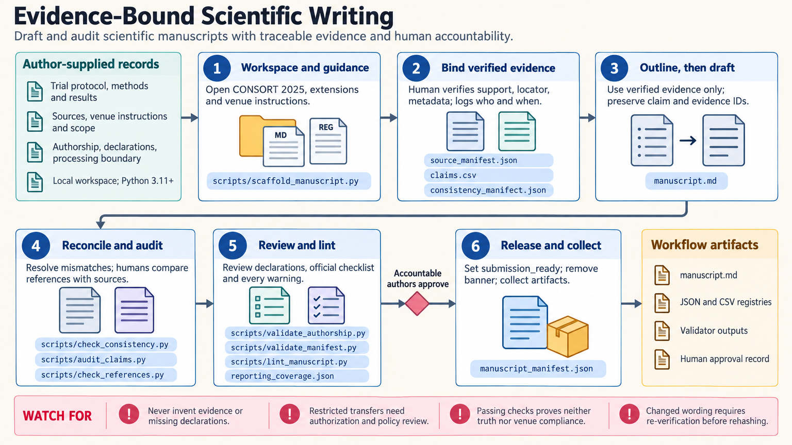

[All skill guides](README.md) / Scientific writing

# Scientific writing

**Turn verified study material into clear prose with traceable claims and consistent reporting.**

The scientific-writing skill supports drafting, revision, and audit of manuscripts and scientific reports. It links statements to evidence, reconciles methods with results, checks reporting coverage, and keeps missing facts explicit. The goal is prose that accurately communicates the work while preserving human authors' responsibility for scientific decisions and final approval.

*From verified study records to an accountable scientific manuscript.
[View the full-size workflow diagram](../images/scientific-writing.png).*

## Tasks this skill can help you complete

- **Draft or revise a manuscript section.** Explain the study clearly without adding unsupported details or findings.
- **Check internal consistency.** Reconcile sample sizes, denominators, units, outcome labels, methods, and repeated numerical facts.
- **Trace claims to their evidence.** Maintain source identifiers and unresolved verification needs.
- **Prepare for submission review.** Examine reporting-guideline coverage, citations, declarations, authorship information, and formatting requirements.

## What you bring

Provide the intended document, study design, audience, venue, protocol, analysis plan, and verified methods and results. Include tables, figures, source papers, author decisions, and declarations that are supported by the study record.

State what is missing or unverified. Ethics approval, consent, funding, contributions, methods, citations, and numerical results must come from real records rather than plausible boilerplate.

## How it works

1. **Establish the document and evidence record.** Identify the target, relevant reporting guidance, source materials, and unresolved information.
2. **Create an evidence-linked outline.** Map section purposes and proposed claims to verified sources, methods, and results.
3. **Draft within that evidence.** Preserve uncertainty, distinguish exploratory work, and describe procedures as actually performed.
4. **Reconcile and verify.** Check repeated facts, method–result relationships, citations, and exact support for each factual claim.
5. **Review declarations and delivery.** Inspect authorship, disclosure, reporting coverage, final formatting, and the human approval record.

## What you get

| Output | What it helps you do |
| --- | --- |
| Drafted or revised prose | Communicate the study more clearly without inventing evidence. |
| Claim and source records | Trace factual statements to their supporting materials. |
| Consistency and coverage reports | Identify conflicting values, missing reporting, or unresolved checks. |
| Author-review package | Prepare a manuscript for accountable final review. |

## Example request

> Use the scientific-writing skill to revise my Results and Discussion from verified tables and an existing draft. Preserve the distinction between observations and interpretation, reconcile all sample counts and units, and flag statements whose sources do not support the wording. Leave missing declarations explicit for the authors to complete.

*This is an illustrative writing request, not a statement about a completed study.*

## Interpreting the results

**Fluent prose is not evidence.** A generated sentence, search snippet, or another paper's bibliography does not verify a claim. Changes in wording may require renewed source review, and local reference checks do not establish that a citation resolves or supports the statement.

Association must not become causation, and a nonsignificant result must not become evidence of equivalence. Confidential manuscripts and restricted records require appropriate handling. Human authors remain accountable for the science, source verification, disclosures, and final submission decisions.

## Get started

Core guidance is platform-neutral. Optional consistency and reference helpers use dependency-free local Python without API keys or network calls. Supply the study record and destination requirements before drafting so unsupported content can remain visibly unresolved.

[Setup and technical instructions](../../skills/scientific-writing/SKILL.md)
