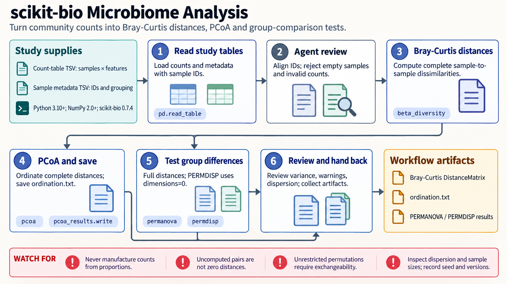

[All skill guides](README.md) / scikit-bio

# scikit-bio

**Connect biological sequences, community tables, and ecological distances to explicit analytical questions.**

The scikit-bio skill supports sequence handling, alignment, phylogenetic trees, diversity metrics, ordination, and ecological statistics. It helps an assistant move among biological data structures while retaining identifiers and methodological assumptions. It is particularly useful for community analyses that combine count tables, sample metadata, and a phylogenetic tree.

*From biological data structures to reviewed sequence and community analyses.
[View the full-size workflow diagram](../images/scikit-bio.png).*

## Questions this skill can help you explore

- **How diverse are samples within and between groups?** Calculate suitable alpha-diversity metrics and between-sample distances.
- **How do community patterns relate to metadata?** Examine ordinations and design-appropriate statistical comparisons.
- **What changes when phylogeny is included?** Use a rooted tree and aligned taxon identifiers for phylogenetic diversity or UniFrac.
- **How should sequence information be handled?** Read, transform, align, and export sequences while preserving quality and annotation context.

## What you bring

Provide the appropriate sequence files, count or abundance table, sample metadata, and phylogenetic tree when required. Retain unique sample and feature identifiers and state the organism, sequence alphabet, quality encoding, and coordinate or translation conventions.

For community comparisons, include the independent sampling unit, grouping variables, repeated measures, and preprocessing history. Count-based estimators require genuine counts rather than proportions scaled into artificial integers.

## How the analysis works

1. **Validate biological inputs.** Check identifiers, sequence conventions, nonnegative abundance values, empty samples, and table orientation.
2. **Align related objects.** Reconcile sample metadata and taxon-to-tree mappings before calculation.
3. **Choose the measure.** Select sequence, diversity, distance, or alignment methods that answer the stated question.
4. **Explore and test appropriately.** Inspect ordination geometry and use statistical procedures compatible with the dependence and permutation design.
5. **Export with interpretation.** Retain metrics, matrices, plots, parameters, seeds, and limitations for downstream work.

## What you get

| Output | What it helps you do |
| --- | --- |
| Processed sequences or alignments | Prepare reproducible sequence-based follow-up work. |
| Diversity summaries and distance matrices | Compare within-sample and between-sample patterns. |
| Ordination results | Explore community structure and metadata associations. |
| Statistical summaries | Assess a defined comparison with explicit test assumptions. |

## Example request

> Use the scikit-bio skill to explore my community count table and sample metadata. Check sample and tree-tip alignment, compare abundance-based and phylogenetic distances, and show an ordination. Before group testing, review whether the repeated sampling design permits the available permutation procedure.

*This is an illustrative ecological-analysis request, not a community difference finding.*

## Interpreting the results

**A two-dimensional ordination does not preserve all distance information.** Negative eigenvalues and retained variance need inspection. Constrained associations do not establish environmental causation.

PERMANOVA can be affected by differences in dispersion, and a nonsignificant dispersion test does not prove equality. Unrestricted permutations are inappropriate for some repeated or blocked designs. Diversity also depends on sampling depth, normalization, metric choice, and tree quality, which must remain part of the scientific interpretation.

## Get started

Use Python, scikit-bio, and compatible NumPy. Plotting, BIOM tables, and alternative dataframe formats may require optional packages. Local analyses need no service credentials; package installation and external data retrieval require network access.

[Setup and technical instructions](../../skills/scikit-bio/SKILL.md)
