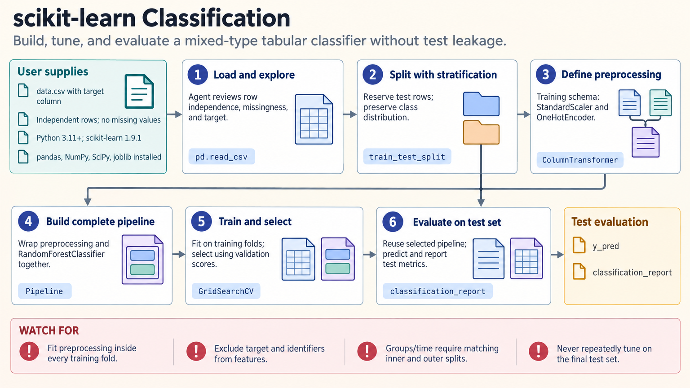

[All skill guides](README.md) / Scikit-learn

# Scikit-learn

**Build and evaluate predictive models with preprocessing and data splits that match the research question.**

The scikit-learn skill supports classification, regression, clustering, dimensionality reduction, and reusable machine-learning pipelines. It guides an assistant through preparing mixed data, comparing models, tuning parameters, and measuring performance. The workflow emphasizes keeping evaluation information out of training and making the intended generalization claim explicit.

*From research features and labels to a reproducible predictive-model comparison.
[View the full-size workflow diagram](../images/scikit-learn.png).*

## Questions this skill can help you explore

- **Can measured features predict an outcome?** Build classification or regression models and compare them with an appropriate baseline.
- **How much does performance depend on model choices?** Tune hyperparameters within a documented validation design.
- **What structure appears without labels?** Explore clusters or reduced representations while keeping them separate from confirmed classes.
- **How can the full analysis be reused?** Save a pipeline that includes the learned transformations as well as the estimator.

## What you bring

Provide a feature table, outcome labels when relevant, stable sample identifiers, and the meaning and units of each variable. Include missingness information, categorical encodings, groups, repeated observations, and timestamps.

Specify what new data should resemble at use time and which mistakes matter scientifically. The independent unit might be a patient, specimen, location, or experiment rather than a row.

## How the analysis works

1. **Define the target and split.** Establish the prediction outcome, baseline, independent unit, and holdout strategy.
2. **Build preprocessing inside the pipeline.** Fit imputation, scaling, encoding, and feature selection using training-fold data only.
3. **Compare suitable estimators.** Choose models and metrics appropriate to the outcome and scientific costs of error.
4. **Tune without contaminating evaluation.** Keep model-selection decisions within the designated training and validation process.
5. **Evaluate and preserve the pipeline.** Report held-out performance, relevant failure patterns, and the complete transformation and model configuration.

## What you get

| Output | What it helps you do |
| --- | --- |
| Preprocessing and model pipeline | Apply the same learned transformations to new data. |
| Validation and tuning results | Review model choices under a declared comparison procedure. |
| Held-out predictions and metrics | Assess the intended generalization task. |
| Exploratory clusters or representations | Inspect structure that may motivate further investigation. |

## Example request

> Use the scikit-learn skill to compare models for my tabular prediction task. Keep all records from the same specimen in one partition, fit preprocessing within cross-validation, compare against a simple baseline, and reserve a final test set. Report the errors that matter for the scientific use case.

*This is an illustrative modeling request, not a claim of predictive success.*

## Interpreting the results

**A strong score depends on what was held out.** Random row splitting can overstate performance when records share subjects, locations, batches, or time structure. Preprocessing before splitting can leak information even when the estimator itself sees only training labels.

Predictive performance does not establish causality or mechanism. Clusters are algorithm- and representation-dependent, and tuning against the test set weakens its role as independent evidence. Metrics should reflect the task and class balance rather than convenience alone.

## Get started

Local work uses Python and scikit-learn with NumPy, SciPy, and related dependencies. Bundled scripts also use pandas and Matplotlib. Installation requires network access; local datasets and examples need no credentials.

[Setup and technical instructions](../../skills/scikit-learn/SKILL.md)
