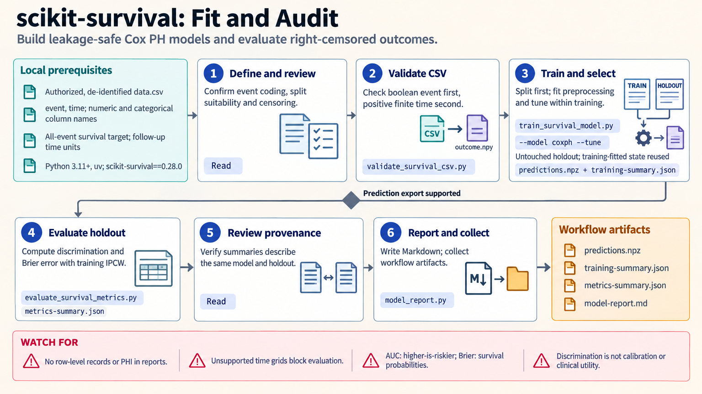

[All skill guides](README.md) / Scikit-survival

# Scikit-survival

**Model time-to-event outcomes while respecting censoring, follow-up, and the intended prediction horizon.**

The scikit-survival skill supports survival prediction with right-censored data, including model selection, probability prediction, and censoring-aware evaluation. It also covers nonparametric cumulative incidence for competing risks. The workflow keeps event definitions, risk scores, survival probabilities, and the support of the observed follow-up distinct.

*From time-to-event records to carefully defined survival predictions.
[View the full-size workflow diagram](../images/scikit-survival.png).*

## Questions this skill can help you explore

- **Can baseline features distinguish earlier from later events?** Compare suitable survival models and ranking performance.
- **How accurate are predicted survival probabilities?** Evaluate at prespecified horizons supported by the data.
- **How should competing events be described?** Estimate cumulative incidence with the appropriate event coding.
- **Does evaluation respect censoring?** Use training-derived censoring information and valid time ranges.

## What you bring

Provide feature data, observed follow-up time, an event indicator, the event definition, and the time origin. Describe censoring, repeated or grouped records, and any competing causes.

Specify the target: overall survival, a cause-specific hazard, or cause-specific cumulative incidence. Include the intended prediction horizons and deployment setting so splitting and evaluation match the scientific claim.

## How the analysis works

1. **Define and validate outcomes.** Confirm event coding, follow-up units, censoring meaning, and the quantity to estimate.
2. **Split before preprocessing.** Keep learned imputation, encoding, scaling, and feature selection within training folds.
3. **Fit and tune appropriately.** Select a compatible model using nested validation or an untouched final holdout.
4. **Generate the correct predictions.** Distinguish higher-is-riskier scores from survival probabilities evaluated at specified times.
5. **Evaluate within support.** Use suitable censoring-aware metrics, inspect horizon-specific behavior, and report limits of follow-up and interpretation.

## What you get

| Output | What it helps you do |
| --- | --- |
| Validated event and follow-up records | Confirm the modeled outcome and censoring structure. |
| Fitted survival pipeline | Reproduce feature processing and prediction. |
| Risk scores or survival curves | Examine the model's output on the appropriate scale. |
| Evaluation and cumulative-incidence summaries | Review discrimination, prediction error, or competing-event occurrence. |

## Example request

> Use the scikit-survival skill to evaluate a time-to-event prediction model from my research cohort. Define the event and censoring rules, keep preprocessing within training folds, and evaluate at supported horizons. Report discrimination separately from probability accuracy and explain how competing events affect the question.

*This is an illustrative research request, not clinical advice or a validated prognostic result.*

## Interpreting the results

**Good ranking does not imply well-calibrated probabilities.** Concordance and time-dependent AUC measure discrimination, while probability error and calibration address other properties.

Censoring assumptions and limited follow-up constrain evaluation. Treating competing events as ordinary censoring and reporting one minus Kaplan–Meier can misstate event-specific probability. The built-in competing-risk workflow is nonparametric and does not supply Fine–Gray regression. None of these outputs alone establishes causality, clinical usefulness, or a treatment decision.

## Get started

The workflow uses an isolated Python environment with the documented scikit-survival and scikit-learn-compatible stack. Bundled helpers run locally without network access or credentials. Installation requires suitable packages and, for source builds, additional compiler dependencies.

[Setup and technical instructions](../../skills/scikit-survival/SKILL.md)
